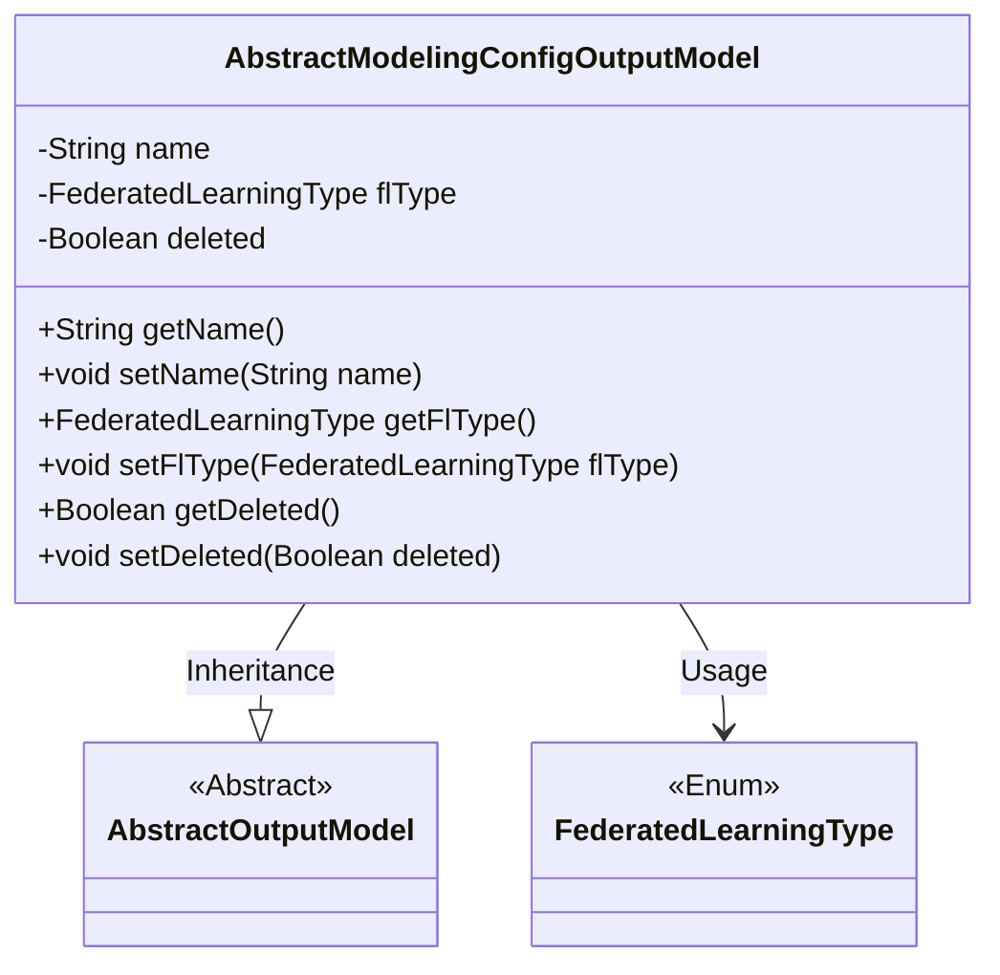
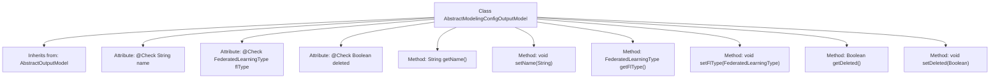

# Basic Information

|      |      |
|------|------|
| Name | AbstractModelingConfigOutputModel |
| Language | .java |
| Code Path | WeFe/board/board-service/src/main/java/com/welab/wefe/board/service/dto/entity/modeling_config/AbstractModelingConfigOutputModel.java |
| Package Name | com.welab.wefe.board.service.dto.entity.modeling_config |
| Dependencies | ['com.welab.wefe.board.service.dto.entity.AbstractOutputModel', 'com.welab.wefe.common.fieldvalidate.annotation.Check', 'com.welab.wefe.common.wefe.enums.FederatedLearningType'] |
| Brief Description | Abstract modeling configuration output model class, including fields for name, federated learning type, and deletion status, along with corresponding getter/setter methods. |

# Description

AbstractModelingConfigOutputModel inherits from AbstractOutputModel and contains three main fields: name (configuration name), flType (federated learning mode), and deleted (whether it is deleted, default false). Each field has corresponding getter and setter methods for accessing and modifying the field values. The name and flType fields are annotated with check annotations to indicate their purposes.

# Class Summary

| Name   | Type  | Description |
|-------|------|-------------|
| AbstractModelingConfigOutputModel | class | The `AbstractModelingConfigOutputModel` class inherits from `AbstractOutputModel` and includes three attributes: configuration name, federated learning mode, and deletion flag, all of which have corresponding getter/setter methods. |

## Class AbstractModelingConfigOutputModel

|      |      |
|------|------|
| Access Modifier | public |
| Type | class |
| Name | AbstractModelingConfigOutputModel |
| Description | The `AbstractModelingConfigOutputModel` class inherits from `AbstractOutputModel` and includes three attributes: configuration name, federated learning mode, and deletion flag, all of which have corresponding getter/setter methods. |

### UML Class Diagram

This class diagram illustrates that AbstractModelingConfigOutputModel inherits from the abstract class AbstractOutputModel and contains three private fields (name, flType, deleted) along with their corresponding getter/setter methods. The flType field utilizes the enum type FederatedLearningType. The class acquires the characteristics of AbstractOutputModel through inheritance while employing the FederatedLearningType enum class via composition. The overall structure clearly demonstrates the inheritance and dependency relationships between the classes.

### Internal Method Call Graph

This code demonstrates a class named AbstractModelingConfigOutputModel, which inherits from AbstractOutputModel. The class contains three attributes annotated with @Check: name (configuration name), flType (federated learning type), and deleted (whether deleted). Each attribute has corresponding getter and setter methods for retrieving and setting values. The flowchart clearly illustrates the class inheritance relationship, attribute definitions, and method structure, highlighting the annotated fields and standard JavaBean method patterns.

### Field List

| Name  | Type  | Description |
|-------|-------|------|
| flType | FederatedLearningType | Define the federated learning mode variable flType, validated using the @Check annotation. |
| deleted = false | Boolean | Check the boolean field for deletion status, default value false. |
| name | String | The code defines a private string variable named "name", marked with the @Check annotation to configure its name. |

### Method List

| Name  | Type  | Description |
|-------|-------|------|
| setFlType | void | The method to set the federated learning type, with the parameter of type FederatedLearningType, assigns the value to the member variable flType. |
| getFlType | FederatedLearningType | This is a Java method that returns an object of type FederatedLearningType named flType. |
| getName | String | The method returns the value of the name variable of type String. |
| setName | void | The method to set the object name is to assign the parameter 'name' to the 'name' property of the object. |
| getDeleted | Boolean | Public method to retrieve the deleted boolean value. |
| setDeleted | void | Boolean method for setting the deletion status of an object. |

