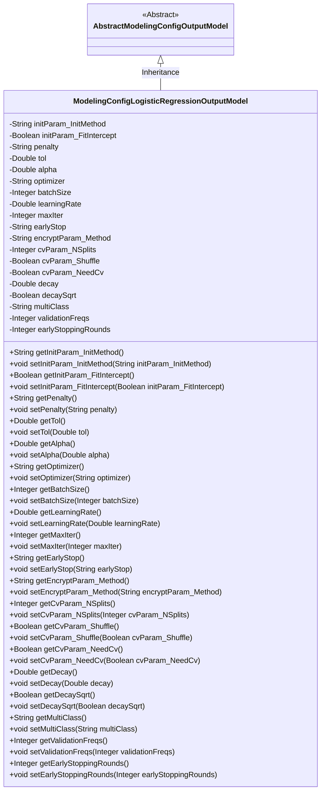

# Basic Information

|      |      |
|------|------|
| Name | ModelingConfigLogisticRegressionOutputModel |
| Language | .java |
| Code Path | WeFe/board/board-service/src/main/java/com/welab/wefe/board/service/dto/entity/modeling_config/ModelingConfigLogisticRegressionOutputModel.java |
| Package Name | com.welab.wefe.board.service.dto.entity.modeling_config |
| Dependencies | ['com.welab.wefe.common.fieldvalidate.annotation.Check'] |
| Brief Description | Logistic Regression Model Configuration Class, including parameters such as initialization method, bias coefficient, penalty method, convergence tolerance, optimization algorithm, batch size, learning rate, maximum iterations, early stopping, cross-validation, and multi-class strategy. |

# Description

This Java class defines the configuration parameters for a logistic regression model, including attributes such as model initialization method, bias coefficient, penalty method, convergence tolerance, penalty coefficient, optimization algorithm, batch size, learning rate, maximum iteration count, convergence judgment method, homomorphic encryption method, KFold splitting parameters, learning rate decay settings, multi-class strategy, validation frequency, and early stopping rounds. Each attribute has corresponding getter and setter methods for retrieving and setting parameter values.

# Class Summary

| Name   | Type  | Description |
|-------|------|-------------|
| ModelingConfigLogisticRegressionOutputModel | class | Logistic regression model configuration class, including parameters such as initialization method, bias coefficient, penalty term, optimization algorithm, learning rate, encryption method, cross-validation, etc. |

## Class ModelingConfigLogisticRegressionOutputModel

|      |      |
|------|------|
| Access Modifier | public |
| Type | class |
| Name | ModelingConfigLogisticRegressionOutputModel |
| Description | Logistic regression model configuration class, including parameters such as initialization method, bias coefficient, penalty term, optimization algorithm, learning rate, encryption method, cross-validation, etc. |

### UML Class Diagram

Class Diagram Description: This diagram illustrates the structure of a logistic regression model configuration class `ModelingConfigLogisticRegressionOutputModel` inheriting from the abstract base class `AbstractModelingConfigOutputModel`. The subclass contains 20 private configuration parameters (such as initialization method, penalty coefficient, learning rate, etc.) and their corresponding getter/setter methods. All fields are validated via `@Check` annotations. The class diagram clearly demonstrates the categorization of configuration parameters (e.g., naming groups like initParam, cvParam) and complete encapsulation, making it suitable for parameter management scenarios in machine learning models.

### Internal Method Call Graph

```mermaid
graph TD
    A["Class ModelingConfigLogisticRegressionOutputModel"]
    B["Inherits from: AbstractModelingConfigOutputModel"]
    C["Attribute: String initParam_InitMethod"]
    D["Attribute: Boolean initParam_FitIntercept"]
    E["Attribute: String penalty"]
    F["Attribute: Double tol"]
    G["Attribute: Double alpha"]
    H["Attribute: String optimizer"]
    I["Attribute: Integer batchSize"]
    J["Attribute: Double learningRate"]
    K["Attribute: Integer maxIter"]
    L["Attribute: String earlyStop"]
    M["Attribute: String encryptParam_Method"]
    N["Attribute: Integer cvParam_NSplits"]
    O["Attribute: Boolean cvParam_Shuffle"]
    P["Attribute: Boolean cvParam_NeedCv"]
    Q["Attribute: Double decay"]
    R["Attribute: Boolean decaySqrt"]
    S["Attribute: String multiClass"]
    T["Attribute: Integer validationFreqs"]
    U["Attribute: Integer earlyStoppingRounds"]
    V["Method: getter/setter for all attributes"]

    A --> B
    A --> C
    A --> D
    A --> E
    A --> F
    A --> G
    A --> H
    A --> I
    A --> J
    A --> K
    A --> L
    A --> M
    A --> N
    A --> O
    A --> P
    A --> Q
    A --> R
    A --> S
    A --> T
    A --> U
    A --> V
```

This code defines a configuration class for a logistic regression model, inheriting from the abstract base class AbstractModelingConfigOutputModel. The class contains 20 configuration parameters covering various settings such as model initialization, optimization algorithms, cross-validation, and learning rate decay. Each parameter has corresponding getter and setter methods for retrieving and modifying parameter values. These parameters are validated using the @Check annotation to ensure configuration correctness. This configuration class provides comprehensive parameter control capabilities for the logistic regression model.

### Field List

| Name  | Type  | Description |
|-------|-------|------|
| cvParam_NeedCv | Boolean | The private boolean variable cvParam_NeedCv is used to check whether this module needs to be executed, annotated with @Check. |
| learningRate | Double | The class private variable learningRate is annotated with @Check as "learning rate". |
| validationFreqs | Integer | The class attribute validationFreqs is used to control the validation frequency, marked by the @Check annotation. |
| cvParam_NSplits | Integer | The KFold splitting parameter cvParam_NSplits is used to set the number of splits for cross-validation. |
| decaySqrt | Boolean | The private boolean variable decaySqrt is used to check whether the decay rate is square-rooted. |
| cvParam_Shuffle | Boolean | The boolean parameter cvParam_Shuffle indicating whether to shuffle before KFold. |
| earlyStop | String | The code defines a private string variable `earlyStop`, which is used to determine convergence and is annotated as a checking method. |
| decay | Double | The class private variable `decay`, used to control the decay rate of the learning rate, is marked as a to-be-checked item. |
| encryptParam_Method | String | Homomorphic encryption method parameter verification. |
| maxIter | Integer | Define a private integer variable maxIter, annotated with @Check as "Maximum Iterations". |
| batchSize | Integer | The integer variable batchSize for batch size checking. |
| earlyStoppingRounds | Integer | Define a private integer variable `earlyStoppingRounds` to record the number of early stopping iterations, validated via the `@Check` annotation. |
| initParam_InitMethod | String | The model initialization parameter `initParam_InitMethod` is used to configure the initialization method. |
| penalty | String | The code defines a private string variable named penalty, which is used to store the penalty method, and it is validated using the @Check annotation. |
| optimizer | String | The code defines a private string variable named `optimizer` and includes an inspection annotation for checking optimization algorithms. |
| tol | Double | Convergence tolerance parameter tol, of type Double. |
| initParam_FitIntercept | Boolean | Check whether the bias coefficient is needed, Boolean variable initParam_FitIntercept. |
| multiClass | String | Multi-class strategy configuration item, optional enumerated values are ovr or ovo. |
| alpha | Double | Penalty term coefficient variable alpha |

### Method List

| Name  | Type  | Description |
|-------|-------|------|
| getInitParam_FitIntercept | Boolean | Get the boolean value of the initialization parameter FitIntercept. |
| getOptimizer | String | Method to obtain the optimizer name. |
| setMultiClass | void | Java Method: Set the value of the multiClass property. |
| getCvParam_NeedCv | Boolean | Method to obtain the boolean value indicating whether CV parameters are required. |
| setCvParam_NeedCv | void | Set the boolean method to determine whether CV parameters are required. |
| getCvParam_NSplits | Integer | Method to obtain the integer value of cvParam_NSplits. |
| setOptimizer | void | This is a Java method used to set the value of an optimizer property. The method is named setOptimizer, which takes a string parameter named optimizer and assigns it to the optimizer member variable of the current object. |
| getPenalty | String | Methods to obtain the penalty value, returning a penalty variable of string type. |
| getCvParam_Shuffle | Boolean | A public method to retrieve the boolean value of cvParam_Shuffle. |
| getEarlyStop | String | Public method to obtain the earlyStop value. |
| getBatchSize | Integer | Get the integer value of the batch size. |
| setAlpha | void | Public method to set the alpha value, with a parameter of type Double. |
| getTol | Double | Public method to obtain the tol value, returns a Double type. |
| getMultiClass | String | This is a Java method that returns the value of the string-type multiClass variable. |
| setLearningRate | void | Defined a public method `setLearningRate` for setting the learning rate parameter. The method takes a Double-type parameter `learningRate` and assigns it to the class's member variable of the same name. |
| setPenalty | void | Set the penalty method by assigning the input string to the class member variable penalty. |
| getValidationFreqs | Integer | This is a Java method that returns the value of the integer variable validationFreqs. |
| getMaxIter | Integer | The method to obtain the maximum number of iterations, returns an integer maxIter. |
| getInitParam_InitMethod | String | This is a Java method that returns the value of the initParam_InitMethod variable of type String. |
| setTol | void | Method for setting tolerance value: Assign the input double-precision numerical value to the class's tol member variable. |
| setCvParam_Shuffle | void | Java Method: Set the cvParam_Shuffle boolean parameter. |
| getLearningRate | Double | Methods to obtain the learning rate, returning a Double-type value learningRate. |
| setInitParam_InitMethod | void | Java Method: Set the value of initialization parameter initParam_InitMethod. |
| setCvParam_NSplits | void | Set the number of splits for cross-validation parameters. |
| setEncryptParam_Method | void | Method for setting encryption parameters, assigning the input value to the class member variable encryptParam_Method. |
| getDecay | Double | Method to obtain the decay value, returns a Double-type variable decay. |
| setDecaySqrt | void | Method for setting the decay square root flag. |
| setInitParam_FitIntercept | void | This is a Java method used to set the value of the boolean initialization parameter initParam_FitIntercept. |
| setDecay | void | Method for setting the decay value: Assign the input parameter `decay` to the `decay` property of the current object. |
| setEarlyStop | void | Defined a public method `setEarlyStop` for setting the value of the `earlyStop` property. The parameter is of string type. |
| getEncryptParam_Method | String | Method to obtain the encrypted parameter, returning a string-type variable encryptParam_Method. |
| setMaxIter | void | A public method to set the maximum number of iterations, with the parameter being an integer maxIter, which is assigned to the class variable this.maxIter. |
| getDecaySqrt | Boolean | This is a Java method that returns a boolean type decaySqrt value. |
| setBatchSize | void | The method to set the batch processing size, with the parameter being of integer type. |
| getAlpha | Double | The method getAlpha returns the alpha value of type Double. |
| setValidationFreqs | void | Method for setting validation frequency, with an integer parameter used to update the internal variable validationFreqs. |
| getEarlyStoppingRounds | Integer | Method to get the number of early stopping rounds, returns an integer value. |
| setEarlyStoppingRounds | void | The method for setting the early stopping rounds parameter. |

