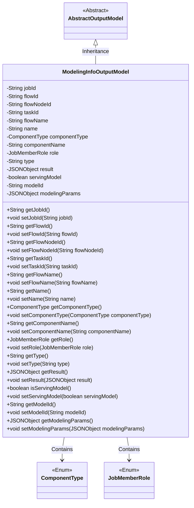

# Basic Information

|      |      |
|------|------|
| Name | ModelingInfoOutputModel |
| Language | .java |
| Code Path | WeFe/board/board-service/src/main/java/com/welab/wefe/board/service/dto/entity/modeling_config/ModelingInfoOutputModel.java |
| Package Name | com.welab.wefe.board.service.dto.entity.modeling_config |
| Dependencies | ['com.alibaba.fastjson.JSONObject', 'com.welab.wefe.board.service.dto.entity.AbstractOutputModel', 'com.welab.wefe.common.fieldvalidate.annotation.Check', 'com.welab.wefe.common.wefe.enums.ComponentType', 'com.welab.wefe.common.wefe.enums.JobMemberRole'] |
| Brief Description | The ModelingInfoOutputModel class inherits from AbstractOutputModel and includes fields such as task ID, process ID, node ID, task name, component type, execution result, and model ID, used for storing modeling information output data. |

# Description

The content defines a Java class named `ModelingInfoOutputModel`, which extends `AbstractOutputModel`. This class includes multiple private fields to store information related to modeling tasks, such as task ID, process ID, process node ID, subtask ID, process name, task name, component type, component type name in Chinese, member role, result type, execution result JSON object, flag indicating whether it can be exported to Serving, model ID, and modeling node parameter JSON object. Each field has corresponding getter and setter methods for accessing and modifying these properties.

# Class Summary

| Name   | Type  | Description |
|-------|------|-------------|
| ModelingInfoOutputModel | class | The ModelingInfoOutputModel class inherits from AbstractOutputModel and contains IDs and names of tasks, processes, nodes, components, etc., as well as attributes such as execution results and model parameters. |

## Class ModelingInfoOutputModel

|      |      |
|------|------|
| Access Modifier | public |
| Type | class |
| Name | ModelingInfoOutputModel |
| Description | The ModelingInfoOutputModel class inherits from AbstractOutputModel and contains IDs and names of tasks, processes, nodes, components, etc., as well as attributes such as execution results and model parameters. |

### UML Class Diagram

This code defines a class named ModelingInfoOutputModel, which inherits from AbstractOutputModel and is used to store information related to modeling tasks. The class contains multiple private fields such as task ID, flow ID, component type, execution results, etc., each with corresponding getter and setter methods. ModelingInfoOutputModel depends on two enum classes, ComponentType and JobMemberRole, to represent component types and member roles. This class is primarily used to encapsulate output data from modeling tasks, facilitating its transfer and processing within the system.

### Internal Method Call Graph

This code defines a class named ModelingInfoOutputModel, which inherits from AbstractOutputModel and is primarily used to store and manipulate modeling task-related information. The class contains multiple attributes annotated with @Check, such as task ID, flow ID, component type, etc., along with corresponding getter and setter methods. These attributes describe various dimensions of modeling tasks, including task identifiers, flow information, component types, execution results, etc., and provide access and modification capabilities for these attributes through methods.

### Field List

| Name  | Type  | Description |
|-------|-------|------|
| servingModel | boolean | The boolean variable servingModel that checks whether the model can be exported to serving. |
| flowName | String | Define a private String variable flowName, and mark the process name with the @Check annotation. |
| name | String | The code defines a private string variable named "name" to store the task name, which is validated using the @Check annotation. |
| jobId | String | Define a private String variable jobId, and annotate it with the Check validation annotation, with the parameter name as "Task Id". |
| componentName | String | Define a private String variable componentName, and use the @Check annotation to validate the Chinese name of the component type. |
| modelId | String | The string-type private variable of the modelId field is validated using the @Check annotation. |
| result | JSONObject | The class private variable `result`, of type `JSONObject`, is annotated with `@Check` and labeled as "Execution Result". |
| taskId | String | Define a private String variable taskId, and use the @Check annotation to validate the subtask ID. |
| componentType | ComponentType | Define private variables for component type checking. |
| modelingParams | JSONObject | The code defines a private JSONObject variable named modelingParams, which is used to store modeling node parameters, and performs validation via the @Check annotation. |
| flowId | String | Define a private String variable flowId, and validate the process ID using the @Check annotation. |
| flowNodeId | String | Define a private string variable for the process node ID, and validate it using the Check annotation. |
| role | JobMemberRole | Member Role Check Annotation. |
| type | String | The class member variable `type` is used to identify the multi-line result type of a task, validated via the `@Check` annotation. |

### Method List

| Name  | Type  | Description |
|-------|-------|------|
| getType | String | Methods to obtain the object type, returning a string-type `type` value. |
| setName | void | The method to set the object name is to assign the parameter 'name' to the 'name' property of the object. |
| setFlowNodeId | void | Method for setting the flow node ID: Assign the parameter `flowNodeId` to the property of the same name in the current object. |
| setFlowName | void | The method to set the flow name assigns the input parameter to the class variable flowName. |
| setComponentName | void | Methods for setting the component name, which assigns the input parameter to the class member variable `componentName`. |
| getName | String | Methods to obtain the name, returning the value of the string-type name variable. |
| getRole | JobMemberRole | Get the role information of the current object. |
| setFlowId | void | Method for setting the flow ID: Assign the incoming flowId to the flowId property of the current object. |
| getFlowId | String | Common method to obtain flowId, returns a string-type flowId value. |
| getFlowName | String | Methods to obtain the process name, returning the value of the variable flowName. |
| getTaskId | String | Methods to obtain the task ID, which returns a string-type taskId. |
| getComponentName | String | Methods to obtain the component name, returning a string-type componentName. |
| getFlowNodeId | String | The method returns a flowNodeId string value. |
| getResult | JSONObject | Get the returned JSON object. |
| setRole | void | Method to set member role, which assigns the passed role parameter to the role property of the current object. |
| getComponentType | ComponentType | Methods to obtain the component type, returns the value of the componentType field. |
| setType | void | The method `setType` is used to set the `type` property of an object, with the parameter being of string type. |
| setJobId | void | Defines a public method setJobId for setting the value of the jobId property. |
| setComponentType | void | The method for setting the component type assigns the parameter componentType to the componentType property of the current object. |
| getJobId | String | Get the unique identifier jobId of the current task. |
| setTaskId | void | This is a Java method used to set the taskId property value of a class. The method takes a string parameter taskId and assigns it to the member variable this.taskId of the class. |
| setResult | void | Set JSON object results. |
| isServingModel | boolean | This method returns a boolean value servingModel, indicating whether the model is currently being served. |
| setServingModel | void | Methods for setting the service model status, with the parameter being a boolean value servingModel. |
| getModelId | String | The method returns a modelId string. |
| setModelId | void | This is a Java method used to set the value of the modelId property. The method takes a string parameter modelId and assigns it to the class's member variable this.modelId. |
| getModelingParams | JSONObject | Get the JSON object of modeling parameters. |
| setModelingParams | void | This is a Java method used to set the modelingParams property, with the parameter type being JSONObject. |

