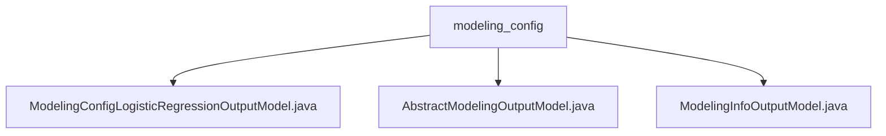

# Basic Information

|      |      |
|------|------|
| Name | modeling_config |
| Language | .java |
| Code Path | WeFe/board/board-service/src/main/java/com/welab/wefe/board/service/dto/entity/modeling_config |
| Package Name | docs.board.board-service.src.main.java.com.welab.wefe.board.service.dto.entity.modeling_config |
| Brief Description | The logistic regression configuration class includes parameters for initialization, penalty, optimization, etc. The inherited class contains fields such as name, mode, and deletion flag. The modeling information class includes fields like task ID, process, and component, all of which provide getter/setter methods. |

# Description

## Overview  
The core responsibility of this module is to manage configuration parameters and task information for federated learning modeling tasks, providing unified interfaces for parameter configuration and task data access. The interface specifications include three model types: logistic regression configurations (e.g., learning rate/penalty coefficient), basic configurations (e.g., federated mode/configuration name), and task information (e.g., process ID/component type). Key data structures include the logistic regression parameter group, task metadata JSON object, and basic configuration fields. External dependencies are limited to the Java standard library. For example, the logistic regression model supports homomorphic encryption and KFold validation settings.  

## Key Business Scenarios  
The module supports end-to-end federated learning process management, similar to a configuration center model. Business workflows cover model initialization (e.g., setting optimization algorithms), task tracking (associated via process node IDs), and result export (marking Serving availability). Typical applications include multi-classification task parameter configuration and modeling node execution status queries. API types range from parameter access (getter/setter) to complex object operations (e.g., JSON serialization). For instance, the ModelingInfoOutputModel can retrieve extended attributes such as the Chinese name of the component type.

### Package Internal Structure View

This flowchart illustrates the relationships between three Java class files under the modeling_config directory. The top-level node represents the modeling_config folder, which contains three output model class files: the logistic regression configuration output model, the abstract model output configuration, and the modeling information output model. All files reside at the same hierarchical level with no nested subdirectory structures.

# File List

| Name   | Type  | Description |
|-------|------|-------------|
| [ModelingConfigLogisticRegressionOutputModel.java](ModelingConfigLogisticRegressionOutputModel.md) | file | Logistic regression model configuration class, including parameters such as initialization method, bias coefficient, penalty method, convergence tolerance, optimization algorithm, batch size, learning rate, maximum number of iterations, early stopping, cross-validation, and multi-class classification strategy. |
| [AbstractModelingConfigOutputModel.java](AbstractModelingConfigOutputModel.md) | file | Abstract modeling configuration output model class, containing fields for name, federated learning type, and deletion status, along with corresponding getter/setter methods. |
| [ModelingInfoOutputModel.java](ModelingInfoOutputModel.md) | file | The ModelingInfoOutputModel class inherits from AbstractOutputModel and includes fields such as task ID, process ID, node ID, task name, component type, execution result, and model ID, used for storing modeling information output data. |

