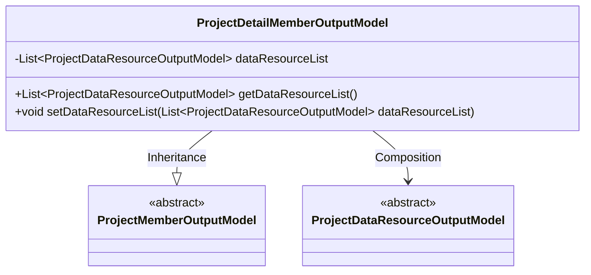
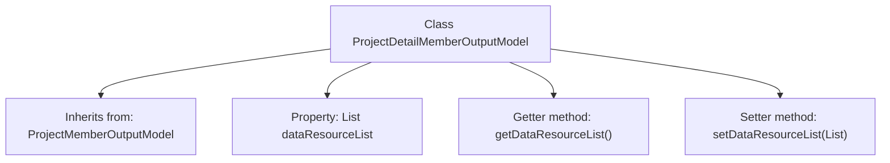

# Basic Information

|      |      |
|------|------|
| Name | ProjectDetailMemberOutputModel |
| Language | .java |
| Code Path | WeFe/board/board-service/src/main/java/com/welab/wefe/board/service/dto/entity/project/ProjectDetailMemberOutputModel.java |
| Package Name | com.welab.wefe.board.service.dto.entity.project |
| Dependencies | ['com.welab.wefe.board.service.dto.entity.project.data_set.ProjectDataResourceOutputModel', 'java.util.List'] |
| Brief Description | ProjectDetailMemberOutputModel extends ProjectMemberOutputModel and includes getter and setter methods for the data resource list. |

# Description

The content defines a Java class named ProjectDetailMemberOutputModel, which extends ProjectMemberOutputModel. This class includes a private member variable dataResourceList, which is a list of type ProjectDataResourceOutputModel. Corresponding getter and setter methods are provided to access and modify this list. The class is primarily used to extend the project member output model by adding the functionality of a data resource list.

# Class Summary

| Name   | Type  | Description |
|-------|------|-------------|
| ProjectDetailMemberOutputModel | class | ProjectDetailMemberOutputModel extends ProjectMemberOutputModel, containing a list of data resources and their getter/setter methods. |

## Class ProjectDetailMemberOutputModel

|      |      |
|------|------|
| Access Modifier | public |
| Type | class |
| Name | ProjectDetailMemberOutputModel |
| Description | ProjectDetailMemberOutputModel extends ProjectMemberOutputModel, containing a list of data resources and their getter/setter methods. |

### UML Class Diagram

This class diagram illustrates that ProjectDetailMemberOutputModel inherits from ProjectMemberOutputModel and contains a list of ProjectDataResourceOutputModel type. ProjectDetailMemberOutputModel manages the data resource list through getter and setter methods, embodying the object-oriented design principle of "composition over inheritance." Both parent classes are abstract, indicating this is a base class structure provided for concrete implementations. The overall structure clearly demonstrates hierarchical relationships and compositional relationships between classes.

### Internal Method Call Graph

This code illustrates the ProjectDetailMemberOutputModel class, which inherits from ProjectMemberOutputModel. It primarily adds a dataResourceList property of type List<ProjectDataResourceOutputModel> along with corresponding getter and setter methods. The flowchart clearly presents the class inheritance relationship, property definition, and method structure, reflecting the design intent of this model class to extend project member information and manage associated data resource lists.

### Field List

| Name  | Type  | Description |
|-------|-------|------|
| dataResourceList | List<ProjectDataResourceOutputModel> | List of Private Project Data Resource Output Models. |

### Method List

| Name  | Type  | Description |
|-------|-------|------|
| getDataResourceList | List<ProjectDataResourceOutputModel> | The method returns a list of data resources. |
| setDataResourceList | void | This is a Java method used to set the data resource list. The method accepts a list parameter of type ProjectDataResourceOutputModel and assigns it to the class member variable dataResourceList. |

