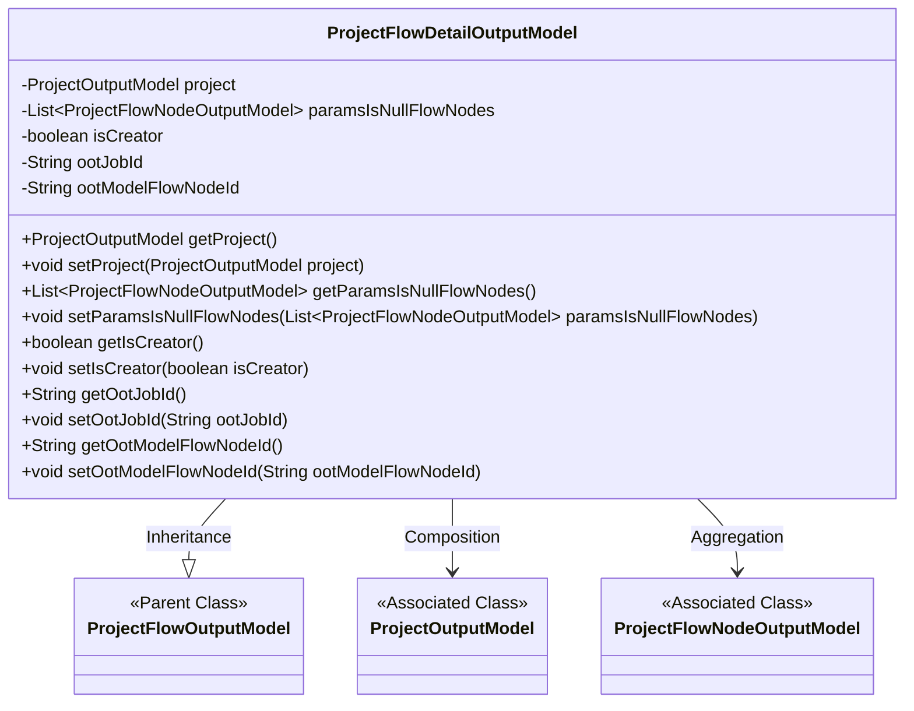

# Basic Information

|      |      |
|------|------|
| Name | ProjectFlowDetailOutputModel |
| Language | .java |
| Code Path | WeFe/board/board-service/src/main/java/com/welab/wefe/board/service/dto/entity/project/ProjectFlowDetailOutputModel.java |
| Package Name | com.welab.wefe.board.service.dto.entity.project |
| Dependencies | ['com.welab.wefe.board.service.dto.entity.job.ProjectFlowNodeOutputModel', 'com.welab.wefe.common.fieldvalidate.annotation.Check', 'java.util.List'] |
| Brief Description | The ProjectFlowDetailOutputModel extends the ProjectFlowOutputModel, containing project information, a list of empty parameter nodes, creator identification, and OOT task and model node IDs. It provides getter and setter methods for each field. |

# Description

The ProjectFlowDetailOutputModel class inherits from ProjectFlowOutputModel and includes project information, a list of flow nodes with empty parameters, creator identification, and OOT-related fields. Specific attributes include project (project model), paramsIsNullFlowNodes (list of nodes with empty parameters), isCreator (whether the creator), ootJobId (OOT job ID), and ootModelFlowNodeId (OOT model node ID). Getter and setter methods are provided for each attribute.

# Class Summary

| Name   | Type  | Description |
|-------|------|-------------|
| ProjectFlowDetailOutputModel | class | The ProjectFlowDetailOutputModel class extends ProjectFlowOutputModel, containing project information, a list of empty parameter nodes, creator identifier, and OOT task and model node IDs. It provides getter and setter methods for each field. |

## Class ProjectFlowDetailOutputModel

|      |      |
|------|------|
| Access Modifier | public |
| Type | class |
| Name | ProjectFlowDetailOutputModel |
| Description | The ProjectFlowDetailOutputModel class extends ProjectFlowOutputModel, containing project information, a list of empty parameter nodes, creator identifier, and OOT task and model node IDs. It provides getter and setter methods for each field. |

### UML Class Diagram

Class Diagram Description: ProjectFlowDetailOutputModel inherits from ProjectFlowOutputModel, containing a ProjectOutputModel object and a list of ProjectFlowNodeOutputModel to manage detailed project flow information. The class stores project data, null-parameter node lists, creator flag, and OOT-related IDs through private fields, with corresponding getter/setter methods provided. Dependency relationships with associated classes are represented via aggregation and composition.

### Internal Method Call Graph

```mermaid
graph TD
    A["Class ProjectFlowDetailOutputModel"]
    B["Inherits from: ProjectFlowOutputModel"]
    C["Property: ProjectOutputModel project"]
    D["Property: List<ProjectFlowNodeOutputModel> paramsIsNullFlowNodes"]
    E["Property: boolean isCreator"]
    F["Property: @Check String ootJobId"]
    G["Property: @Check String ootModelFlowNodeId"]
    H["Method: getProject()"]
    I["Method: setProject(ProjectOutputModel)"]
    J["Method: getParamsIsNullFlowNodes()"]
    K["Method: setParamsIsNullFlowNodes(List<ProjectFlowNodeOutputModel>)"]
    L["Method: getIsCreator()"]
    M["Method: setIsCreator(boolean)"]
    N["Method: getOotJobId()"]
    O["Method: setOotJobId(String)"]
    P["Method: getOotModelFlowNodeId()"]
    Q["Method: setOotModelFlowNodeId(String)"]

    A --> B
    A --> C
    A --> D
    A --> E
    A --> F
    A --> G
    A --> H
    A --> I
    A --> J
    A --> K
    A --> L
    A --> M
    A --> N
    A --> O
    A --> P
    A --> Q
```

This flowchart illustrates the complete structure of the ProjectFlowDetailOutputModel class, including its inheritance relationship, property declarations, and method definitions. The class inherits from ProjectFlowOutputModel and contains five core properties (two annotated with @Check), with standard getter/setter methods provided for each property. The properties encompass a project model, a list of flow nodes, a creator identifier, and two OOT-related ID fields, demonstrating encapsulation capabilities for detailed project flow data. All methods adhere to the single responsibility principle, focusing solely on property operations.

### Field List

| Name  | Type  | Description |
|-------|-------|------|
| paramsIsNullFlowNodes | List<ProjectFlowNodeOutputModel> | The private variable `paramsIsNullFlowNodes`, which is a list of type `ProjectFlowNodeOutputModel`. |
| project | ProjectOutputModel | Private project output model instance. |
| ootModelFlowNodeId | String | The model ID field being checked, labeled as "OOT model ID". |
| ootJobId | String | The task ID field being oot, with the variable name as ootJobId. |
| isCreator | boolean | The variable `isCreator` indicates whether it is the creator, of boolean type. |

### Method List

| Name  | Type  | Description |
|-------|-------|------|
| getOotModelFlowNodeId | String | This is a Java method that returns the value of the string variable ootModelFlowNodeId. |
| setIsCreator | void | Boolean method to determine if it is the creator. |
| setOotJobId | void | Java Method: Set the value of the ootJobId property. |
| setParamsIsNullFlowNodes | void | List of process nodes with empty parameter settings. |
| setProject | void | The method to set the project object assigns the passed ProjectOutputModel to the project property of the current object. |
| getOotJobId | String | This is a Java method that returns the ootJobId value of string type. |
| getProject | ProjectOutputModel | Methods to Obtain Project Output Models. |
| setOotModelFlowNodeId | void | The method to set the OOT model flow node ID involves assigning the parameter to the class member variable `ootModelFlowNodeId`. |
| getParamsIsNullFlowNodes | List<ProjectFlowNodeOutputModel> | Get the list of process nodes with empty parameters. |
| getIsCreator | boolean | The method getIsCreator returns a boolean value isCreator, indicating whether it is the creator. |

