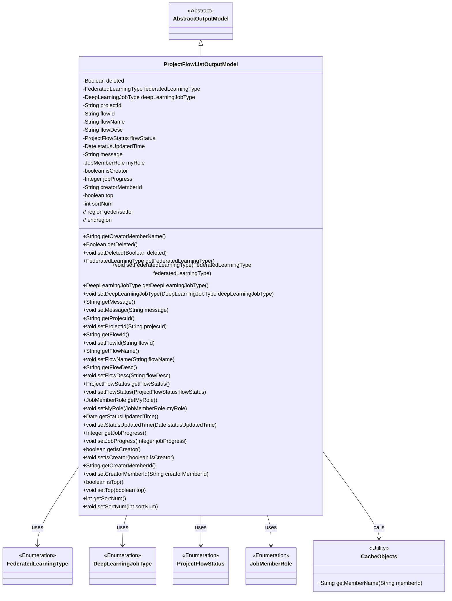

# Basic Information

|      |      |
|------|------|
| Name | ProjectFlowListOutputModel |
| Language | .java |
| Code Path | WeFe/board/board-service/src/main/java/com/welab/wefe/board/service/dto/entity/project/ProjectFlowListOutputModel.java |
| Package Name | com.welab.wefe.board.service.dto.entity.project |
| Dependencies | ['com.welab.wefe.board.service.dto.entity.AbstractOutputModel', 'com.welab.wefe.board.service.service.CacheObjects', 'com.welab.wefe.common.fieldvalidate.annotation.Check', 'com.welab.wefe.common.wefe.enums.DeepLearningJobType', 'com.welab.wefe.common.wefe.enums.FederatedLearningType', 'com.welab.wefe.common.wefe.enums.JobMemberRole', 'com.welab.wefe.common.wefe.enums.ProjectFlowStatus', 'java.util.Date'] |
| Brief Description | The ProjectFlowListOutputModel class contains detailed information about project workflows, such as attributes like ID, name, status, progress, creator, role, type, and their corresponding getter/setter methods. |

# Description

The `ProjectFlowListOutputModel` class is an output model that inherits from `AbstractOutputModel`, designed to represent information related to project flow lists. This class includes multiple attributes such as deletion status, federated learning type, deep learning task type, project ID, flow ID, flow name, flow description, flow status, status update time, message, our role, whether it is the creator, task progress, creator member ID, pinned status, and sort order. Each attribute has corresponding getter and setter methods for easy access and modification. Additionally, it provides a method `getCreatorMemberName` to retrieve the creator member's name. This class is primarily used to encapsulate detailed information about project flow lists, facilitating its transfer and processing within the system.

# Class Summary

| Name   | Type  | Description |
|-------|------|-------------|
| ProjectFlowListOutputModel | class | The ProjectFlowListOutputModel class contains attributes such as flow ID, name, status, type, progress, and creator, which are used to manage federated learning project flow information. |

## Class ProjectFlowListOutputModel

|      |      |
|------|------|
| Access Modifier | public |
| Type | class |
| Name | ProjectFlowListOutputModel |
| Description | The ProjectFlowListOutputModel class contains attributes such as flow ID, name, status, type, progress, and creator, which are used to manage federated learning project flow information. |

### UML Class Diagram

Class Diagram Description: ProjectFlowListOutputModel inherits from AbstractOutputModel and contains multiple private fields with corresponding getter/setter methods, representing the output model for a project flow list. This class utilizes several enumeration types (FederatedLearningType, DeepLearningJobType, etc.) to define specific field types and retrieves member names via the CacheObjects utility class. The model primarily encapsulates project flow-related information, including attributes such as status, roles, progress, etc.

### Internal Method Call Graph

```mermaid
graph TD
    A["Class ProjectFlowListOutputModel"]
    B["Inheritance: AbstractOutputModel"]
    C["Property: Boolean deleted"]
    D["Property: FederatedLearningType federatedLearningType"]
    E["Property: DeepLearningJobType deepLearningJobType"]
    F["Property: String projectId"]
    G["Property: String flowId"]
    H["Property: String flowName"]
    I["Property: String flowDesc"]
    J["Property: ProjectFlowStatus flowStatus"]
    K["Property: Date statusUpdatedTime"]
    L["Property: String message"]
    M["Property: JobMemberRole myRole"]
    N["Property: boolean isCreator"]
    O["Property: Integer jobProgress"]
    P["Property: String creatorMemberId"]
    Q["Property: boolean top"]
    R["Property: int sortNum"]
    S["Method: String getCreatorMemberName()"]
    T["Method: 28 getter/setter methods"]

    A --> B
    A --> C
    A --> D
    A --> E
    A --> F
    A --> G
    A --> H
    A --> I
    A --> J
    A --> K
    A --> L
    A --> M
    A --> N
    A --> O
    A --> P
    A --> Q
    A --> R
    A --> S
    A -.-> T
```

This flowchart illustrates the complete structure of the ProjectFlowListOutputModel class, including inheritance relationships, 15 annotated property fields, 1 custom method getCreatorMemberName(), and 28 auto-generated getter/setter methods. All properties are annotated with @Check for parameter validation, covering business-critical fields such as federated learning type, deep learning task type, and flow status. The class inherits from AbstractOutputModel, with its clear overall structure reflecting the data model design for federated learning project management workflows.

### Field List

| Name  | Type  | Description |
|-------|-------|------|
| myRole | JobMemberRole | Define a private variable `myRole`, and use the `@Check` annotation to validate the role attribute, restricting it to our own roles. |
| top | boolean | The class member variable `top`, of boolean type, is used to mark whether it is pinned to the top, annotated with the `@Check` annotation. |
| flowName | String | The code defines a private string variable `flowName` and marks the process name check with the `@Check` annotation. |
| message | String | private String variable message |
| statusUpdatedTime | Date | The private date-type variable `statusUpdatedTime` is used to record the status update time. |
| flowId | String | Define the process ID field and validate the name using the @Check annotation. |
| sortNum | int | The class member variable `sortNum`, used for sorting, is annotated with `@Check`. |
| jobProgress | Integer | The private integer field jobProgress, used to mark task progress, annotated with @Check. |
| deleted | Boolean | The field `deleted` is marked with the `@Check` annotation to verify whether it has been deleted. |
| isCreator | boolean | The field `isCreator` is used to check whether the user is the creator, annotated as `@Check`. |
| flowStatus | ProjectFlowStatus | Check the private variable `flowStatus` for the flow state, of type `ProjectFlowStatus`. |
| flowDesc | String | The private class field `flowDesc`, used to store process descriptions, is annotated with `@Check`. |
| deepLearningJobType | DeepLearningJobType | Deep learning task type field, used to identify tasks such as object detection or image classification. |
| federatedLearningType | FederatedLearningType | Check the private variable federatedLearningType for the federated task type (horizontal/vertical). |
| creatorMemberId | String | Define a private variable of string type for the process creator ID, validated via the @Check annotation. |
| projectId | String | Define a private String variable projectId, and validate the project ID using the @Check annotation. |

### Method List

| Name  | Type  | Description |
|-------|-------|------|
| setFlowDesc | void | The method for setting the flow description assigns the input parameter to the class variable flowDesc. |
| getDeepLearningJobType | DeepLearningJobType | Methods to obtain the current deep learning task type, with the return value being a DeepLearningJobType object. |
| getCreatorMemberName | String | Method to get creator member name, which queries and returns the name based on member ID through the cache object. |
| getProjectId | String | Methods to obtain the project ID, returning a string-type projectId. |
| setMessage | void | This is a Java method used to set the value of the message attribute of a class. The method takes a string parameter named message and assigns it to the member variable of the same name in the class. |
| getCreatorMemberId | String | Methods to obtain the creator member ID, returns a string-type creatorMemberId. |
| setProjectId | void | A public method `setProjectId` is defined to set the `projectId` property of the class. The parameter is of string type `projectId`. |
| setJobProgress | void | This is a Java method used to set the task progress value. The method takes an integer parameter jobProgress and assigns it to the class member variable of the same name. |
| getFlowId | String | Public method to obtain the flowId, returns the flowId as a string. |
| getFlowStatus | ProjectFlowStatus | Methods to obtain the current project workflow status, returning the `flowStatus` value. |
| getDeleted | Boolean | The method returns a boolean value `deleted`, indicating whether it has been deleted. |
| getJobProgress | Integer | Methods to obtain task progress, returns an integer value jobProgress. |
| getMyRole | JobMemberRole | Get the role information of the current user. |
| setStatusUpdatedTime | void | The method for setting the status update time assigns the passed date parameter to the object's statusUpdatedTime property. |
| getFlowDesc | String | The method getFlowDesc returns the value of the string flowDesc. |
| setCreatorMemberId | void | The method to set the creator member ID assigns the parameter value to the class member variable `creatorMemberId`. |
| isTop | boolean | This is a Java method that returns the state of the boolean value top. |
| setTop | void | Public method for setting the object's pinned status, with a boolean parameter 'top' to update the object's top property. |
| getSortNum | int | This is a Java method that returns the value of the integer variable sortNum. |
| setSortNum | void | This is a Java method used to set the sortNum property value of a class. The method takes an integer parameter sortNum and assigns it to the member variable of the same name in the class. |
| getIsCreator | boolean | The method returns a boolean value isCreator, indicating whether it is the creator. |
| getStatusUpdatedTime | Date | Method to obtain the status update time, returns the value of the statusUpdatedTime variable. |
| setFederatedLearningType | void | The method to set the federated learning type, with the parameter of type FederatedLearningType, assigns the value to the member variable federatedLearningType. |
| setDeepLearningJobType | void | The method for setting the deep learning task type, with the parameter being of type DeepLearningJobType. |
| getFederatedLearningType | FederatedLearningType | Methods to obtain the federated learning type, returns the federatedLearningType value. |
| getFlowName | String | Methods to obtain the flow name, returning the string flowName. |
| setFlowId | void | Method for setting the flow ID: Assign the passed flowId to the flowId property of the current object. |
| setIsCreator | void | Method to set whether it is the creator, with a boolean parameter isCreator. |
| getMessage | String | Methods to obtain the message string. |
| setDeleted | void | Public method for setting the object's deletion status, with a boolean parameter 'deleted' to update the object's 'deleted' property. |
| setFlowStatus | void | Method to set the project flow status: Assign the input parameter flowStatus to the flowStatus property of the current object. |
| setMyRole | void | The method `setMyRole` is used to set the `myRole` property of the current object, with the parameter being of type `JobMemberRole`. |
| setFlowName | void | The method to set the flow name assigns the input parameter to the class variable flowName. |

