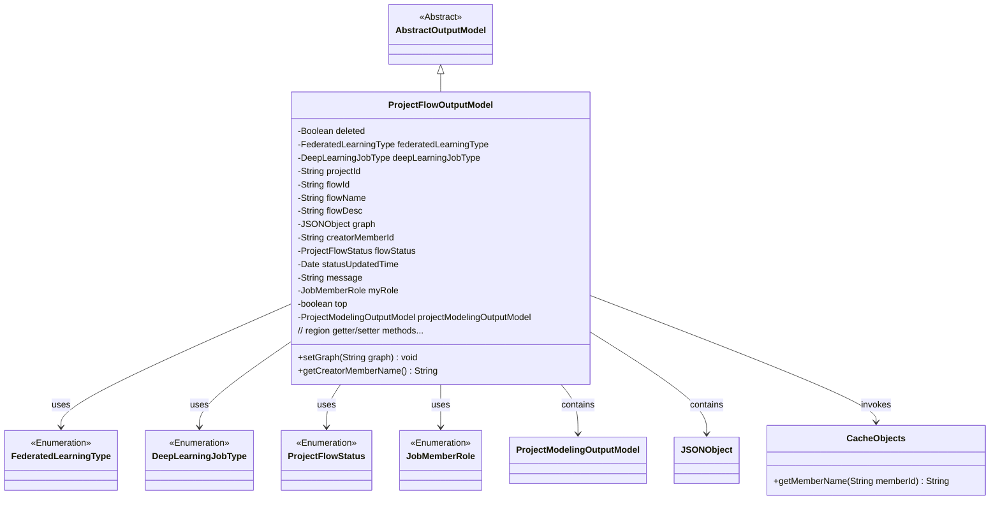

# Basic Information

|      |      |
|------|------|
| Name | ProjectFlowOutputModel |
| Language | .java |
| Code Path | WeFe/board/board-service/src/main/java/com/welab/wefe/board/service/dto/entity/project/ProjectFlowOutputModel.java |
| Package Name | com.welab.wefe.board.service.dto.entity.project |
| Dependencies | ['com.alibaba.fastjson.JSON', 'com.alibaba.fastjson.JSONObject', 'com.welab.wefe.board.service.dto.entity.AbstractOutputModel', 'com.welab.wefe.board.service.service.CacheObjects', 'com.welab.wefe.common.fieldvalidate.annotation.Check', 'com.welab.wefe.common.wefe.enums.DeepLearningJobType', 'com.welab.wefe.common.wefe.enums.FederatedLearningType', 'com.welab.wefe.common.wefe.enums.JobMemberRole', 'com.welab.wefe.common.wefe.enums.ProjectFlowStatus', 'java.util.Date'] |
| Brief Description | The ProjectFlowOutputModel class inherits from AbstractOutputModel and includes attributes such as flow ID, name, status, type, and creator, used for managing project flow data. |

# Description

The ProjectFlowOutputModel class inherits from AbstractOutputModel and is used to represent the output model of a project flow. This class includes multiple attributes such as deletion status, federated learning type, deep learning task type, project ID, flow ID, flow name, flow description, canvas editing diagram, creator member ID, etc. Each attribute is annotated with @Check to describe its purpose. Additionally, the class contains attributes like flow status, status update time, message, our role, whether it is pinned, and an attribute of type ProjectModelingOutputModel. The class provides getter and setter methods for all attributes, as well as a method to serialize strings into JSON objects.

# Class Summary

| Name   | Type  | Description |
|-------|------|-------------|
| ProjectFlowOutputModel | class | The ProjectFlowOutputModel class contains detailed information about the project flow, such as ID, name, status, type, creator, etc., and provides getter and setter methods for the relevant attributes. |

## Class ProjectFlowOutputModel

|      |      |
|------|------|
| Access Modifier | public |
| Type | class |
| Name | ProjectFlowOutputModel |
| Description | The ProjectFlowOutputModel class contains detailed information about the project flow, such as ID, name, status, type, creator, etc., and provides getter and setter methods for the relevant attributes. |

### UML Class Diagram

This code defines a project flow output model class `ProjectFlowOutputModel`, which inherits from the abstract base class `AbstractOutputModel`. The class contains multiple attribute fields to describe federated learning project flow information, including flow ID, name, status, type, etc. It utilizes several enumeration types (such as `FederatedLearningType`) and helper classes (such as `JSONObject`). Notably, the `graph` field implements string-to-JSON object conversion through the `setGraph` method, and the creator's name is obtained via `CacheObjects`. This class primarily encapsulates complete output data for project flows, incorporating various attributes required for business logic such as status tracking and permission control.

### Internal Method Call Graph

```mermaid
graph TD
    A["Class ProjectFlowOutputModel"]
    B["Inherits from: AbstractOutputModel"]
    C["Property: Boolean deleted"]
    D["Property: FederatedLearningType federatedLearningType"]
    E["Property: DeepLearningJobType deepLearningJobType"]
    F["Property: String projectId"]
    G["Property: String flowId"]
    H["Property: String flowName"]
    I["Property: String flowDesc"]
    J["Property: JSONObject graph"]
    K["Property: String creatorMemberId"]
    L["Property: ProjectFlowStatus flowStatus"]
    M["Property: Date statusUpdatedTime"]
    N["Property: String message"]
    O["Property: JobMemberRole myRole"]
    P["Property: boolean top"]
    Q["Property: ProjectModelingOutputModel projectModelingOutputModel"]
    R["Method: setGraph(String graph)"]
    S["Method: getCreatorMemberName()"]
    T["Getter/Setter Methods Section"]

    A --> B
    A --> C
    A --> D
    A --> E
    A --> F
    A --> G
    A --> H
    A --> I
    A --> J
    A --> K
    A --> L
    A --> M
    A --> N
    A --> O
    A --> P
    A --> Q
    A --> R
    A --> S
    A --> T
    R --> J
    S --> K
    T --> C
    T --> D
    T --> E
    T --> F
    T --> G
    T --> H
    T --> I
    T --> J
    T --> K
    T --> L
    T --> M
    T --> N
    T --> O
    T --> P
    T --> Q
```

This code defines a class named ProjectFlowOutputModel that inherits from AbstractOutputModel, primarily used for managing workflow output data in federated learning projects. The class contains multiple properties annotated with @Check for field validation, along with corresponding getter/setter methods. Core functionalities include processing JSON-formatted flowchart data (setGraph method) and retrieving member names via member IDs (getCreatorMemberName method). The class features a clear structure with property grouping and annotations to distinguish functional modules, making it suitable for encapsulating and transmitting workflow data in federated learning projects.

### Field List

| Name  | Type  | Description |
|-------|-------|------|
| message | String | Private string variable message |
| flowName | String | The code defines a private string variable `flowName`, annotated with `@Check` to mark the process name. |
| top | boolean | The private boolean variable `top` is used to check whether it is pinned to the top, with the annotation `@Check` marking its name as "Whether Pinned to Top". |
| creatorMemberId | String | Check the member ID field in the creation process |
| deepLearningJobType | DeepLearningJobType | Deep learning task type field, used to identify object detection or image classification. |
| projectId | String | The code defines a private string variable named projectId, and marks it with the @Check annotation as "Project ID". |
| federatedLearningType | FederatedLearningType | Check the private variable `federatedLearningType` for the federated task type (horizontal/vertical). |
| graph | JSONObject | The code defines a private JSONObject variable named `graph`, which is used to store the edited diagram data from the canvas, and it is validated using the `@Check` annotation. |
| projectModelingOutputModel | ProjectModelingOutputModel | Private project modeling output model instances. |
| flowStatus | ProjectFlowStatus | Check the private variable `flowStatus` for the process status, which is of type `ProjectFlowStatus`. |
| deleted | Boolean | The field `deleted` marks the deletion status and is validated using the `@Check` annotation. |
| flowDesc | String | The class private field `flowDesc`, used for process description, annotated with `@Check`. |
| statusUpdatedTime | Date | The private Date-type variable statusUpdatedTime records the status update time. |
| flowId | String | Define a private String variable flowId, annotated with @Check as the process ID. |
| myRole | JobMemberRole | Define a private variable myRole, annotated with @Check with the property name "Our Role" and the type JobMemberRole. |

### Method List

| Name  | Type  | Description |
|-------|-------|------|
| setCreatorMemberId | void | This is a Java method used to set the creator member ID, which assigns the passed string parameter to the class member variable `creatorMemberId`. |
| getProjectId | String | Methods to obtain the project ID, returning a string-type projectId. |
| setMyRole | void | This is a Java method used to set the myRole property of an object, with the parameter being of type JobMemberRole. The method assigns the passed value to the myRole field of the current object. |
| getStatusUpdatedTime | Date | Methods to obtain the status update time, returning the value of the statusUpdatedTime variable. |
| getFlowStatus | ProjectFlowStatus | Methods to obtain the current project workflow status, returning the flowStatus value. |
| getFlowId | String | The method to obtain the flowId directly returns the value of the member variable flowId. |
| getCreatorMemberId | String | This is a Java method that returns the creator member ID string. The method is named getCreatorMemberId, with a return type of String, and directly returns the value of the member variable creatorMemberId. |
| setFederatedLearningType | void | The method for setting the federated learning type, with the parameter of type FederatedLearningType, assigns the value to the member variable federatedLearningType. |
| setProjectModelingOutputModel | void | Set the method for modeling output models of the project, assigning the input parameters to the member variables of the class. |
| getProjectModelingOutputModel | ProjectModelingOutputModel | Methods for obtaining the project's modeling output models. |
| setFlowId | void | Method for setting the flow ID: Assign the parameter flowId to the flowId property of the current object. |
| getDeleted | Boolean | Get the boolean value method for object deletion status. |
| getFederatedLearningType | FederatedLearningType | The method returns a federated learning type object. |
| setDeleted | void | A public method to set the deletion status of an object, with a boolean parameter `deleted`. |
| setFlowDesc | void | This is a Java method used to set the value of the flow description property `flowDesc`. The method takes a string parameter `flowDesc` and assigns it to the class member variable of the same name. |
| getMyRole | JobMemberRole | The method getMyRole returns the myRole attribute of the current object, with the type being JobMemberRole. |
| setStatusUpdatedTime | void | The method for setting the status update time assigns the parameter to the object's statusUpdatedTime property. |
| setProjectId | void | This is a Java method used to set the projectId property value of a class. The method takes a string parameter projectId and assigns it to the class member variable of the same name. |
| setFlowName | void | The method for setting the flow name assigns the input parameter to the class variable flowName. |
| getCreatorMemberName | String | The method to obtain the creator member name, which returns the name based on the member ID through a cache object. |
| getDeepLearningJobType | DeepLearningJobType | Methods to obtain the current deep learning task type, with the return value being a DeepLearningJobType object. |
| setGraph | void | The method `setGraph` accepts a string parameter `graph`, and when it is not empty, parses it into a JSON object and assigns it to the member variable `graph`. |
| getFlowDesc | String | The method getFlowDesc returns the value of the string flowDesc. |
| getMessage | String | Methods to obtain the message string. |
| setDeepLearningJobType | void | The method for setting the type of deep learning task, with the parameter being a DeepLearningJobType object. |
| getFlowName | String | Methods to obtain the flow name, returning the string flowName. |
| setMessage | void | Methods for setting message content, assigning the input string to the class member variable message. |
| getGraph | JSONObject | The method getGraph returns a graph object of type JSONObject. |
| setFlowStatus | void | Method to set the project flow status, assigning the input parameter to the member variable flowStatus. |
| isTop | boolean | This is a Java method that returns a boolean value `top`, indicating whether the object is in the top state. |
| setTop | void | A public method for setting the pinned status of an object, with a boolean parameter 'top' used to update the 'top' property of the current object. |

