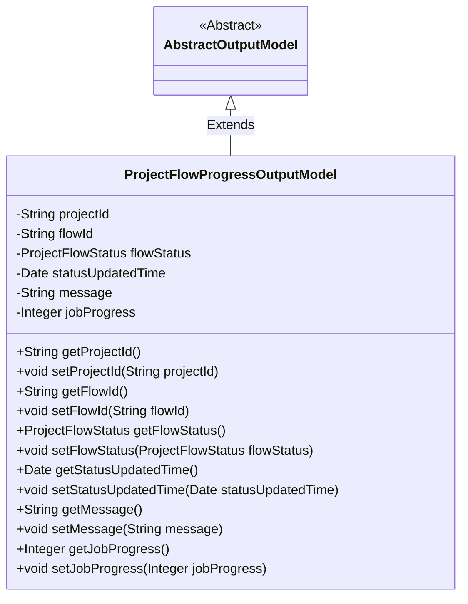

# Basic Information

|      |      |
|------|------|
| Name | ProjectFlowProgressOutputModel |
| Language | .java |
| Code Path | WeFe/board/board-service/src/main/java/com/welab/wefe/board/service/dto/entity/project/ProjectFlowProgressOutputModel.java |
| Package Name | com.welab.wefe.board.service.dto.entity.project |
| Dependencies | ['com.welab.wefe.board.service.dto.entity.AbstractOutputModel', 'com.welab.wefe.common.fieldvalidate.annotation.Check', 'com.welab.wefe.common.wefe.enums.ProjectFlowStatus', 'java.util.Date'] |
| Brief Description | Project process progress output model, including project ID, process ID, status, update time, message, and task progress fields along with their corresponding getter/setter methods. |

# Description

The ProjectFlowProgressOutputModel class inherits from AbstractOutputModel and is used to represent the project flow progress output model. It includes fields such as project ID, flow ID, flow status, status update time, message, and task progress, all of which provide getter and setter methods. The flow status uses the ProjectFlowStatus enum type, and some fields are validated via the @Check annotation.

# Class Summary

| Name   | Type  | Description |
|-------|------|-------------|
| ProjectFlowProgressOutputModel | class | The ProjectFlowProgressOutputModel class extends AbstractOutputModel and includes fields such as project ID, flow ID, status, update time, message, and task progress, along with their corresponding getter/setter methods. |

## Class ProjectFlowProgressOutputModel

|      |      |
|------|------|
| Access Modifier | public |
| Type | class |
| Name | ProjectFlowProgressOutputModel |
| Description | The ProjectFlowProgressOutputModel class extends AbstractOutputModel and includes fields such as project ID, flow ID, status, update time, message, and task progress, along with their corresponding getter/setter methods. |

### UML Class Diagram

This class diagram illustrates the structure where ProjectFlowProgressOutputModel inherits from the abstract class AbstractOutputModel. The ProjectFlowProgressOutputModel contains private fields such as project ID, flow ID, flow status, status update time, message, and job progress, along with public getter and setter methods for each field. These fields are validated via the @Check annotation, indicating that this is a model class designed for outputting project flow progress information, primarily used to encapsulate and transmit project flow status data.

### Internal Method Call Graph

```mermaid
graph TD
    A["Class ProjectFlowProgressOutputModel"]
    B["Inherits: AbstractOutputModel"]
    C["Property: String projectId '@Check'"]
    D["Property: String flowId '@Check'"]
    E["Property: ProjectFlowStatus flowStatus '@Check'"]
    F["Property: Date statusUpdatedTime"]
    G["Property: String message"]
    H["Property: Integer jobProgress '@Check'"]
    I["Method: getProjectId()"]
    J["Method: setProjectId()"]
    K["Method: getFlowId()"]
    L["Method: setFlowId()"]
    M["Method: getFlowStatus()"]
    N["Method: setFlowStatus()"]
    O["Method: getStatusUpdatedTime()"]
    P["Method: setStatusUpdatedTime()"]
    Q["Method: getMessage()"]
    R["Method: setMessage()"]
    S["Method: getJobProgress()"]
    T["Method: setJobProgress()"]

    A --> B
    A --> C
    A --> D
    A --> E
    A --> F
    A --> G
    A --> H
    A --> I
    A --> J
    A --> K
    A --> L
    A --> M
    A --> N
    A --> O
    A --> P
    A --> Q
    A --> R
    A --> S
    A --> T
```

This code defines a class named ProjectFlowProgressOutputModel, which inherits from AbstractOutputModel and represents a project flow progress output model. The class contains multiple properties, including project ID, flow ID, flow status, status update time, message, and job progress, with some properties annotated with @Check. Each property has corresponding getter and setter methods for retrieving and setting property values. This class is primarily used to encapsulate project flow progress-related information, facilitating the transfer and processing of such data within the system.

### Field List

| Name  | Type  | Description |
|-------|-------|------|
| flowId | String | Define a private String variable flowId, and validate the process ID using the @Check annotation. |
| flowStatus | ProjectFlowStatus | Check the private variable `flowStatus` for the process state, which is of type `ProjectFlowStatus`. |
| statusUpdatedTime | Date | The private Date-type variable statusUpdatedTime records the status update time. |
| projectId | String | The code defines a private string variable named projectId and adds an annotation for project ID validation. |
| jobProgress | Integer | The class member variable `jobProgress`, used to mark task progress, is annotated with `@Check`. |
| message | String | Private string variable message. |

### Method List

| Name  | Type  | Description |
|-------|-------|------|
| getStatusUpdatedTime | Date | Method to get the status update time, returns the statusUpdatedTime variable. |
| getFlowId | String | Common method to obtain flowId, returns a string-type flowId. |
| getProjectId | String | Methods to obtain the project ID, returns a string-type projectId. |
| setFlowId | void | The method to set the flow ID involves assigning the parameter flowId to the flowId property of the current object. |
| getFlowStatus | ProjectFlowStatus | Methods to obtain the project flow status, returning the flowStatus value. |
| setStatusUpdatedTime | void | The method for setting the status update time assigns the parameter to the object's `statusUpdatedTime` property. |
| setFlowStatus | void | The method to set the project flow status assigns the incoming `flowStatus` to the `flowStatus` property of the current object. |
| setProjectId | void | Methods for setting the project ID: Assign the input parameter projectId to the projectId property of the current object. |
| getMessage | String | The method returns the value of the string message. |
| setMessage | void | Methods for setting the message attribute, assigning the parameter value to the message field of the current object. |
| getJobProgress | Integer | Methods to obtain task progress, returns an integer value. |
| setJobProgress | void | The method to set task progress, with an integer parameter jobProgress, is used to update the current task progress value. |

