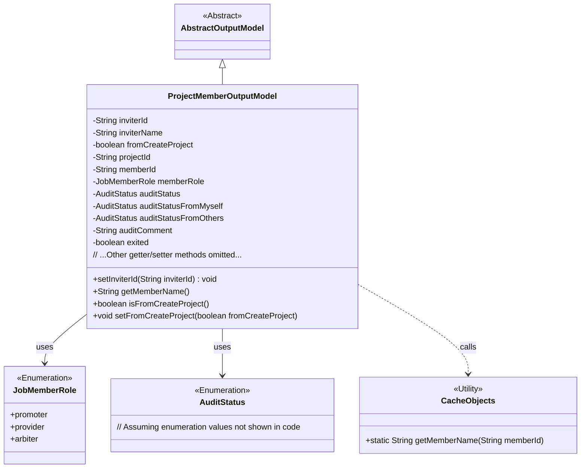

# Basic Information

|      |      |
|------|------|
| Name | ProjectMemberOutputModel |
| Language | .java |
| Code Path | WeFe/board/board-service/src/main/java/com/welab/wefe/board/service/dto/entity/project/ProjectMemberOutputModel.java |
| Package Name | com.welab.wefe.board.service.dto.entity.project |
| Dependencies | ['com.welab.wefe.board.service.dto.entity.AbstractOutputModel', 'com.welab.wefe.board.service.service.CacheObjects', 'com.welab.wefe.common.exception.StatusCodeWithException', 'com.welab.wefe.common.fieldvalidate.annotation.Check', 'com.welab.wefe.common.wefe.enums.AuditStatus', 'com.welab.wefe.common.wefe.enums.JobMemberRole'] |
| Brief Description | Project member output model class, including attributes such as member ID, role, review status, comments, and whether exited, providing relevant getter/setter methods. |

# Description

The ProjectMemberOutputModel class is used to describe project member information, including attributes such as member ID, role, and review status. Key fields consist of inviter member ID and name, whether the member is from project creation, associated project ID, member ID, task role (promoter/provider/arbiter), comprehensive review status, self-review status, peer-review status, review comments, and whether the member has exited. The class provides getter and setter methods for each attribute, where the setInviterId method synchronously sets the inviter's name. This class inherits from AbstractOutputModel and is designed for outputting project member-related data.

# Class Summary

| Name   | Type  | Description |
|-------|------|-------------|
| ProjectMemberOutputModel | class | The ProjectMemberOutputModel class contains project member information, such as inviter ID, name, member role, review status and comments, as well as attributes like whether they have exited. |

## Class ProjectMemberOutputModel

|      |      |
|------|------|
| Access Modifier | public |
| Type | class |
| Name | ProjectMemberOutputModel |
| Description | The ProjectMemberOutputModel class contains project member information, such as inviter ID, name, member role, review status and comments, as well as attributes like whether they have exited. |

### UML Class Diagram

Class diagram description: ProjectMemberOutputModel inherits from AbstractOutputModel and represents the project member output data model. It contains core attributes such as member ID, role, and audit status, with member roles defined by the JobMemberRole enumeration and audit status managed by AuditStatus. The model retrieves member names through the CacheObjects utility class, reflecting functionalities like invitation relationships, audit workflows, and status tracking in project member management. The class extensively uses @Check annotations for parameter validation to ensure data integrity.

### Internal Method Call Graph

```mermaid
graph TD
    A["Class ProjectMemberOutputModel"]
    B["Inherits: AbstractOutputModel"]
    C["Property: String inviterId"]
    D["Property: String inviterName"]
    E["Property: boolean fromCreateProject"]
    F["Property: String projectId"]
    G["Property: String memberId"]
    H["Property: JobMemberRole memberRole"]
    I["Property: AuditStatus auditStatus"]
    J["Property: AuditStatus auditStatusFromMyself"]
    K["Property: AuditStatus auditStatusFromOthers"]
    L["Property: String auditComment"]
    M["Property: boolean exited"]
    N["Method: setInviterId(String inviterId)"]
    O["Method: getMemberName()"]
    P["Method: isFromCreateProject()"]
    Q["Method: setFromCreateProject(boolean)"]
    R["Method: setMemberId(String)"]
    S["Method: getAuditStatus()"]
    T["Method: setAuditStatus(AuditStatus)"]
    U["Method: getAuditStatusFromMyself()"]
    V["Method: setAuditStatusFromMyself(AuditStatus)"]
    W["Method: getAuditStatusFromOthers()"]
    X["Method: setAuditStatusFromOthers(AuditStatus)"]
    Y["Method: getAuditComment()"]
    Z["Method: setAuditComment(String)"]
    AA["Method: getInviterName()"]
    AB["Method: setInviterName(String)"]
    AC["Method: getInviterId()"]
    AD["Method: getProjectId()"]
    AE["Method: setProjectId(String)"]
    AF["Method: getMemberId()"]
    AG["Method: getMemberRole()"]
    AH["Method: setMemberRole(JobMemberRole)"]
    AI["Method: isExited()"]
    AJ["Method: setExited(boolean)"]

    A --> B
    A --> C
    A --> D
    A --> E
    A --> F
    A --> G
    A --> H
    A --> I
    A --> J
    A --> K
    A --> L
    A --> M
    A --> N
    A --> O
    A --> P
    A --> Q
    A --> R
    A --> S
    A --> T
    A --> U
    A --> V
    A --> W
    A --> X
    A --> Y
    A --> Z
    A --> AA
    A --> AB
    A --> AC
    A --> AD
    A --> AE
    A --> AF
    A --> AG
    A --> AH
    A --> AI
    A --> AJ
    N -->|Calls| D
    O -->|Calls| G
```

### Field List

| Name  | Type  | Description |
|-------|-------|------|
| auditComment | String | The private string variable `auditComment` is used to store audit comments, annotated with `@Check`. |
| auditStatus | AuditStatus | The class member variable `auditStatus`, labeled as the comprehensive audit result, is of type `AuditStatus`. |
| fromCreateProject | boolean | The field `fromCreateProject` indicates whether the project was added during initialization, which affects the approval process. |
| memberId | String | Member ID Validation Annotation |
| auditStatusFromOthers | AuditStatus | The private variable `auditStatusFromOthers` is used to check whether others have agreed, with the type `AuditStatus`. |
| inviterName | String | The field inviterName is used to store the name of the inviting member and is validated using the @Check annotation. |
| projectId | String | The field projectId is labeled as the primary key of the associated project, used to validate the project ID. |
| exited = false | boolean | The private boolean variable `exited` marks the exit status, defaulting to false, with a check annotation. |
| inviterId | String | The field inviterId is used to identify the inviting member and must be validated as non-null. |
| auditStatusFromMyself | AuditStatus | The field `auditStatusFromMyself` is used to record the audit status by oneself, validated via the `@Check` annotation to determine approval. |
| memberRole | JobMemberRole | Check task roles, enumeration types: promoter/provider/arbiter. |

### Method List

| Name  | Type  | Description |
|-------|-------|------|
| getAuditStatusFromMyself | AuditStatus | Get the audit status of the current object. |
| setInviterId | void | Set the inviter ID and update their name, throwing an exception if it fails. |
| setFromCreateProject | void | Boolean value indicating whether the method settings are from project creation. |
| setAuditComment | void | The method for setting review comments assigns the input parameter to the `auditComment` property of the class. |
| setInviterName | void | The method to set the inviter's name assigns the parameter value to the class member variable inviterName. |
| getMemberName | String | Methods for obtaining member names, querying and returning names from the cache using member IDs. |
| getAuditStatusFromOthers | AuditStatus | The method getAuditStatusFromOthers returns the value of auditStatusFromOthers. |
| getInviterName | String | The method to obtain the inviter's name, which returns a string-type variable `inviterName`. |
| getAuditStatus | AuditStatus | Methods to obtain the review status, returns the value of the auditStatus property. |
| setAuditStatusFromOthers | void | Set the audit status from other parties, assigning the incoming parameter to the member variable `auditStatusFromOthers`. |
| setMemberId | void | The method to set the member ID assigns the passed string parameter to the class's member variable memberId. |
| isFromCreateProject | boolean | This is a Java method that returns a boolean value indicating whether it is from creating a project. |
| setAuditStatus | void | The method `setAuditStatus` is used to set the value of the `auditStatus` property. |
| setAuditStatusFromMyself | void | Methods for setting self-audit status, with parameters of type AuditStatus. |
| getInviterId | String | Methods to obtain the inviter ID, returns a string-type inviterId. |
| getProjectId | String | Methods to obtain the project ID, returns the projectId as a string. |
| setProjectId | void | The method to set the project ID involves assigning the input parameter projectId to the class member variable projectId. |
| getMemberId | String | The method to obtain the member ID, which returns a string-type memberId. |
| getMemberRole | JobMemberRole | Method to obtain member roles, returns a member role object. |
| setMemberRole | void | This is a Java method used to set the member role attribute. The method is named `setMemberRole`, which accepts a parameter of type `JobMemberRole` named `memberRole`, and assigns it to the member variable `memberRole` of the current object. |
| isExited | boolean | The method isExited returns the state of the boolean exited. |
| setExited | void | Boolean method to set exit status. |
| getAuditComment | String | Method to obtain audit comments, returns the auditComment string. |

