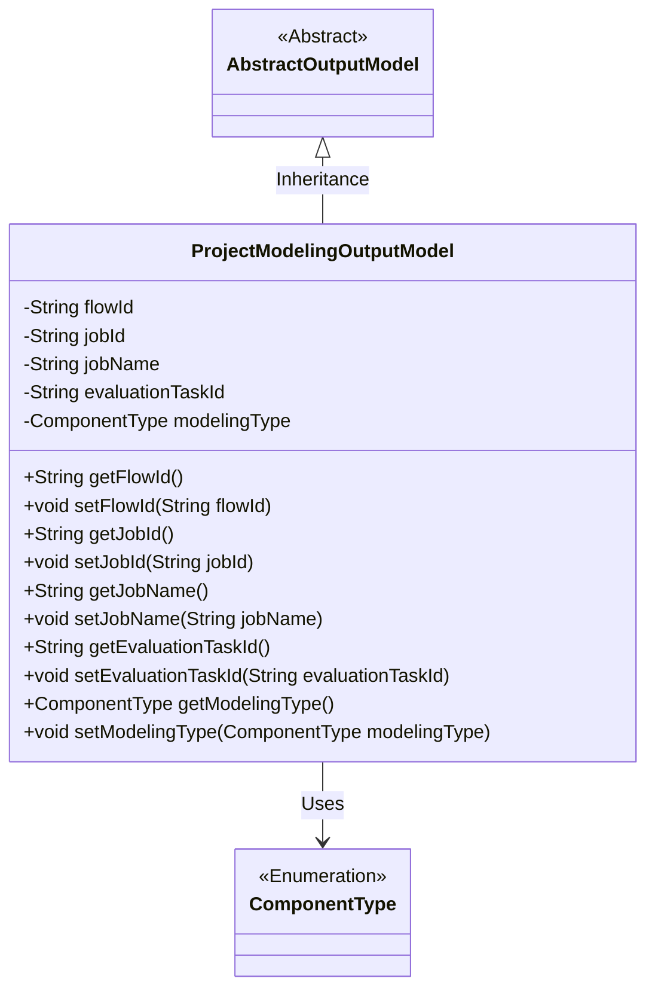

# Basic Information

|      |      |
|------|------|
| Name | ProjectModelingOutputModel |
| Language | .java |
| Code Path | WeFe/board/board-service/src/main/java/com/welab/wefe/board/service/dto/entity/project/ProjectModelingOutputModel.java |
| Package Name | com.welab.wefe.board.service.dto.entity.project |
| Dependencies | ['com.welab.wefe.board.service.dto.entity.AbstractOutputModel', 'com.welab.wefe.common.fieldvalidate.annotation.Check', 'com.welab.wefe.common.wefe.enums.ComponentType'] |
| Brief Description | The ProjectModelingOutputModel class inherits from AbstractOutputModel and contains fields for process ID, job_id, job name, model evaluation task ID, and model type, along with their corresponding getter/setter methods. |

# Description

The `ProjectModelingOutputModel` class inherits from `AbstractOutputModel` and contains five main attributes: flow ID (`flowId`), job ID (`jobId`), job name (`jobName`), model evaluation task ID (`evaluationTaskId`), and modeling type (`modelingType`). Each attribute has corresponding getter and setter methods and is marked with validation annotations via `@Check`. This class is used to encapsulate data related to project modeling output.

# Class Summary

| Name   | Type  | Description |
|-------|------|-------------|
| ProjectModelingOutputModel | class | The ProjectModelingOutputModel class inherits from AbstractOutputModel and includes fields such as process ID, job_id, job name, model evaluation task ID, and model type, along with their corresponding getter/setter methods. |

## Class ProjectModelingOutputModel

|      |      |
|------|------|
| Access Modifier | public |
| Type | class |
| Name | ProjectModelingOutputModel |
| Description | The ProjectModelingOutputModel class inherits from AbstractOutputModel and includes fields such as process ID, job_id, job name, model evaluation task ID, and model type, along with their corresponding getter/setter methods. |

### UML Class Diagram

This class diagram illustrates that ProjectModelingOutputModel inherits from AbstractOutputModel and contains five private fields with their corresponding getter/setter methods. The modelingType field utilizes the ComponentType enumeration, reflecting constraints on model type selection. All fields are annotated with @Check, indicating validation requirements in business logic. The overall structure clearly demonstrates the encapsulation and validation needs for project modeling output data.

### Internal Method Call Graph

```mermaid
graph TD
    A["Class ProjectModelingOutputModel"]
    B["Inherits from: AbstractOutputModel"]
    C["Annotated property: @Check String flowId"]
    D["Annotated property: @Check String jobId"]
    E["Annotated property: @Check String jobName"]
    F["Annotated property: @Check String evaluationTaskId"]
    G["Annotated property: @Check ComponentType modelingType"]
    H["Method: getFlowId()/setFlowId()"]
    I["Method: getJobId()/setJobId()"]
    J["Method: getJobName()/setJobName()"]
    K["Method: getEvaluationTaskId()/setEvaluationTaskId()"]
    L["Method: getModelingType()/setModelingType()"]

    A --> B
    A --> C
    A --> D
    A --> E
    A --> F
    A --> G
    A --> H
    A --> I
    A --> J
    A --> K
    A --> L
```

This flowchart illustrates the complete structure of the ProjectModelingOutputModel class, including 5 properties annotated with @Check and their corresponding getter/setter methods. The class inherits from AbstractOutputModel and is primarily used to store modeling workflow-related output data, encompassing core fields such as flow ID, job ID, job name, evaluation task ID, and modeling type. Each property is validated through annotations and accessed via standard JavaBean accessor methods.

### Field List

| Name  | Type  | Description |
|-------|-------|------|
| jobName | String | The code defines a private string variable named jobName, which is annotated with @Check. The annotation parameter "name" has a value of "job name". |
| evaluationTaskId | String | Model evaluation task ID field, used to identify the evaluation task. |
| modelingType | ComponentType | Define a private variable modelingType, and use the @Check annotation to validate the model type. |
| jobId | String | Define a private String jobId, and use the @Check annotation to validate the field named job_id. |
| flowId | String | Define a private String variable flowId, annotated with @Check as the process ID. |

### Method List

| Name  | Type  | Description |
|-------|-------|------|
| setModelingType | void | The method `setModelingType` is used to set the modeling type of a component, with the parameter being of type `ComponentType`, which is assigned to the member variable `modelingType`. |
| setEvaluationTaskId | void | Method for setting the evaluation task ID, which assigns the parameter evaluationTaskId to the property of the same name in the current object. |
| setJobId | void | Methods for setting the task ID: Assign the parameter `jobId` to the `jobId` property of the current object. |
| getModelingType | ComponentType | Get the modeling type of the current component. |
| getJobName | String | The method returns the jobName string. |
| getFlowId | String | Methods to obtain the current flow ID, which returns a string-type flowId. |
| getEvaluationTaskId | String | Methods to obtain the evaluation task ID, which returns a string-type `evaluationTaskId`. |
| setFlowId | void | The method for setting the flow ID assigns the input parameter flowId to the flowId property of the current object. |
| setJobName | void | Define the method `setJobName` to set the value of the `jobName` property. The parameter is of type `String`. |
| getJobId | String | Get the unique identifier jobId of the current task. |

