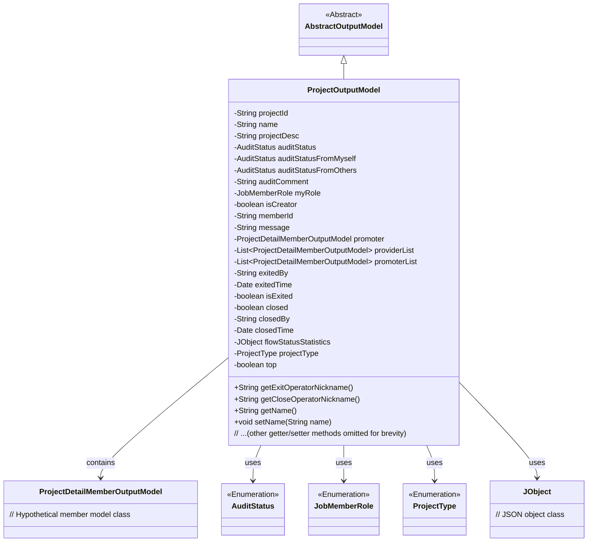

# Basic Information

|      |      |
|------|------|
| Name | ProjectOutputModel |
| Language | .java |
| Code Path | WeFe/board/board-service/src/main/java/com/welab/wefe/board/service/dto/entity/project/ProjectOutputModel.java |
| Package Name | com.welab.wefe.board.service.dto.entity.project |
| Dependencies | ['com.welab.wefe.board.service.dto.entity.AbstractOutputModel', 'com.welab.wefe.board.service.service.CacheObjects', 'com.welab.wefe.common.fieldvalidate.annotation.Check', 'com.welab.wefe.common.util.JObject', 'com.welab.wefe.common.wefe.enums.AuditStatus', 'com.welab.wefe.common.wefe.enums.JobMemberRole', 'com.welab.wefe.common.wefe.enums.ProjectType', 'java.util.Date', 'java.util.List'] |
| Brief Description | The ProjectOutputModel class includes attributes such as project ID, name, description, review status, member role, creator identifier, exit status, and close status, which are used to manage project information and operation records. |

# Description

The ProjectOutputModel class is a project output model that inherits from AbstractOutputModel. It includes attributes such as project ID, name, description, review status (covering both self and others' review statuses), review comments, member roles, creator identifier, member IDs, message notes, and more. Additionally, it contains member information like initiators, supplier lists, and initiator lists. The class provides attributes related to project exit and closure, such as operator, time, and status identifiers. It also encompasses extended attributes like project type and pinning identifier. All attributes are equipped with getter and setter methods, with some attributes validated through annotations.

# Class Summary

| Name   | Type  | Description |
|-------|------|-------------|
| ProjectOutputModel | class | The project output model class includes fields and corresponding methods such as project ID, name, description, review status, member roles, creator identifier, exit/closure information, project type, and pinned flag. |

## Class ProjectOutputModel

|      |      |
|------|------|
| Access Modifier | public |
| Type | class |
| Name | ProjectOutputModel |
| Description | The project output model class includes fields and corresponding methods such as project ID, name, description, review status, member roles, creator identifier, exit/closure information, project type, and pinned flag. |

### UML Class Diagram

Class diagram description: ProjectOutputModel inherits from AbstractOutputModel and contains attributes such as basic project information, audit statuses, member roles, and operation records. Enumeration classes manage status types, while the association with ProjectDetailMemberOutputModel represents member information. JObject is used for flow statistics processing. The overall structure demonstrates the data organization and relationships of the project output model, reflecting the core fields and status control mechanisms of project management.

### Internal Method Call Graph

### Field List

| Name  | Type  | Description |
|-------|-------|------|
| projectId | String | Define a private String variable projectId, and validate the project ID using the @Check annotation. |
| promoter | ProjectDetailMemberOutputModel | Project Details Member Output Model - Sponsor Field. |
| memberId | String | The code defines a private string variable memberId, with a validation annotation marked with the parameter name as "Our Member ID". |
| closed = false | boolean | The private boolean variable "closed" is initially set to false, used to check whether it has been closed. |
| projectDesc | String | The class member variable projectDesc is annotated with @Check as "Project Description". |
| closedBy | String | The field `closedBy` is marked as a checklist item, used to record the name of the operator who closed the project. |
| isCreator | boolean | Private boolean variable isCreator, used to check if it is the creator, annotated with @Check. |
| auditComment | String | Define a private string variable auditComment to store audit comments, annotated with @Check. |
| name | String | The code defines a private string variable named "name" and marks it with the @Check annotation, specifying its display name as "Name". |
| top | boolean | The class member variable `top`, of boolean type, is used to check whether it is pinned to the top, with the annotation `@Check` marking its name as "Whether Pinned to Top". |
| myRole | JobMemberRole | The annotation @Check validates the myRole field, restricting it to our identity enum values (promoter/provider). |
| isExited | boolean | The boolean variable `isExited` checks whether a member has exited the project. |
| auditStatus | AuditStatus | The private audit state variable `auditStatus`. |
| exitedTime | Date | The field `exitedTime` is labeled as the exit time check item, with the type `Date`. |
| projectType | ProjectType | The code defines a private variable `projectType`, annotated with `@Check` to validate the project type. |
| providerList | List<ProjectDetailMemberOutputModel> | The private member variable providerList, which is a list of type ProjectDetailMemberOutputModel. |
| auditStatusFromMyself | AuditStatus | The field `auditStatusFromMyself` is used to record the audit status by oneself, marked with the `@Check` annotation to verify whether approval is granted. |
| promoterList | List<ProjectDetailMemberOutputModel> | The private member variable promoterList, which is a list of type ProjectDetailMemberOutputModel. |
| auditStatusFromOthers | AuditStatus | The field `auditStatusFromOthers` is used to record whether others agree, marked with the `@Check` annotation. |
| exitedBy | String | The operator field for exiting the project is marked with the @Check annotation. |
| closedTime | Date | The field `closedTime` is annotated with `@Check`, with the check item named "Closing Time". |
| flowStatusStatistics | JObject | The private variable `flowStatusStatistics`, of type `JObject`. |
| message | String | Message remark field, stores failure reasons or remark information. |

### Method List

| Name  | Type  | Description |
|-------|-------|------|
| getPromoter | ProjectDetailMemberOutputModel | Public method to obtain project sponsor information, returns an object of type ProjectDetailMemberOutputModel. |
| setAuditStatus | void | The method `setAuditStatus` is used to set the value of the `auditStatus` property, with the parameter being of type `AuditStatus`. |
| getExitOperatorNickname | String | Method to retrieve the nickname of the operator who exited, returning the nickname corresponding to exitedBy via the cache object. |
| getProjectId | String | Methods to obtain the project ID, which returns the projectId as a string. |
| getClosedTime | Date | Methods to obtain the closing time, returns the closedTime value. |
| setClosed | void | Method to set the closed state of an object, where the parameter `closed` determines the state. |
| getMessage | String | This is a Java method that returns the value of the string-type message variable. |
| getClosedBy | String | Get the string value of the closedBy attribute. |
| getAuditStatus | AuditStatus | Methods to obtain the audit status, returns the value of the auditStatus variable. |
| setPromoter | void | The method `setPromoter` is used to set the project promoter, with the parameter being an object of type `ProjectDetailMemberOutputModel` named `promoter`. |
| setName | void | Methods for setting the object name, assigning the parameter `name` to the `name` property of the object. |
| setProviderList | void | Set the provider list with a parameter of type ProjectDetailMemberOutputModel list, and assign it to the member variable providerList. |
| setMemberId | void | The method to set the member ID assigns the input parameter memberId to the memberId property of the current object. |
| getAuditStatusFromMyself | AuditStatus | Get the current object's approval status. |
| setExitedTime | void | The method to set the exit time assigns the passed date parameter to the object's exitedTime property. |
| setAuditStatusFromOthers | void | Set the audit status from other parties by assigning the incoming auditStatusFromOthers to the corresponding property of the current object. |
| setMessage | void | Methods for setting message content, assigning the input string to the class member variable message. |
| setMyRole | void | This is a Java method used to set the myRole property of the current object, with the parameter being of type JobMemberRole. The method assigns the passed myRole to the object's property of the same name. |
| getIsExited | boolean | This is a Java method that returns a boolean value `isExited`, indicating whether it has exited. |
| setIsExited | void | Boolean method to set exit status. |
| getProjectType | ProjectType | Methods to obtain the current project type, returning the value of the projectType field. |
| setProjectType | void | The method for setting the project type assigns the input parameter to the `projectType` property of the class. |
| isTop | boolean | This is a Java method that returns a boolean value `top`, indicating whether the object is in the top state. |
| setTop | void | Method for setting the boolean value of an object's pinned status. |
| setProjectId | void | Defines a public method `setProjectId` for setting the value of the class member variable `projectId`. The parameter is of string type `projectId`. |
| setAuditComment | void | This is a Java method used to set the value of the auditComment property. The method takes a string parameter auditComment and assigns it to the class's member variable of the same name. |
| setAuditStatusFromMyself | void | Methods for setting self-audit status, with parameters of type AuditStatus. |
| getExitedTime | Date | Methods to obtain the exit time, returning the `exitedTime` variable. |
| setIsCreator | void | Method to set whether it is the creator, with a boolean parameter isCreator. |
| getIsCreator | boolean | This is a Java method that returns a boolean value isCreator, used to determine whether it is the creator. |
| getProviderList | List<ProjectDetailMemberOutputModel> | The method to obtain the supplier list returns a list of type ProjectDetailMemberOutputModel. |
| setPromoterList | void | This is a Java method used to set the project member list. The method takes a project member list parameter and assigns it to the class member variable promoterList. |
| setFlowStatusStatistics | void | The method converts the string parameter into a JObject and assigns it to the flowStatusStatistics variable. |
| setClosedTime | void | This is a Java method used to set the closedTime property of an object. It accepts a Date-type parameter closedTime and assigns it to the member variable this.closedTime. |
| getAuditStatusFromOthers | AuditStatus | Method to obtain external audit status, returns the auditStatusFromOthers value. |
| getExitedBy | String | Method to retrieve information about the exit, returns the value of the exitedBy variable. |
| getPromoterList | List<ProjectDetailMemberOutputModel> | The method to obtain the promoter list returns a list of ProjectDetailMemberOutputModel type named promoterList. |
| setClosedBy | void | Set the closer method, assigning the input parameter closedBy to the closedBy property of the current object. |
| getMyRole | JobMemberRole | Get the current user's role information. |
| getAuditComment | String | Method to obtain the audit comment, returns the auditComment string. |
| getName | String | This is a Java method that returns the value of the string-type variable `name`. |
| getFlowStatusStatistics | JObject | Public method for obtaining process status statistics, returning a JObject type object flowStatusStatistics. |
| getMemberId | String | The method returns the member ID string. |
| setProjectDesc | void | This is a Java method used to set the project description. The method is named `setProjectDesc`, which takes a string parameter `projectDesc` and assigns it to the class's member variable `projectDesc`. |
| getCloseOperatorNickname | String | The method returns the nickname of the user corresponding to the closedBy parameter, obtained via CacheObjects.getNickname. |
| setExitedBy | void | The method to set the exit identifier is to assign the parameter exitedBy to the class member variable exitedBy. |
| isClosed | boolean | The method isClosed returns a boolean value closed, indicating whether the object is closed. |
| getProjectDesc | String | Methods to obtain the project description, returning a string-type variable `projectDesc`. |

