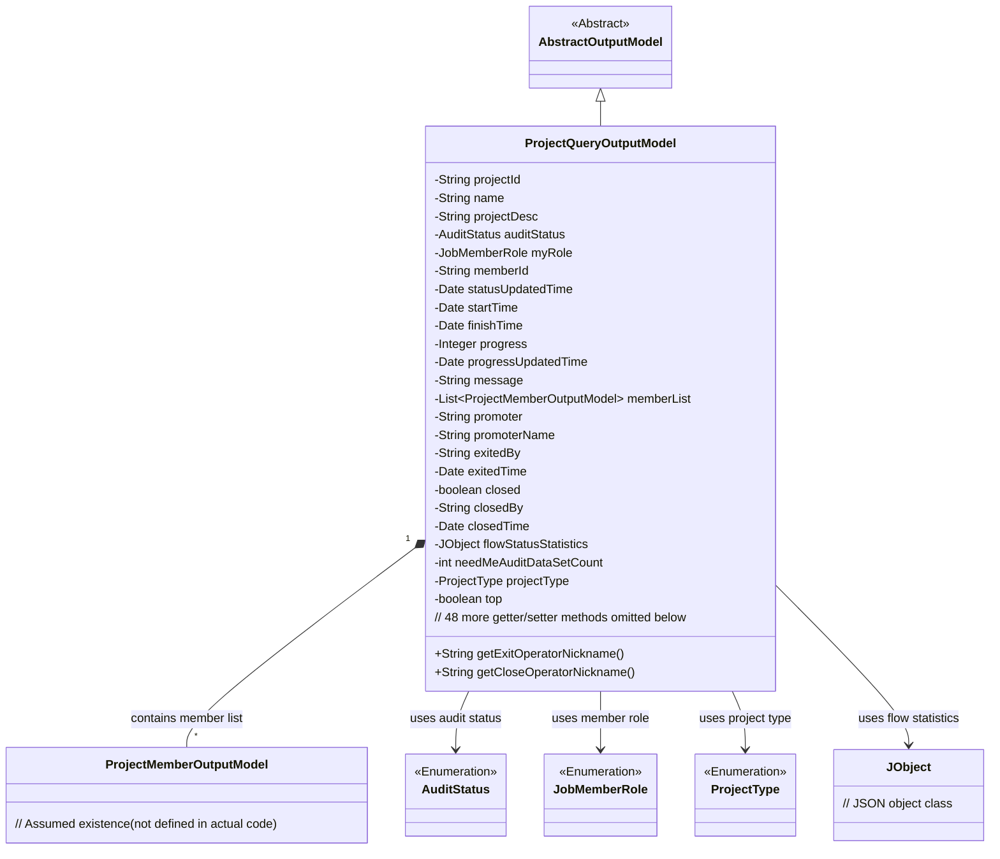

# Basic Information

|      |      |
|------|------|
| Name | ProjectQueryOutputModel |
| Language | .java |
| Code Path | WeFe/board/board-service/src/main/java/com/welab/wefe/board/service/dto/entity/project/ProjectQueryOutputModel.java |
| Package Name | com.welab.wefe.board.service.dto.entity.project |
| Dependencies | ['com.welab.wefe.board.service.dto.entity.AbstractOutputModel', 'com.welab.wefe.board.service.service.CacheObjects', 'com.welab.wefe.common.fieldvalidate.annotation.Check', 'com.welab.wefe.common.util.JObject', 'com.welab.wefe.common.wefe.enums.AuditStatus', 'com.welab.wefe.common.wefe.enums.JobMemberRole', 'com.welab.wefe.common.wefe.enums.ProjectType', 'java.util.Date', 'java.util.List'] |
| Brief Description | Project Query Output Model Class, including fields such as project ID, name, description, status, role, time, progress, member list, initiator, close/exit information, and statistics, along with their corresponding getter/setter methods. |

# Description

The ProjectQueryOutputModel is a project query output model class that inherits from AbstractOutputModel. It includes fields such as project ID, name, description, review status, our identity, member ID, status update time, start and end times, progress and update time, message notes, etc. It also contains attributes like member list, initiator information, exit and close operators along with their timestamps, process status statistics, number of datasets pending review, project type, and pinned status. The class provides getter and setter methods for all fields, as well as methods to retrieve the nicknames of exit and close operators.

# Class Summary

| Name   | Type  | Description |
|-------|------|-------------|
| ProjectQueryOutputModel | class | The ProjectQueryOutputModel class includes fields such as project ID, name, description, status, role, time, progress, member list, initiator, closure/exit information, and statistics, which are used for project query output. |

## Class ProjectQueryOutputModel

|      |      |
|------|------|
| Access Modifier | public |
| Type | class |
| Name | ProjectQueryOutputModel |
| Description | The ProjectQueryOutputModel class includes fields such as project ID, name, description, status, role, time, progress, member list, initiator, closure/exit information, and statistics, which are used for project query output. |

### UML Class Diagram

This diagram illustrates how ProjectQueryOutputModel inherits from AbstractOutputModel, containing detailed project query fields (e.g., project ID, name, timestamps) and enumeration dependencies. As a project query response model, it manages member lists through aggregation relationships and processes flow statistics via JObject, reflecting the core data structure of project management. The class contains 50+ fields with corresponding access methods, primarily used for complete encapsulation and transmission of project information.

### Internal Method Call Graph

```mermaid
graph TD
    A["Class ProjectQueryOutputModel"]
    B["Inherits from: AbstractOutputModel"]
    C["Property: String projectId"]
    D["Property: String name"]
    E["Property: String projectDesc"]
    F["Property: AuditStatus auditStatus"]
    G["Property: JobMemberRole myRole"]
    H["Property: String memberId"]
    I["Property: Date statusUpdatedTime"]
    J["Property: Date startTime"]
    K["Property: Date finishTime"]
    L["Property: Integer progress"]
    M["Property: Date progressUpdatedTime"]
    N["Property: String message"]
    O["Property: List<ProjectMemberOutputModel> memberList"]
    P["Property: String promoter"]
    Q["Property: String promoterName"]
    R["Property: String exitedBy"]
    S["Property: Date exitedTime"]
    T["Property: boolean closed"]
    U["Property: String closedBy"]
    V["Property: Date closedTime"]
    W["Property: JObject flowStatusStatistics"]
    X["Property: int needMeAuditDataSetCount"]
    Y["Property: ProjectType projectType"]
    Z["Property: boolean top"]
    AA["Method: getExitOperatorNickname()"]
    AB["Method: getCloseOperatorNickname()"]
    AC["Method: getter/setter method group"]

    A --> B
    A --> C
    A --> D
    A --> E
    A --> F
    A --> G
    A --> H
    A --> I
    A --> J
    A --> K
    A --> L
    A --> M
    A --> N
    A --> O
    A --> P
    A --> Q
    A --> R
    A --> S
    A --> T
    A --> U
    A --> V
    A --> W
    A --> X
    A --> Y
    A --> Z
    A --> AA
    A --> AB
    A --> AC
```

This flowchart illustrates the complete structure of the ProjectQueryOutputModel class, including its inheritance relationship, 23 property fields (containing primitive types, enums, and complex objects), and core methods. The class implements field validation through @Check annotations, encapsulating the core data model for project management, including basic project information, time status, member lists, and operation records. It provides standard access interfaces via getter/setter methods. Two special methods retrieve operator nicknames through CacheObjects.

### Field List

| Name  | Type  | Description |
|-------|-------|------|
| memberList | List<ProjectMemberOutputModel> | Project member list, storing ProjectMemberOutputModel objects. |
| projectType | ProjectType | The code defines a private variable projectType, which is validated for project type using the @Check annotation. |
| flowStatusStatistics | JObject | JSON object variable for checking process status statistics. |
| exitedTime | Date | The field exitedTime is labeled as the exit time check item, with the type being Date. |
| auditStatus | AuditStatus | The private audit state variable `auditStatus`. |
| promoter | String | The code defines a private string variable named promoter and adds a check annotation @Check(name = "initiator ID") to identify or validate the initiator ID. |
| closedTime | Date | The field `closedTime` is used to record the closing time and is validated using the `@Check` annotation. |
| promoterName | String | The code defines a private String variable named promoterName, annotated with @Check, where the parameter name has a value of "Initiator name". |
| exitedBy | String | Define a private string variable `exitedBy` to mark the operator who exited the project, validated via the `@Check` annotation. |
| closedBy | String | The field `closedBy` is marked as a check item, used to record the name of the operator who closed the project. |
| finishTime | Date | The field finishTime is marked with the @Check annotation as "End Time" and has a type of Date. |
| progress | Integer | Progress check field, type integer. |
| projectId | String | The code defines a private string variable `projectId` and adds an `@Check` annotation with the parameter `name` set to "Project ID" for validating the project ID. |
| closed = false | boolean | Java code: Define a private boolean variable `closed` with default value false, annotated with `@Check` to verify if it is closed. |
| progressUpdatedTime | Date | Progress update time field, type is Date. |
| top | boolean | The class member variable `top`, of boolean type, is used to mark whether it is pinned to the top, and is validated via the `@Check` annotation. |
| statusUpdatedTime | Date | The field statusUpdatedTime is used to record the time of status updates and is marked as a mandatory inspection item. |
| startTime | Date | Define a private date-type variable startTime, annotated with @Check as "Start Time". |
| name | String | The code defines a private string variable named "name" and marks it with the @Check annotation, specifying its display name as "Name". |
| projectDesc | String | The class private field projectDesc is marked with the @Check annotation as "Project Description". |
| myRole | JobMemberRole | The field myRole is annotated with @Check validation, with enumerated values being promoter or provider, indicating our identity. |
| memberId | String | The code defines a private string variable memberId, annotated with @Check as a validation field for "our member ID". |
| needMeAuditDataSetCount | int | The private integer variable for the number of datasets pending review, used to store the count of datasets requiring review. |
| message | String | The class field `message` is used to store message notes or failure reasons, annotated with `@Check`. |

### Method List

| Name  | Type  | Description |
|-------|-------|------|
| getFinishTime | Date | The method getFinishTime returns the finishTime date object. |
| getExitedBy | String | The method returns the exitedBy string value. |
| getStartTime | Date | The method to obtain the start time, returns the startTime variable of type Date. |
| setExitedTime | void | The method to set the exit time takes a parameter of type Date and assigns it to the member variable exitedTime. |
| setFinishTime | void | The method for setting the completion time involves assigning the parameter finishTime to the object's finishTime property. |
| getAuditStatus | AuditStatus | Methods to obtain the audit status, returns the value of the auditStatus variable. |
| getPromoter | String | Methods to obtain the promoter string value. |
| setPromoter | void | Methods for setting promoter attributes. |
| setStartTime | void | The method to set the start time assigns the parameter startTime to the class member variable startTime. |
| getExitedTime | Date | Methods to obtain the exit time, returning the exitedTime variable. |
| setProjectId | void | The method to set the project ID assigns the input parameter to the class's projectId member variable. |
| setPromoterName | void | The method to set the promoter name assigns the input parameter to the class member variable promoterName. |
| setName | void | Methods for setting the object name, assigning the input parameter `name` to the `name` property of the object. |
| getProgress | Integer | Methods to obtain the progress value, returning an integer-type progress variable. |
| setFlowStatusStatistics | void | Method to set the flow status statistics information, converting the input string into a JObject object and assigning it to the member variable flowStatusStatistics. |
| setProgress | void | The method to set the progress value assigns the input parameter `progress` to the class member variable `progress`. |
| setClosedBy | void | This is a Java method used to set the value of the closedBy property. The method accepts a string parameter closedBy and assigns it to the class member variable this.closedBy. |
| getClosedTime | Date | Methods to obtain the closedTime property, returning a value of type Date. |
| setClosedTime | void | The method to set the closing time, with the parameter of type Date, assigns the value to the member variable closedTime. |
| getNeedMeAuditDataSetCount | int | Method to obtain the number of datasets pending review, which returns the value of the integer variable `needMeAuditDataSetCount`. |
| setNeedMeAuditDataSetCount | void | The method to set the number of datasets pending review involves assigning the parameter value to the class member variable `needMeAuditDataSetCount`. |
| getProjectType | ProjectType | Methods to obtain the project type, returns the value of the projectType property. |
| setProjectType | void | The method to set the project type assigns the passed parameter to the class member variable projectType. |
| isTop | boolean | The method isTop returns a boolean value top, indicating whether it is in the top state. |
| setTop | void | Public method for setting the pinned status of an object, with a boolean parameter 'top' to update the object's top property. |
| setClosed | void | Set the boolean method for the object's closed state. |
| getFlowStatusStatistics | JObject | Public method for retrieving process status statistics, returns a result of type JObject. |
| setMessage | void | Methods for setting message content, assigning the input string to an internal variable of the class. |
| getMemberId | String | Methods to obtain member ID, returns a string-type memberId. |
| setMemberId | void | The method to set the member ID assigns the input string to the member variable memberId. |
| getCloseOperatorNickname | String | Method to retrieve the nickname of the closing operator: Obtain the nickname from `closedBy` via `CacheObjects` and return it. |
| getMyRole | JobMemberRole | Get the current user's role information. |
| setExitedBy | void | Set the exit method to update the value of the exitedBy field. |
| getProgressUpdatedTime | Date | Method to obtain the progress update time, returns the value of the progressUpdatedTime variable. |
| getProjectDesc | String | Methods to obtain the project description, returning a string-type variable `projectDesc`. |
| setAuditStatus | void | The method to set the audit status assigns the incoming `auditStatus` to the `auditStatus` property of the current object. |
| getStatusUpdatedTime | Date | Methods to obtain the status update time, returning the value of the statusUpdatedTime variable. |
| setMyRole | void | This is a Java method used to set the role attribute of the current object. The method accepts a parameter of type JobMemberRole named myRole and assigns it to the member variable of the same name in the object. |
| getMemberList | List<ProjectMemberOutputModel> | Methods to obtain the project member list, returning member list data. |
| getExitOperatorNickname | String | Method to retrieve the nickname of the operator who exited, obtaining and returning the nickname from exitedBy via CacheObjects. |
| setProjectDesc | void | This is a Java method used to set the project description property. The method takes a string parameter projectDesc and assigns it to the class member variable of the same name. |
| getMessage | String | Methods to obtain the message string. |
| getProjectId | String | Methods to obtain the project ID, returns a string-type projectId. |
| getPromoterName | String | Method to obtain the promoter's name, returns the promoter's name as a string. |
| setProgressUpdatedTime | void | The method to set the progress update time assigns the parameter `progressUpdatedTime` to the class member variable of the same name. |
| getName | String | Methods to obtain the name, returning the value of the string-type name variable. |
| getClosedBy | String | Public method to obtain the value of the closedBy field. |
| setStatusUpdatedTime | void | This is a Java method used to set the status update time, which assigns the passed Date object to the class's statusUpdatedTime member variable. |
| setMemberList | void | The method to set the project member list, with the parameter being the member list object. |
| isClosed | boolean | The method isClosed returns a boolean value closed, indicating whether the object is closed. |

