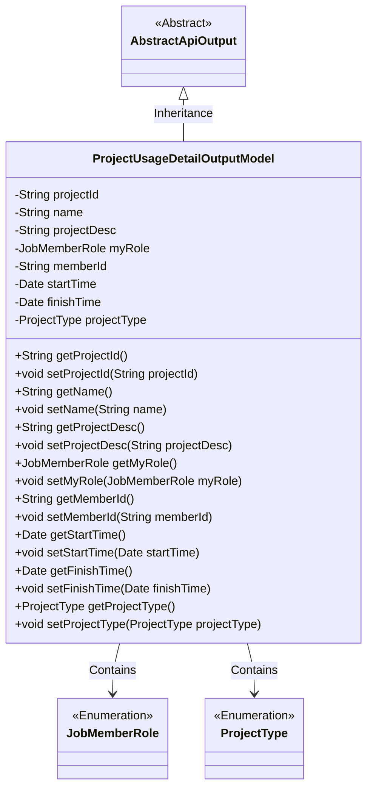
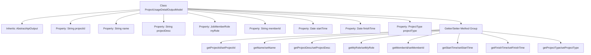

# Basic Information

|      |      |
|------|------|
| Name | ProjectUsageDetailOutputModel |
| Language | .java |
| Code Path | WeFe/board/board-service/src/main/java/com/welab/wefe/board/service/dto/entity/project/ProjectUsageDetailOutputModel.java |
| Package Name | com.welab.wefe.board.service.dto.entity.project |
| Dependencies | ['com.welab.wefe.common.fieldvalidate.annotation.Check', 'com.welab.wefe.common.web.dto.AbstractApiOutput', 'com.welab.wefe.common.wefe.enums.JobMemberRole', 'com.welab.wefe.common.wefe.enums.ProjectType', 'java.util.Date'] |
| Brief Description | Project Details Output Model, including fields such as project ID, name, description, role, creator ID, start/end time, and type, along with their getter/setter methods. |

# Description

The content defines a Java class named ProjectUsageDetailOutputModel, which extends AbstractApiOutput. The class contains multiple private fields with annotations, including project ID, name, description, our role, creator ID, start time, end time, and project type. Each field has corresponding getter and setter methods for accessing and modifying the field values. These fields are annotated with validation markers, such as for project ID and name. The overall structure is a typical data transfer object used to encapsulate project usage details.

# Class Summary

| Name   | Type  | Description |
|-------|------|-------------|
| ProjectUsageDetailOutputModel | class | The ProjectUsageDetailOutputModel class includes fields such as project ID, name, description, role, creator ID, start/end time, and type, along with their corresponding getter/setter methods. |

## Class ProjectUsageDetailOutputModel

|      |      |
|------|------|
| Access Modifier | public |
| Type | class |
| Name | ProjectUsageDetailOutputModel |
| Description | The ProjectUsageDetailOutputModel class includes fields such as project ID, name, description, role, creator ID, start/end time, and type, along with their corresponding getter/setter methods. |

### UML Class Diagram

This class diagram illustrates that ProjectUsageDetailOutputModel inherits from AbstractApiOutput and contains multiple private fields with corresponding getter/setter methods. The class references two enumeration types, JobMemberRole and ProjectType, through composition relationships to represent role and type information within projects. All fields are annotated with @Check, indicating validation requirements. This model primarily encapsulates data output for project usage details, including core attributes such as basic project information, time ranges, and participation roles.

### Internal Method Call Graph

This flowchart illustrates the complete structure of the ProjectUsageDetailOutputModel class, which inherits from the AbstractApiOutput base class. The diagram clearly presents 8 core properties and their corresponding Getter/Setter method groups, with all properties annotated with field descriptions marked by @Check annotations. Each property strictly maps to its access methods, forming a complete object encapsulation structure. This design pattern is typically used in DTO (Data Transfer Object) scenarios to ensure controlled access and validation of data fields.

### Field List

| Name  | Type  | Description |
|-------|-------|------|
| startTime | Date | The code defines a private date-type variable named startTime, which is annotated with @Check and labeled as "Start Time". |
| myRole | JobMemberRole | Define a private variable myRole, and use the @Check annotation to validate that its value is "our role" with the type JobMemberRole. |
| name | String | The code defines a private string variable named "name" and marks it with the @Check annotation, specifying its display name as "Name". |
| memberId | String | The member variable of the project creator ID, validated using the @Check annotation. |
| projectDesc | String | The class member variable projectDesc is annotated with @Check as "project description". |
| projectId | String | Define a private string variable projectId, and add a check annotation for the project ID. |
| finishTime | Date | End time check field, type is Date. |
| projectType | ProjectType | The code defines a private variable `projectType`, annotated with `@Check` to mark its name as "Project Type" and its type as `ProjectType`. |

### Method List

| Name  | Type  | Description |
|-------|-------|------|
| setProjectId | void | The method to set the project ID assigns the input parameter projectId to the projectId property of the current object. |
| setMyRole | void | This is a Java method used to set the myRole property of the current object, with the parameter being of type JobMemberRole. |
| setStartTime | void | The method to set the start time involves assigning the parameter `startTime` to the object's `startTime` property. |
| getName | String | Methods to obtain the name, returning the value of the string-type name variable. |
| getStartTime | Date | The method getStartTime returns the startTime date object. |
| getMemberId | String | Methods to obtain member ID, returns the member ID string. |
| getProjectDesc | String | Methods to obtain the project description, returning a string-type projectDesc. |
| setProjectDesc | void | This is a Java method used to set the project description property. The method takes a string parameter projectDesc and assigns it to the class's member variable projectDesc. |
| setMemberId | void | Methods for setting member ID: Assign the input string to the class's member variable `memberId`. |
| setName | void | Methods for setting object names, assigning the parameter `name` to the `name` property of the object. |
| getProjectId | String | Methods to obtain the project ID, returns the projectId as a string. |
| getMyRole | JobMemberRole | Get the current user's role information. |
| getFinishTime | Date | The method getFinishTime returns the finishTime date object. |
| setFinishTime | void | The method for setting the completion time assigns the parameter finishTime to the class's member variable finishTime. |
| getProjectType | ProjectType | Methods to obtain the project type, returns the value of the projectType field. |
| setProjectType | void | The method `setProjectType` is used to set the project type, with the parameter being a `ProjectType` object. |

