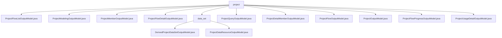

# Basic Information

|      |      |
|------|------|
| Name | project |
| Language | .java |
| Code Path | WeFe/board/board-service/src/main/java/com/welab/wefe/board/service/dto/entity/project |
| Package Name | docs.board.board-service.src.main.java.com.welab.wefe.board.service.dto.entity.project |
| Brief Description | The ProjectFlowListOutputModel class encapsulates project flow list information, including attributes such as status, type, and ID. The ProjectModelingOutputModel class is used for modeling output data, containing flow ID, task ID, etc. The ProjectMemberOutputModel class describes member information, including ID, role, approval status, etc. The ProjectFlowDetailOutputModel class extends flow details, including project information, empty parameter nodes, etc. The ProjectQueryOutputModel class contains project query results, including ID, name, status, etc. The ProjectDetailMemberOutputModel class extends member information by adding a data resource list. The ProjectFlowOutputModel class represents flow output, including status, type, ID, etc. The ProjectOutputModel class encapsulates project output, including ID, name, approval status, etc. The ProjectFlowProgressOutputModel class represents flow progress, including status, update time, etc. The ProjectUsageDetailOutputModel class encapsulates project usage details, including ID, name, time, etc. |

# Description

## Overview  
The core responsibility of this module is to manage the full lifecycle data of federated learning projects, including project basic information, process management, member collaboration, and resource status tracking. The interface specification uniformly adopts the Getter/Setter pattern, such as `getFlowStatus()` and `setModelingType()`, with key validations implemented via the `@Check` annotation. The key data structure consists of a four-layer model: 1) Basic classes like `ProjectOutputModel`; 2) Process classes like `ProjectFlowListOutputModel`; 3) Member classes like `ProjectDetailMemberOutputModel`; 4) Derived classes like `ProjectUsageDetailOutputModel`. The only external dependency is the parent class `AbstractOutputModel`, for instance, the process progress model implements state enumeration validation through inheritance.

## Main Business Scenarios  
The module supports collaborative workflows for federated learning projects, similar to a multi-tenant SaaS system. Typical scenarios include: 1) Project dashboard (aggregating process status, member roles, and dataset statistics via `ProjectQueryOutputModel`); 2) Process orchestration (e.g., `ProjectFlowOutputModel` manages canvas editing graphs and modeling tasks); 3) Member collaboration (e.g., `ProjectMemberOutputModel` handles role approvals and data resource authorization). Integration cases manifest as model nesting, such as process details combining OOT task IDs and empty parameter node lists via `ProjectFlowDetailOutputModel`.

### Package Internal Structure View

This flowchart illustrates the hierarchical structure of DTOs for the project entity in the board-service module of the WeFe project. The root node "project" contains 11 child nodes, including 10 output model class files and 1 "data_set" subdirectory. The data_set directory further contains two output model classes related to data collections. The overall structure clearly demonstrates the organization of output models across different dimensions such as project workflows, members, and datasets.

# File List

| Name   | Type  | Description |
|-------|------|-------------|
| [ProjectFlowListOutputModel.java](ProjectFlowListOutputModel.md) | file | The ProjectFlowListOutputModel class contains detailed information about project workflows, such as attributes like ID, name, status, progress, creator, role, type, and their corresponding getter/setter methods. |
| [ProjectModelingOutputModel.java](ProjectModelingOutputModel.md) | file | The ProjectModelingOutputModel class inherits from AbstractOutputModel and includes fields for process ID, job_id, job name, model evaluation task ID, and model type, along with their corresponding getter/setter methods. |
| [ProjectMemberOutputModel.java](ProjectMemberOutputModel.md) | file | Project members output model class, including attributes such as member ID, role, review status, comments, and whether exited, providing relevant getter/setter methods. |
| [ProjectFlowDetailOutputModel.java](ProjectFlowDetailOutputModel.md) | file | The ProjectFlowDetailOutputModel extends ProjectFlowOutputModel, containing project information, a list of empty parameter nodes, creator identification, and OOT task and model node IDs. It provides getter and setter methods for each field. |
| [ProjectQueryOutputModel.java](ProjectQueryOutputModel.md) | file | Project query output model class, including fields such as project ID, name, description, status, role, time, progress, member list, initiator, close/exit information, and statistics, along with their getter/setter methods. |
| [ProjectDetailMemberOutputModel.java](ProjectDetailMemberOutputModel.md) | file | ProjectDetailMemberOutputModel extends ProjectMemberOutputModel, containing getter and setter methods for the data resource list. |
| [ProjectFlowOutputModel.java](ProjectFlowOutputModel.md) | file | The ProjectFlowOutputModel class inherits from AbstractOutputModel and includes attributes such as flow ID, name, status, type, and creator, used for managing project flow data. |
| [ProjectOutputModel.java](ProjectOutputModel.md) | file | The ProjectOutputModel class includes attributes such as project ID, name, description, review status, member role, creator identifier, exit status, and closure status, which are used to manage project information and operation records. |
| [ProjectFlowProgressOutputModel.java](ProjectFlowProgressOutputModel.md) | file | Project Process Progress Output Model, including fields such as project ID, process ID, status, update time, message, and task progress, along with corresponding getter/setter methods. |
| [ProjectUsageDetailOutputModel.java](ProjectUsageDetailOutputModel.md) | file | Project details output model, including fields such as project ID, name, description, role, creator ID, start/end time, and type, along with their getter/setter methods. |
| [data_set](data_set/_module.md) | package | The DerivedProjectDataSetOutputModel inherits from ProjectDataResourceOutputModel and includes a list member variable of JobMemberWithDataSetOutputModel along with its access methods. The ProjectDataResourceOutputModel inherits from AbstractOutputModel and contains project data resource-related attributes and enumeration type fields. |

