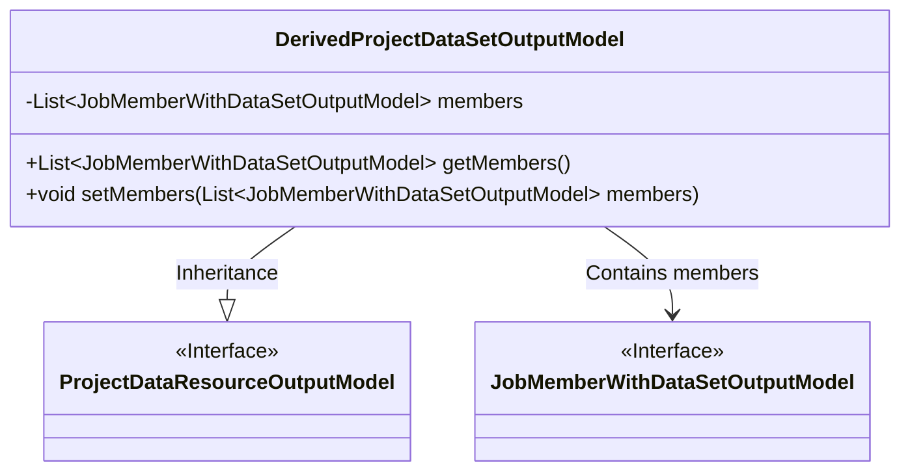
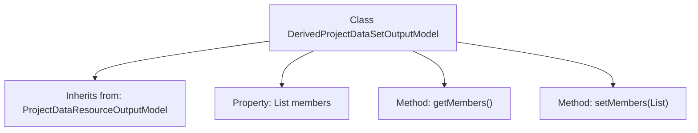

# Basic Information

|      |      |
|------|------|
| Name | DerivedProjectDataSetOutputModel |
| Language | .java |
| Code Path | WeFe/board/board-service/src/main/java/com/welab/wefe/board/service/dto/entity/project/data_set/DerivedProjectDataSetOutputModel.java |
| Package Name | com.welab.wefe.board.service.dto.entity.project.data_set |
| Dependencies | ['com.welab.wefe.board.service.dto.vo.JobMemberWithDataSetOutputModel', 'java.util.List'] |
| Brief Description | The derived project dataset output model inherits from the project data resource output model, including the member list and its getter/setter methods. |

# Description

The `DerivedProjectDataSetOutputModel` class inherits from `ProjectDataResourceOutputModel` and contains a private member variable `members`, which is a list of type `JobMemberWithDataSetOutputModel`. It provides `getMembers` and `setMembers` methods to retrieve and set the value of this list. This class is primarily used for handling output models related to derived project datasets.

# Class Summary

| Name   | Type  | Description |
|-------|------|-------------|
| DerivedProjectDataSetOutputModel | class | The derived project dataset output model inherits from the project data resource output model, including the member list and its getter/setter methods. |

## Class DerivedProjectDataSetOutputModel

|      |      |
|------|------|
| Access Modifier | public |
| Type | class |
| Name | DerivedProjectDataSetOutputModel |
| Description | The derived project dataset output model inherits from the project data resource output model, including the member list and its getter/setter methods. |

### UML Class Diagram

This class diagram illustrates that DerivedProjectDataSetOutputModel inherits from the ProjectDataResourceOutputModel interface and contains a list member of type JobMemberWithDataSetOutputModel. The DerivedProjectDataSetOutputModel provides getter and setter methods for the member list, demonstrating the extension and concrete implementation of the project dataset output model. Through inheritance and composition relationships, a clear class hierarchy is formed.

### Internal Method Call Graph

This flowchart illustrates the structure of the DerivedProjectDataSetOutputModel class, which is a subclass inheriting from ProjectDataResourceOutputModel. The class contains a member variable 'members' of type List<JobMemberWithDataSetOutputModel>, along with corresponding getter and setter methods. Through inheritance, this class extends the functionality of its parent class, specializing in handling output models related to project datasets.

### Field List

| Name  | Type  | Description |
|-------|-------|------|
| members | List<JobMemberWithDataSetOutputModel> | Private member variable, a list of type JobMemberWithDataSetOutputModel. |

### Method List

| Name  | Type  | Description |
|-------|-------|------|
| getMembers | List<JobMemberWithDataSetOutputModel> | The method returns a list of members, with the type being JobMemberWithDataSetOutputModel. |
| setMembers | void | This is a Java method used to set the member list, with the parameter being a list of type JobMemberWithDataSetOutputModel. |

