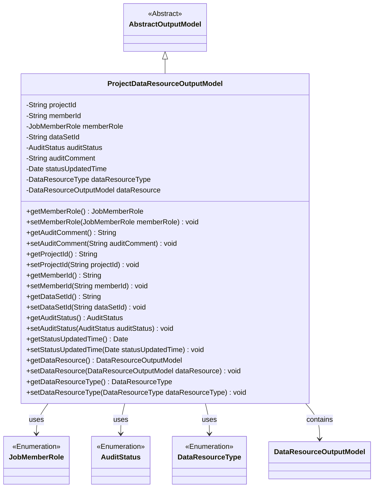

# Basic Information

|      |      |
|------|------|
| Name | ProjectDataResourceOutputModel |
| Language | .java |
| Code Path | WeFe/board/board-service/src/main/java/com/welab/wefe/board/service/dto/entity/project/data_set/ProjectDataResourceOutputModel.java |
| Package Name | com.welab.wefe.board.service.dto.entity.project.data_set |
| Dependencies | ['com.welab.wefe.board.service.dto.entity.AbstractOutputModel', 'com.welab.wefe.board.service.dto.entity.data_resource.output.DataResourceOutputModel', 'com.welab.wefe.common.fieldvalidate.annotation.Check', 'com.welab.wefe.common.wefe.enums.AuditStatus', 'com.welab.wefe.common.wefe.enums.DataResourceType', 'com.welab.wefe.common.wefe.enums.JobMemberRole', 'java.util.Date'] |
| Brief Description | Project data resource output model class, containing fields such as project ID, member ID, role, dataset ID, review status, comments, update time, type, details, and their corresponding getter/setter methods. |

# Description

The ProjectDataResourceOutputModel class inherits from AbstractOutputModel and includes attributes related to project data resources: project ID, member ID, member role (distinguishing dataset ownership), dataset ID, review status, review comments, status update time, dataset type, and dataset details. Each attribute has corresponding getter and setter methods for retrieving and setting attribute values. The member role and dataset type use the JobMemberRole and DataResourceType enum types, respectively. The dataset details are represented by a DataResourceOutputModel object.

# Class Summary

| Name   | Type  | Description |
|-------|------|-------------|
| ProjectDataResourceOutputModel | class | The ProjectDataResourceOutputModel class includes fields such as project ID, member ID, dataset ID, review status, and dataset type, which are used to manage project data resource information. |

## Class ProjectDataResourceOutputModel

|      |      |
|------|------|
| Access Modifier | public |
| Type | class |
| Name | ProjectDataResourceOutputModel |
| Description | The ProjectDataResourceOutputModel class includes fields such as project ID, member ID, dataset ID, review status, and dataset type, which are used to manage project data resource information. |

### UML Class Diagram

This code defines a project data resource output model class that inherits from an abstract output model class. It includes fields such as project ID, member ID, member role, dataset ID, along with corresponding getter and setter methods. The class utilizes annotations for field validation and references multiple enumeration types and another data resource output model class to describe project data resource information and status. The class diagram clearly illustrates the inheritance relationships and dependencies between classes.

### Internal Method Call Graph

```mermaid
graph TD
    A["Class ProjectDataResourceOutputModel"]
    B["Inherits: AbstractOutputModel"]
    C["Property: String projectId"]
    D["Property: String memberId"]
    E["Property: JobMemberRole memberRole"]
    F["Property: String dataSetId"]
    G["Property: AuditStatus auditStatus"]
    H["Property: String auditComment"]
    I["Property: Date statusUpdatedTime"]
    J["Property: DataResourceType dataResourceType"]
    K["Property: DataResourceOutputModel dataResource"]
    L["Getter/Setter: projectId"]
    M["Getter/Setter: memberId"]
    N["Getter/Setter: memberRole"]
    O["Getter/Setter: dataSetId"]
    P["Getter/Setter: auditStatus"]
    Q["Getter/Setter: auditComment"]
    R["Getter/Setter: statusUpdatedTime"]
    S["Getter/Setter: dataResourceType"]
    T["Getter/Setter: dataResource"]

    A --> B
    A --> C
    A --> D
    A --> E
    A --> F
    A --> G
    A --> H
    A --> I
    A --> J
    A --> K
    A --> L
    A --> M
    A --> N
    A --> O
    A --> P
    A --> Q
    A --> R
    A --> S
    A --> T
```

This code defines a class named ProjectDataResourceOutputModel, which inherits from AbstractOutputModel. The class includes multiple properties such as projectId, memberId, memberRole, etc., each with corresponding Getter and Setter methods. These properties are used to store information related to project data resources, including project ID, member ID, member role, dataset ID, audit status, and more. The properties in the class are validated using the @Check annotation to ensure data validity. The overall structure is clear, with a well-defined correspondence between properties and methods, making it easy to manage and manipulate information related to project data resources.

### Field List

| Name  | Type  | Description |
|-------|-------|------|
| dataSetId | String | The code defines a private string variable named dataSetId, and marks it with the @Check annotation with the name "Dataset Id". |
| memberId | String | Member ID field, validated using the @Check annotation. |
| projectId | String | The field projectId is marked as the project primary key and validated using @Check. |
| dataResource | DataResourceOutputModel | Class member variable `dataResource`, annotated as dataset detail inspection, with type `DataResourceOutputModel`. |
| dataResourceType | DataResourceType | Define a private variable `dataResourceType`, annotated with the `@Check` annotation to perform dataset type validation. |
| statusUpdatedTime | Date | The field `statusUpdatedTime` is used to record the status update time and is marked as a mandatory check item. |
| auditComment | String | Define a private String variable `auditComment` to store audit comments, annotated with `@Check`. |
| memberRole | JobMemberRole | The member roles distinguish dataset ownership, used to handle situations involving oneself and one's own modeling. |
| auditStatus | AuditStatus | The entity class field `auditStatus` uses the `@Check` annotation to validate the status, with the type being `AuditStatus`. |

### Method List

| Name  | Type  | Description |
|-------|-------|------|
| getMemberRole | JobMemberRole | Method to obtain member roles, returns a member role object. |
| getStatusUpdatedTime | Date | Methods to obtain the status update time, returns the value of the statusUpdatedTime variable. |
| setStatusUpdatedTime | void | This is a Java method used to set the status update time, assigning the passed Date object to the class member variable statusUpdatedTime. |
| getDataSetId | String | Methods to obtain the dataset ID, returning the dataset ID as a string type. |
| setAuditStatus | void | The method setAuditStatus is used to set the value of the auditStatus property. |
| getMemberId | String | Methods to obtain member ID, returns a string-type memberId. |
| setAuditComment | void | The method for setting audit comments assigns the input parameter to the class member variable `auditComment`. |
| getAuditStatus | AuditStatus | The method returns the value of the audit status, auditStatus. |
| getProjectId | String | Methods to obtain the project ID, which returns a string-type projectId. |
| getDataResource | DataResourceOutputModel | This method returns a dataResource object of type DataResourceOutputModel. |
| setDataResource | void | This method is used to set the data resource, which accepts a parameter of type DataResourceOutputModel and assigns it to the dataResource property of the current object. |
| setProjectId | void | The method `setProjectId` is used to set the value of the class member variable `projectId`, with the parameter being of string type. |
| setMemberRole | void | Method for setting member roles, which assigns the passed member role parameter to the member role property of the current object. |
| setDataSetId | void | Method for setting the dataset ID: Assign the input parameter to the class's dataSetId member variable. |
| setMemberId | void | The method to set the member ID assigns the input parameter to the class's member variable memberId. |
| getDataResourceType | DataResourceType | Methods for obtaining the data resource type, returns dataResourceType. |
| getAuditComment | String | Method to obtain the audit comment, returns the auditComment string. |
| setDataResourceType | void | The method for setting the data resource type assigns the input parameters to the member variables of the class. |

