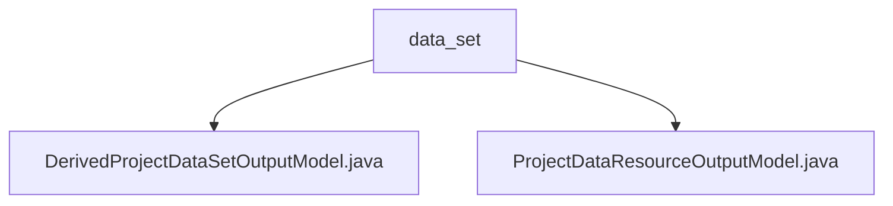

# Basic Information

|      |      |
|------|------|
| Name | data_set |
| Language | .java |
| Code Path | WeFe/board/board-service/src/main/java/com/welab/wefe/board/service/dto/entity/project/data_set |
| Package Name | docs.board.board-service.src.main.java.com.welab.wefe.board.service.dto.entity.project.data_set |
| Brief Description | The DerivedProjectDataSetOutputModel inherits from ProjectDataResourceOutputModel and includes a list member variable of JobMemberWithDataSetOutputModel along with its access methods. The ProjectDataResourceOutputModel inherits from AbstractOutputModel and contains project data resource-related attributes and enumeration type fields. |

# Description

## Overview  
The core responsibility of this module is to manage output models related to datasets in federated learning projects, including basic data resource models and derived dataset models. The interface specification uniformly adopts the Getter/Setter pattern, such as `getMembers()` and `setMembers()` for manipulating member lists. Key data structures include `JobMemberWithDataSetOutputModel` (member datasets), `DataResourceOutputModel` (dataset details), and enumeration types `JobMemberRole`/`DataResourceType`. External dependencies only involve the base model class `AbstractOutputModel`. For example, derived models extend the attributes of basic data resources through the `members` list.  

## Main Business Scenarios  
Primarily used for tracking data resource status in federated learning projects, similar to a data provenance system. The complete business process includes: 1) Recording dataset metadata such as ownership (e.g., member roles) and audit status via `ProjectDataResourceOutputModel`; 2) `DerivedProjectDataSetOutputModel` extends the handling of associations between derived datasets and members. A typical application is updating timestamps synchronously via `setAuditComment()` when audit comments are modified. Integration cases manifest as multi-level model nesting, such as dynamically loading dataset details through the `DataResourceOutputModel` object.

### Package Internal Structure View

This flowchart illustrates the structure of two output model files under the project dataset directory. The parent node "data_set" contains two Java class files: DerivedProjectDataSetOutputModel and ProjectDataResourceOutputModel, reflecting the organization of project dataset-related output models in the DTO layer. The entire structure presents a clear and concise hierarchy between the files.

# File List

| Name   | Type  | Description |
|-------|------|-------------|
| [DerivedProjectDataSetOutputModel.java](DerivedProjectDataSetOutputModel.md) | file | The derived project dataset output model inherits from the project data resource output model, including member lists and their getter/setter methods. |
| [ProjectDataResourceOutputModel.java](ProjectDataResourceOutputModel.md) | file | Project data resource output model class, containing fields such as project ID, member ID, role, dataset ID, review status, comments, update time, type, details, and their corresponding getter/setter methods. |

