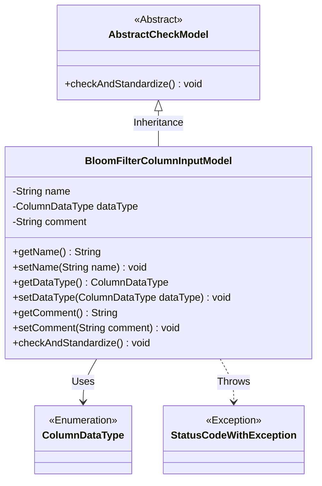
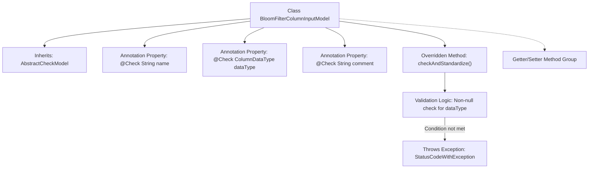

# Basic Information

|      |      |
|------|------|
| Name | BloomFilterColumnInputModel |
| Language | .java |
| Code Path | WeFe/board/board-service/src/main/java/com/welab/wefe/board/service/dto/fusion/BloomFilterColumnInputModel.java |
| Package Name | com.welab.wefe.board.service.dto.fusion |
| Dependencies | ['com.welab.wefe.common.StatusCode', 'com.welab.wefe.common.exception.StatusCodeWithException', 'com.welab.wefe.common.fieldvalidate.AbstractCheckModel', 'com.welab.wefe.common.fieldvalidate.annotation.Check', 'com.welab.wefe.common.wefe.enums.ColumnDataType'] |
| Brief Description | The BloomFilterColumnInputModel class inherits from AbstractCheckModel and includes field name, data type, and comment attributes, with a comment length limit of 250 characters and mandatory validation for the data type. |

# Description

The `BloomFilterColumnInputModel` class inherits from `AbstractCheckModel` and contains three fields: `name` (field name), `dataType` (data type), and `comment` (description). The `comment` field is restricted to a maximum length of 250 characters via a regular expression. The class implements the `checkAndStandardize` method to verify whether `dataType` is null, throwing an exception if it is. Getter and setter methods are provided for each field.

# Class Summary

| Name   | Type  | Description |
|-------|------|-------------|
| BloomFilterColumnInputModel | class | The BloomFilterColumnInputModel class inherits from AbstractCheckModel and includes validation logic for field names, data types, and comments. The comment length is limited to 250 characters, and the data type cannot be empty. |

## Class BloomFilterColumnInputModel

|      |      |
|------|------|
| Access Modifier | public |
| Type | class |
| Name | BloomFilterColumnInputModel |
| Description | The BloomFilterColumnInputModel class inherits from AbstractCheckModel and includes validation logic for field names, data types, and comments. The comment length is limited to 250 characters, and the data type cannot be empty. |

### UML Class Diagram

This class diagram illustrates that BloomFilterColumnInputModel inherits from AbstractCheckModel and contains three private fields (name/dataType/comment) along with their getter/setter methods. The class implements parameter validation through the @Check annotation and overrides the checkAndStandardize() method for data standardization checks. When dataType is null, it throws a StatusCodeWithException. ColumnDataType is utilized as an enumeration type by this class, with the overall structure reflecting parameter validation and exception handling mechanisms.

### Internal Method Call Graph

This flowchart illustrates the core structure of the BloomFilterColumnInputModel class, which inherits from AbstractCheckModel and contains three properties with validation annotations. It highlights the execution flow of the overridden checkAndStandardize() method, including data type non-null validation and exception throwing mechanism, while also indicating the standard Getter/Setter method group. The class implements parameter validation functionality through annotations, reflecting the design philosophy of separating parameter validation from business logic.

### Field List

| Name  | Type  | Description |
|-------|-------|------|
| comment | String | The code defines a string field named "comment" and uses the @Check annotation to restrict its length to no more than 250 characters, otherwise displaying the message "Comment too long~". |
| name | String | The code defines a private string field "name" and annotates it with the @Check annotation, with the annotation parameter specifying the field name as "field name". |
| dataType | ColumnDataType | Define a private field `dataType`, and use the `@Check` annotation to validate the data type, with the annotation parameter `name` set to "Data Type". |

### Method List

| Name  | Type  | Description |
|-------|-------|------|
| checkAndStandardize | void | Check and standardize fields, throw an exception if the data type is not set. |
| getDataType | ColumnDataType | Data types of the columns returned by the method. |
| setName | void | The method for setting the object name assigns the parameter `name` to the `name` property of the object. |
| getComment | String | The method returns the value of the comment variable, which is of type string. |
| getName | String | Methods to get the name, returns the value of the variable name. |
| setDataType | void | The method `setDataType` sets the column data type, with the parameter being of type `ColumnDataType`, and assigns it to the member variable `dataType`. |
| setComment | void | The method for setting the object's comment attribute assigns the input string to the internal variable `comment`. |

