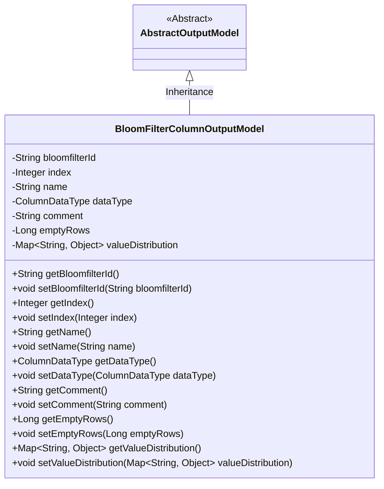

# Basic Information

|      |      |
|------|------|
| Name | BloomFilterColumnOutputModel |
| Language | .java |
| Code Path | WeFe/board/board-service/src/main/java/com/welab/wefe/board/service/dto/fusion/BloomFilterColumnOutputModel.java |
| Package Name | com.welab.wefe.board.service.dto.fusion |
| Dependencies | ['com.welab.wefe.board.service.dto.entity.AbstractOutputModel', 'com.welab.wefe.common.fieldvalidate.annotation.Check', 'com.welab.wefe.common.wefe.enums.ColumnDataType', 'java.util.Map'] |
| Brief Description | The `BloomFilterColumnOutputModel` class extends `AbstractOutputModel` and includes attributes such as filter ID, field index, name, data type, comments, null value count, and value distribution, along with their corresponding getter/setter methods. |

# Description

The `BloomFilterColumnOutputModel` class inherits from `AbstractOutputModel` and includes multiple annotated fields: `bloomfilterId` represents the filter ID, `index` denotes the field sequence number, `name` indicates the field name, `dataType` specifies the data type, `comment` provides the annotation, and `emptyRows` counts the number of rows with null values. Additionally, it contains a non-annotated `valueDistribution` field for storing numerical distribution information. The class provides corresponding getter and setter methods for all fields.

# Class Summary

| Name   | Type  | Description |
|-------|------|-------------|
| BloomFilterColumnOutputModel | class | The BloomFilterColumnOutputModel class inherits from AbstractOutputModel and includes attributes such as filter ID, field sequence number, name, data type, comments, null value count, and value distribution, along with their corresponding getter/setter methods. |

## Class BloomFilterColumnOutputModel

|      |      |
|------|------|
| Access Modifier | public |
| Type | class |
| Name | BloomFilterColumnOutputModel |
| Description | The BloomFilterColumnOutputModel class inherits from AbstractOutputModel and includes attributes such as filter ID, field sequence number, name, data type, comments, null value count, and value distribution, along with their corresponding getter/setter methods. |

### UML Class Diagram

This class diagram illustrates the inheritance structure where BloomFilterColumnOutputModel extends AbstractOutputModel, containing 8 private fields with corresponding getter/setter methods. It represents a typical Java Bean class for storing Bloom filter column output model data, including metadata such as field ID, sequence number, name, data type, as well as empty row count and value distribution statistics. The class implements field validation through @Check annotation and stores dynamic distribution data via generic Map.

### Internal Method Call Graph

```mermaid
graph TD
    A["Class BloomFilterColumnOutputModel"]
    B["Inherits: AbstractOutputModel"]
    C["Property: String bloomfilterId"]
    D["Property: Integer index"]
    E["Property: String name"]
    F["Property: ColumnDataType dataType"]
    G["Property: String comment"]
    H["Property: Long emptyRows"]
    I["Property: Map<String, Object> valueDistribution"]
    J["Method: getBloomfilterId()"]
    K["Method: setBloomfilterId(String)"]
    L["Method: getIndex()"]
    M["Method: setIndex(Integer)"]
    N["Method: getName()"]
    O["Method: setName(String)"]
    P["Method: getDataType()"]
    Q["Method: setDataType(ColumnDataType)"]
    R["Method: getComment()"]
    S["Method: setComment(String)"]
    T["Method: getEmptyRows()"]
    U["Method: setEmptyRows(Long)"]
    V["Method: getValueDistribution()"]
    W["Method: setValueDistribution(Map<String, Object>)"]

    A --> B
    A --> C
    A --> D
    A --> E
    A --> F
    A --> G
    A --> H
    A --> I
    A --> J
    A --> K
    A --> L
    A --> M
    A --> N
    A --> O
    A --> P
    A --> Q
    A --> R
    A --> S
    A --> T
    A --> U
    A --> V
    A --> W
```

This flowchart illustrates the structure of the BloomFilterColumnOutputModel class, including its inheritance relationship, properties, and methods. The class inherits from AbstractOutputModel and contains multiple properties annotated with @Check, such as bloomfilterId, index, etc., along with corresponding getter and setter methods. The valueDistribution property stores value distribution data but lacks the @Check annotation. All methods revolve around property access and modification, forming a standard JavaBean structure.

### Field List

| Name  | Type  | Description |
|-------|-------|------|
| index | Integer | Field sequence number check, private integer variable index. |
| dataType | ColumnDataType | Define a private field dataType, use the @Check annotation to validate the data type, with the annotation parameter name as "data type". |
| valueDistribution | Map<String, Object> | Defined a private Map variable named valueDistribution, with keys of type String and values of type Object. |
| comment | String | The code snippet defines a private string variable named comment, with a validation annotation labeled "Comment". |
| name | String | Field Name Validation Annotations |
| bloomfilterId | String | Define a private string variable bloomfilterId, and use the @Check annotation to validate the filter ID. |
| emptyRows | Long | The field `emptyRows` for checking the number of rows with null values. |

### Method List

| Name  | Type  | Description |
|-------|-------|------|
| getDataType | ColumnDataType | Data types of the columns returned by the method. |
| setBloomfilterId | void | Method for setting the Bloom filter ID, which assigns the input parameter to the member variable bloomfilterId. |
| getIndex | Integer | Methods to obtain the current index value, returns an integer type. |
| setComment | void | Methods for setting the object's comment attribute, assigning the input string to the member variable comment. |
| setName | void | The method to set the object name is to assign the parameter `name` to the `name` property of the object. |
| getComment | String | Methods to obtain the comment string. |
| setEmptyRows | void | Method to set the number of empty lines, with the parameter being a Long type emptyRows. |
| setIndex | void | This is a Java method used to set the value of the class member variable `index`. The method accepts an Integer parameter and assigns it to the `index` property of the current object. |
| getValueDistribution | Map<String, Object> | Get a Map object of value distribution, with keys as strings and values of any type. |
| setDataType | void | The method `setDataType` is used to set the column data type, with the parameter of type `ColumnDataType`, which is assigned to the member variable `dataType`. |
| getEmptyRows | Long | Method returns the number of empty lines. |
| getBloomfilterId | String | The method returns a bloomfilterId value of string type. |
| getName | String | The method returns the value of the name variable, which is of string type. |
| setValueDistribution | void | Java method: Set key-value pairs mapped to the valueDistribution property. |

