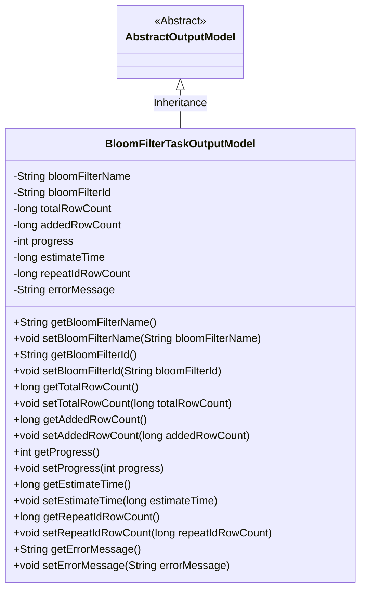

# Basic Information

|      |      |
|------|------|
| Name | BloomFilterTaskOutputModel |
| Language | .java |
| Code Path | WeFe/board/board-service/src/main/java/com/welab/wefe/board/service/dto/fusion/BloomFilterTaskOutputModel.java |
| Package Name | com.welab.wefe.board.service.dto.fusion |
| Dependencies | ['com.welab.wefe.board.service.dto.entity.AbstractOutputModel', 'com.welab.wefe.common.fieldvalidate.annotation.Check'] |
| Brief Description | BloomFilter task output model class, including fields such as filter name, ID, data row count, progress, remaining time, duplicate primary key count, and error messages, along with their corresponding getter/setter methods. |

# Description

The `BloomFilterTaskOutputModel` class inherits from `AbstractOutputModel` and contains key information about the output of a Bloom filter task. This class defines eight fields: filter name, filter ID, total data row count, written row count, task progress percentage, estimated remaining time, duplicate primary key count, and error message. Each field has corresponding getter and setter methods for retrieving and setting field values. The fields are validated using the `@Check` annotation to ensure data validity.

# Class Summary

| Name   | Type  | Description |
|-------|------|-------------|
| BloomFilterTaskOutputModel | class | The BloomFilterTaskOutputModel class contains Bloom filter task output information, including fields such as name, ID, data row count, progress, remaining time, and error messages, along with their corresponding getter/setter methods. |

## Class BloomFilterTaskOutputModel

|      |      |
|------|------|
| Access Modifier | public |
| Type | class |
| Name | BloomFilterTaskOutputModel |
| Description | The BloomFilterTaskOutputModel class contains Bloom filter task output information, including fields such as name, ID, data row count, progress, remaining time, and error messages, along with their corresponding getter/setter methods. |

### UML Class Diagram

Class diagram description: BloomFilterTaskOutputModel inherits from the abstract class AbstractOutputModel and contains output attributes related to Bloom filter tasks, such as filter name, ID, row count statistics, progress percentage, estimated remaining time, primary key duplicates count, and error messages. All attributes are private and accessed/modified through public getter and setter methods, complying with JavaBean specifications.

### Internal Method Call Graph

```mermaid
graph TD
    A["Class BloomFilterTaskOutputModel"]
    B["Inherits: AbstractOutputModel"]
    C["Annotation Property: @Check 'Filter Name'"]
    D["Property: String bloomFilterName"]
    E["Annotation Property: @Check 'Filter ID'"]
    F["Property: String bloomFilterId"]
    G["Annotation Property: @Check 'Total Data Rows'"]
    H["Property: long totalRowCount"]
    I["Annotation Property: @Check 'Written Data Rows'"]
    J["Property: long addedRowCount"]
    K["Annotation Property: @Check 'Task Progress Percentage'"]
    L["Property: int progress"]
    M["Annotation Property: @Check 'Estimated Remaining Time'"]
    N["Property: long estimateTime"]
    O["Annotation Property: @Check 'Duplicate Primary Key Count'"]
    P["Property: long repeatIdRowCount"]
    Q["Annotation Property: @Check 'Error Message'"]
    R["Property: String errorMessage"]
    S["Method: get/setBloomFilterName"]
    T["Method: get/setBloomFilterId"]
    U["Method: get/setTotalRowCount"]
    V["Method: get/setAddedRowCount"]
    W["Method: get/setProgress"]
    X["Method: get/setEstimateTime"]
    Y["Method: get/setRepeatIdRowCount"]
    Z["Method: get/setErrorMessage"]

    A --> B
    A --> C
    C --> D
    A --> E
    E --> F
    A --> G
    G --> H
    A --> I
    I --> J
    A --> K
    K --> L
    A --> M
    M --> N
    A --> O
    O --> P
    A --> Q
    Q --> R
    A --> S
    A --> T
    A --> U
    A --> V
    A --> W
    A --> X
    A --> Y
    A --> Z
```

This code defines a BloomFilterTaskOutputModel class that inherits from AbstractOutputModel, representing the output model for Bloom filter tasks. The class contains multiple properties annotated with @Check, including filter name, ID, data row statistics, task progress, estimated remaining time, duplicate primary key count, and error messages. Each property has corresponding getter and setter methods for encapsulating access and modification. This model is primarily used to track and report the status and results of Bloom filter tasks.

### Field List

| Name  | Type  | Description |
|-------|-------|------|
| progress | int | The private integer variable `progress` represents the task completion percentage and is marked with the `@Check` annotation. |
| estimateTime | long | Define a private long variable estimateTime to store the estimated remaining time, marked with the @Check annotation. |
| totalRowCount | long | Defined a private long variable `totalRowCount` to store the total number of data rows, with validation performed via the `@Check` annotation. |
| bloomFilterId | String | Define a private String variable bloomFilterId, and mark the filter ID with the @Check annotation. |
| bloomFilterName | String | The code defines a private string variable named bloomFilterName and marks it with the @Check annotation, specifying its name as "Filter Name". |
| addedRowCount | long | The statistical variable for the number of data rows written. |
| errorMessage | String | Java field definition: private String errorMessage, annotated with @Check to mark error messages. |
| repeatIdRowCount | long | Duplicate primary key count field. |

### Method List

| Name  | Type  | Description |
|-------|-------|------|
| getAddedRowCount | long | Method to obtain the number of newly added rows, returns the value of the long integer variable addedRowCount. |
| getBloomFilterName | String | The method returns the Bloom filter name string. |
| getProgress | int | The method getProgress returns the value of the integer variable progress. |
| getTotalRowCount | long | Method to get the total row count, returns a long integer value totalRowCount. |
| setEstimateTime | void | The method to set the estimated time takes a long integer parameter estimateTime and assigns it to the class member variable of the same name. |
| getBloomFilterId | String | The method to obtain the Bloom filter ID directly returns the value of the member variable bloomFilterId. |
| getEstimateTime | long | The method to obtain the estimated time returns a long integer value `estimateTime`. |
| getRepeatIdRowCount | long | The method returns the number of rows with duplicate IDs. |
| setRepeatIdRowCount | void | Set the number of rows with duplicate IDs. |
| getErrorMessage | String | Methods to obtain error messages, returns a string-type errorMessage. |
| setErrorMessage | void | Methods for setting error messages, assigning the input string to the errorMessage variable of the class. |
| setTotalRowCount | void | Method to set the total number of rows: assign the parameter totalRowCount to the class member variable with the same name. |
| setAddedRowCount | void | This is a Java method used to set the value of the newly added row count. The method takes a long integer parameter named addedRowCount and assigns it to the class member variable of the same name. |
| setProgress | void | Methods for setting the progress value: assign the parameter `progress` to the member variable `progress`. |
| setBloomFilterId | void | Method for setting the Bloom filter ID, which assigns the input parameter to the class member variable bloomFilterId. |
| setBloomFilterName | void | The method to set the Bloom filter name assigns the input parameter to the member variable. |

