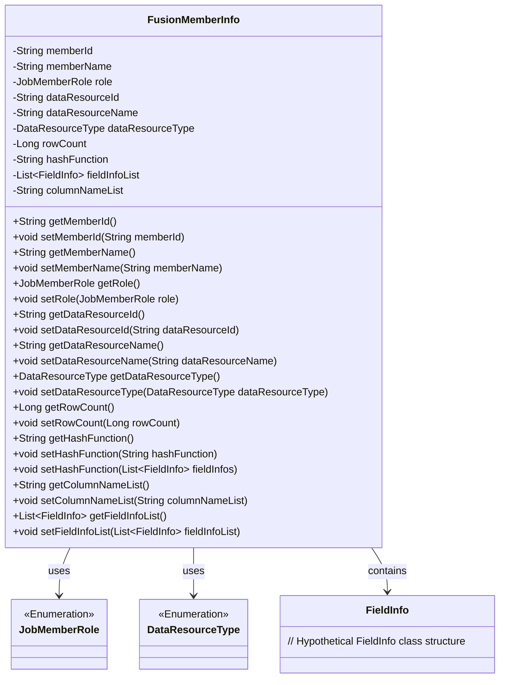

# Basic Information

|      |      |
|------|------|
| Name | FusionMemberInfo |
| Language | .java |
| Code Path | WeFe/board/board-service/src/main/java/com/welab/wefe/board/service/dto/fusion/FusionMemberInfo.java |
| Package Name | com.welab.wefe.board.service.dto.fusion |
| Dependencies | ['com.welab.wefe.board.service.util.primarykey.FieldInfo', 'com.welab.wefe.board.service.util.primarykey.PrimaryKeyUtils', 'com.welab.wefe.common.wefe.enums.DataResourceType', 'com.welab.wefe.common.wefe.enums.JobMemberRole', 'java.util.List'] |
| Brief Description | The FusionMemberInfo class contains attributes such as member ID, name, role, data resource information, row count, hash function, field list, and column name list, and provides getter and setter methods. |

# Description

The `FusionMemberInfo` class defines the data structure for member information, including member ID, name, and role. It involves data resource ID, name, type, row count, and hash function. It contains a list of field information and a list of column names. It provides getter and setter methods for each attribute and supports setting the hash function through a field list.

# Class Summary

| Name   | Type  | Description |
|-------|------|-------------|
| FusionMemberInfo | class | The FusionMemberInfo class contains member ID, name, role, data resource ID, name, type, row count, hash function, field information list, and column name list, and provides relevant getter and setter methods. |

## Class FusionMemberInfo

|      |      |
|------|------|
| Access Modifier | public |
| Type | class |
| Name | FusionMemberInfo |
| Description | The FusionMemberInfo class contains member ID, name, role, data resource ID, name, type, row count, hash function, field information list, and column name list, and provides relevant getter and setter methods. |

### UML Class Diagram

This code defines a `FusionMemberInfo` class for storing member information, data resource information, and field information. The class includes multiple private fields and corresponding getter/setter methods to manage member ID, name, role, data resource ID, name, type, row count, hash function, field information list, and column name list. The class depends on the `JobMemberRole` and `DataResourceType` enumeration types and contains a list of `FieldInfo` classes. The overall design is intended to encapsulate and manage member-related information during data fusion processes.

### Internal Method Call Graph

This code defines a class named FusionMemberInfo, which is used to store and manage member information and its associated data resource details. The class contains multiple properties such as memberId, memberName, role, etc., along with corresponding getter and setter methods. Notably, the hashFunction property has two setter methods: one that accepts a String parameter and another that takes a List<FieldInfo> parameter and invokes the PrimaryKeyUtils.hashFunction() method to generate a hash value. This class primarily serves to encapsulate member information and its related data resource details, facilitating unified management and operations within the program.

### Field List

| Name  | Type  | Description |
|-------|-------|------|
| columnNameList | String | A list variable of column names in string type. |
| memberId | String | Member ID string variable |
| rowCount | Long | Declare a long integer variable rowCount. |
| dataResourceId | String | Data resource ID of string type. |
| dataResourceName | String | String data resource name. |
| hashFunction | String | String Hash Function |
| fieldInfoList | List<FieldInfo> | Field information list, storing multiple FieldInfo objects. |
| memberName | String | Declare a string variable memberName |
| role | JobMemberRole | Defined a variable named role of type JobMemberRole. |
| dataResourceType | DataResourceType | Defined a variable named dataResourceType with the type DataResourceType. |

### Method List

| Name  | Type  | Description |
|-------|-------|------|
| getMemberId | String | Methods to obtain member ID, returns the member ID string. |
| setRole | void | The method `setRole` is used to set a member's role, with the parameter being of type `JobMemberRole`, which is directly assigned to the `role` property of the current object. |
| getDataResourceType | DataResourceType | Methods for obtaining the data resource type, returns dataResourceType. |
| getRole | JobMemberRole | The method getRole returns the value of the member variable role of type JobMemberRole. |
| getMemberName | String | This is a Java method that returns the value of the member variable memberName. |
| setMemberName | void | Set the value of the member variable memberName. |
| getHashFunction | String | Methods to Obtain Hash Function Names. |
| setDataResourceType | void | The method for setting the data resource type, with the parameter of type DataResourceType, assigns the value to the member variable dataResourceType of the class. |
| setDataResourceId | void | The method to set the data resource ID assigns the input parameter to the class member variable dataResourceId. |
| setMemberId | void | The method to set the member ID assigns the input string to the class's member variable `memberId`. |
| setRowCount | void | The method to set the number of rows assigns the parameter rowCount to the class member variable rowCount. |
| getDataResourceId | String | Methods to obtain the data resource ID, returning a string type. |
| getRowCount | Long | Methods to obtain the number of rows, returning the rowCount value. |
| setDataResourceName | void | This is a Java method used to set the data resource name property of a class. The method accepts a string parameter and assigns it to the member variable dataResourceName of the class. |
| setHashFunction | void | The method `setHashFunction` receives a list of field information, invokes the `hashFunction` of `PrimaryKeyUtils` to generate a hash function, and assigns it to the current object. |
| getDataResourceName | String | Methods for obtaining the name of a data resource, returning a string-type value `dataResourceName`. |
| setHashFunction | void | This is a Java method used to set the hashFunction property value of an object. The method accepts a string parameter and assigns it to the hashFunction field of the current object. |
| getColumnNameList | String | Methods to obtain the column name list, returning a string-type variable columnNameList. |
| setColumnNameList | void | Methods for setting the column name list, assigning the input string to the class's column name list variable. |
| getFieldInfoList | List<FieldInfo> | This method returns a list of FieldInfo type, namely fieldInfoList. |
| setFieldInfoList | void | The method for setting the field information list assigns the input parameters to the class member variable fieldInfoList. |

