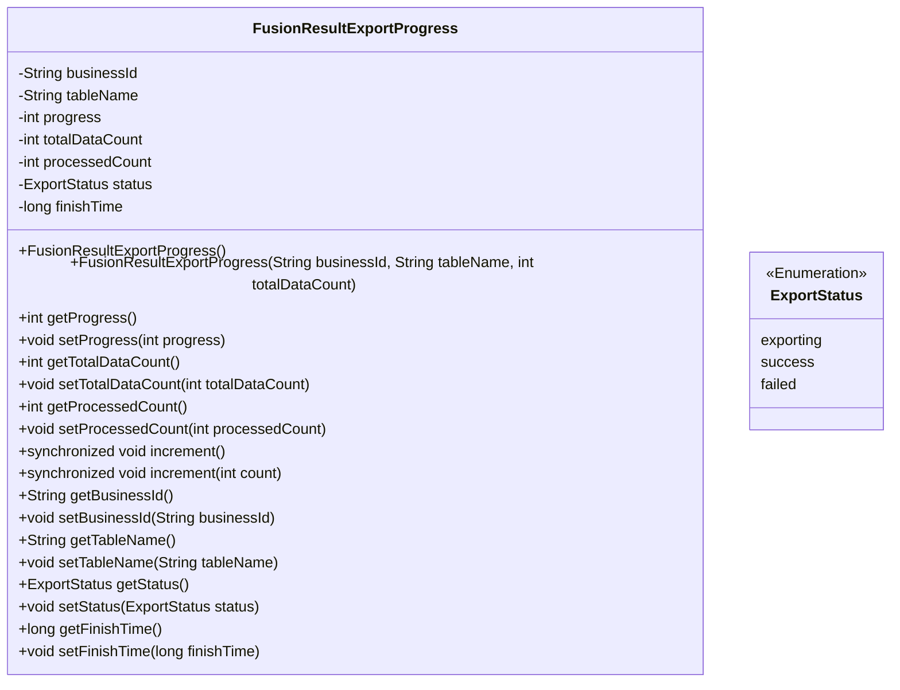

# Basic Information

|      |      |
|------|------|
| Name | FusionResultExportProgress |
| Language | .java |
| Code Path | WeFe/board/board-service/src/main/java/com/welab/wefe/board/service/dto/fusion/FusionResultExportProgress.java |
| Package Name | com.welab.wefe.board.service.dto.fusion |
| Dependencies | ['com.welab.wefe.board.service.fusion.enums.ExportStatus'] |
| Brief Description | The `FusionResultExportProgress` class is used to track export progress, containing fields such as business ID, table name, progress percentage, total count, processed count, status, and completion time. It provides methods for progress calculation and incremental updates. |

# Description

The `FusionResultExportProgress` class is used to track data export progress, containing attributes such as business ID, table name, total data volume, processed quantity, progress percentage, status, and completion time. It provides a constructor method to initialize export tasks, supports updating the processed quantity via the `increment` method while automatically calculating progress, and updates the status and completion time upon task completion. The class includes getter and setter methods for each attribute.

# Class Summary

| Name   | Type  | Description |
|-------|------|-------------|
| FusionResultExportProgress | class | The FusionResultExportProgress class is used to track data export progress, containing business ID, table name, total count, processed count, status, and completion time, while providing methods for progress calculation and incremental updates. |

## Class FusionResultExportProgress

|      |      |
|------|------|
| Access Modifier | public |
| Type | class |
| Name | FusionResultExportProgress |
| Description | The FusionResultExportProgress class is used to track data export progress, containing business ID, table name, total count, processed count, status, and completion time, while providing methods for progress calculation and incremental updates. |

### UML Class Diagram

This class diagram illustrates the structure of the FusionResultExportProgress class, which is designed to track the progress of data export tasks. It includes core fields such as business ID, table name, progress percentage, total data volume, processed count, etc. Thread-safe progress updates are achieved through synchronized methods, with automatic status and timestamp updates upon task completion. The ExportStatus enumeration defines three states for export tasks. The class automatically calculates progress values based on the ratio of processed count to total volume and provides complete getter/setter methods.

### Internal Method Call Graph

```mermaid
graph TD
    A["Class FusionResultExportProgress"]
    B["Property: String businessId"]
    C["Property: String tableName"]
    D["Property: int progress"]
    E["Property: int totalDataCount"]
    F["Property: int processedCount"]
    G["Property: ExportStatus status"]
    H["Property: long finishTime"]
    I["Constructor: FusionResultExportProgress()"]
    J["Constructor: FusionResultExportProgress(String businessId, String tableName, int totalDataCount)"]
    K["Method: int getProgress()"]
    L["Method: void setProgress(int progress)"]
    M["Method: int getTotalDataCount()"]
    N["Method: void setTotalDataCount(int totalDataCount)"]
    O["Method: int getProcessedCount()"]
    P["Method: void setProcessedCount(int processedCount)"]
    Q["Synchronized Method: void increment()"]
    R["Synchronized Method: void increment(int count)"]
    S["Method: String getBusinessId()"]
    T["Method: void setBusinessId(String businessId)"]
    U["Method: String getTableName()"]
    V["Method: void setTableName(String tableName)"]
    W["Method: ExportStatus getStatus()"]
    X["Method: void setStatus(ExportStatus status)"]
    Y["Method: long getFinishTime()"]
    Z["Method: void setFinishTime(long finishTime)"]

    A --> B
    A --> C
    A --> D
    A --> E
    A --> F
    A --> G
    A --> H
    A --> I
    A --> J
    A --> K
    A --> L
    A --> M
    A --> N
    A --> O
    A --> P
    A --> Q
    A --> R
    A --> S
    A --> T
    A --> U
    A --> V
    A --> W
    A --> X
    A --> Y
    A --> Z
```

This flowchart illustrates the complete structure of the FusionResultExportProgress class, comprising 8 property fields, 2 constructors, and 16 member methods. Core functionalities include: synchronously updating processing progress via the increment() method, automatically calculating export percentage (getProgress), and automatically marking the status as success with timestamp upon completion. All properties are equipped with getter/setter methods, where the progress field calculation involves floating-point conversion and percentage computation.

### Field List

| Name  | Type  | Description |
|-------|-------|------|
| progress | int | The integer variable `progress` is used to track progress. |
| tableName | String | Define a string variable tableName to store the table name. |
| finishTime | long | Long integer completion time variable |
| totalDataCount | int | The variable totalDataCount is used to store the total number of data. |
| status | ExportStatus | The variable `status` represents the export status. |
| businessId | String | Business identification string |
| processedCount | int | Processed count variable. |

### Method List

| Name  | Type  | Description |
|-------|-------|------|
| setProgress | void | Methods for setting the progress value: assign the parameter progress to the member variable progress. |
| increment | void | The synchronous method `increment` is used to increase the count and returns directly if the count is negative. After processing the count increment, it marks the completion time and sets the status to success if the total amount is reached. |
| setTableName | void | This is a Java method used to set the tableName property value of a class. The method takes a string parameter tableName and assigns it to the class's member variable of the same name. |
| getTableName | String | The method returns the value of the table name variable tableName. |
| setBusinessId | void | The method setBusinessId is used to set the value of the businessId field, with the parameter being of type String. |
| getProgress | int | This method calculates and returns the processing progress percentage by dividing the processed quantity by the total quantity, multiplying by 100, and then rounding the result. |
| getBusinessId | String | This is a Java method that returns a businessId of type String. |
| setProcessedCount | void | Set the processed count method, assign the parameter processedCount to the class member variable processedCount. |
| getTotalDataCount | int | This is a Java method that returns the value of the integer variable totalDataCount. |
| getStatus | ExportStatus | Methods to obtain the current export status, returning an ExportStatus object. |
| getProcessedCount | int | Method to get the processed count, returns an integer value processedCount. |
| increment | void | The synchronous method increment() is used to increase the count. When the processed number reaches the total, it records the completion time and updates the status to success. |
| setTotalDataCount | void | The method for setting the total data volume assigns the input parameter to the class member variable totalDataCount. |
| setStatus | void | Method to set the export status, which assigns the passed status parameter to the class's status property. |
| getFinishTime | long | Methods to obtain the completion time, returns the finishTime value. |
| setFinishTime | void | The method to set the completion time, with the parameter being a long integer finishTime. |

