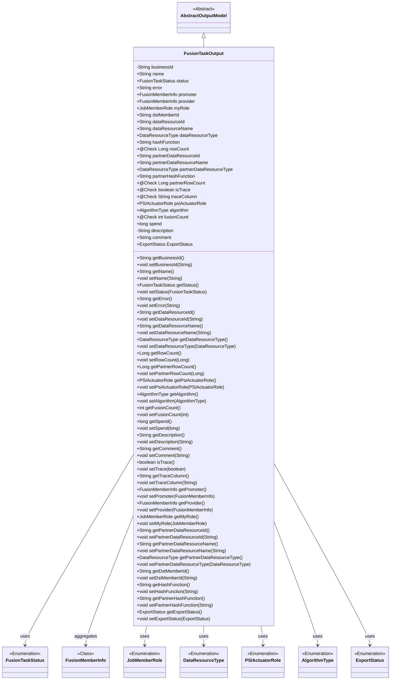

# Basic Information

|      |      |
|------|------|
| Name | FusionTaskOutput |
| Language | .java |
| Code Path | WeFe/board/board-service/src/main/java/com/welab/wefe/board/service/dto/fusion/FusionTaskOutput.java |
| Package Name | com.welab.wefe.board.service.dto.fusion |
| Dependencies | ['com.welab.wefe.board.service.dto.entity.AbstractOutputModel', 'com.welab.wefe.board.service.dto.entity.data_resource.output.BloomFilterOutputModel', 'com.welab.wefe.board.service.dto.entity.data_resource.output.TableDataSetOutputModel', 'com.welab.wefe.board.service.fusion.enums.ExportStatus', 'com.welab.wefe.common.fieldvalidate.annotation.Check', 'com.welab.wefe.common.wefe.enums.DataResourceType', 'com.welab.wefe.common.wefe.enums.JobMemberRole', 'com.welab.wefe.fusion.core.enums.AlgorithmType', 'com.welab.wefe.fusion.core.enums.FusionTaskStatus', 'com.welab.wefe.fusion.core.enums.PSIActuatorRole', 'javax.persistence.Column', 'javax.persistence.EnumType', 'javax.persistence.Enumerated', 'java.util.List'] |
| Brief Description | The FusionTaskOutput class includes attributes such as task ID, name, status, error message, member role, data resource information, algorithm type, tracking fields, and time consumption, which are used to describe the output results of a fusion task. |

# Description

The `FusionTaskOutput` class is a model class that inherits from `AbstractOutputModel`, used to represent the output information of a fusion task. It includes multiple fields such as business ID, task name, status, error message, initiator and provider information, member role, data resource ID and name, data type, hash function, row count, tracking fields, algorithm type, fusion count, time consumed, description, comments, and export status. Each field has corresponding getter and setter methods for retrieving and setting field values. The class also contains some fields annotated with `@Check` to validate data effectiveness. Overall, this class provides comprehensive encapsulation and management of fusion task output information.

# Class Summary

| Name   | Type  | Description |
|-------|------|-------------|
| FusionTaskOutput | class | The FusionTaskOutput class is used to describe the output of a data fusion task, containing attributes such as task ID, status, participant information, data resource details, algorithm type, row count statistics, and tracking fields. |

## Class FusionTaskOutput

|      |      |
|------|------|
| Access Modifier | public |
| Type | class |
| Name | FusionTaskOutput |
| Description | The FusionTaskOutput class is used to describe the output of a data fusion task, containing attributes such as task ID, status, participant information, data resource details, algorithm type, row count statistics, and tracking fields. |

### UML Class Diagram

This class diagram illustrates that the FusionTaskOutput class inherits from AbstractOutputModel, containing multiple enumeration-type and custom-type attributes primarily used to describe the output results of fusion tasks. The class features extensive fields and methods for tracking task status, data resource information, participant roles, and various statistical metrics, with validation markers via annotations. Its associations with multiple enumeration classes demonstrate multidimensional state management and type control capabilities for tasks.

### Internal Method Call Graph

```mermaid
graph TD
    A["Class FusionTaskOutput"]
    B["Inherits from: AbstractOutputModel"]
    C["Property: String businessId"]
    D["Property: String name"]
    E["Property: FusionTaskStatus status"]
    F["Property: String error"]
    G["Property: FusionMemberInfo promoter"]
    H["Property: FusionMemberInfo provider"]
    I["Property: JobMemberRole myRole"]
    J["Property: String dstMemberId"]
    K["Property: String dataResourceId"]
    L["Property: String dataResourceName"]
    M["Property: DataResourceType dataResourceType"]
    N["Property: String hashFunction"]
    O["Property: @Check Long rowCount"]
    P["Property: String partnerDataResourceId"]
    Q["Property: String partnerDataResourceName"]
    R["Property: DataResourceType partnerDataResourceType"]
    S["Property: String partnerHashFunction"]
    T["Property: @Check Long partnerRowCount"]
    U["Property: @Check boolean isTrace"]
    V["Property: @Check String traceColumn"]
    W["Property: PSIActuatorRole psiActuatorRole"]
    X["Property: AlgorithmType algorithm"]
    Y["Property: @Check int fusionCount"]
    Z["Property: long spend"]
    AA["Property: String description"]
    AB["Property: String comment"]
    AC["Property: ExportStatus ExportStatus"]
    AD["Method: getter/setter method group"]

    A --> B
    A --> C
    A --> D
    A --> E
    A --> F
    A --> G
    A --> H
    A --> I
    A --> J
    A --> K
    A --> L
    A --> M
    A --> N
    A --> O
    A --> P
    A --> Q
    A --> R
    A --> S
    A --> T
    A --> U
    A --> V
    A --> W
    A --> X
    A --> Y
    A --> Z
    A --> AA
    A --> AB
    A --> AC
    A --> AD
```

This flowchart illustrates the complete structure of the FusionTaskOutput class, which inherits from AbstractOutputModel and contains 25 properties along with corresponding getter/setter methods. The properties cover core fields such as business ID, task status, error information, member roles, data resource details, hash functions, row count statistics, trace markers, algorithm types, etc., with several properties annotated with @Check. The class structure clearly reflects the comprehensive data model for data fusion task outputs, suitable for complex data processing scenarios.

### Field List

| Name  | Type  | Description |
|-------|-------|------|
| partnerDataResourceId | String | The `partnerDataResourceId` is a string variable that stores the partner data resource ID. |
| psiActuatorRole | PSIActuatorRole | Define the variable psiActuatorRole with the type PSIActuatorRole. |
| spend | long | The variable `spend` is of type long integer, representing the expenditure amount. |
| partnerHashFunction | String | String-type partner hash function variable. |
| status | FusionTaskStatus | The variable `status` in `FusionTaskStatus` is used to indicate the task state. |
| rowCount | Long | Check the field for the number of data resource rows, with the type being long integer. |
| businessId | String | The private string-type variable businessId is used to store the business identifier. |
| traceColumn | String | The code defines a public string variable named traceColumn, which is marked as a tracking field using the @Check annotation. |
| algorithm | AlgorithmType | Declare a variable named algorithm of type AlgorithmType. |
| dstMemberId | String | Define a string type variable dstMemberId. |
| dataResourceName | String | String type data resource name variable. |
| description | String | The private string-type variable description is used to store descriptive information. |
| fusionCount | int | The public integer variable fusionCount is used to record the number of fusions, annotated with a quantity check. |
| provider | FusionMemberInfo | FusionMemberInfo provider, used for managing member information. |
| comment | String | Declare a public string variable comment. |
| hashFunction | String | Declaration of string hash function variables. |
| promoter | FusionMemberInfo | Member information fusion initiator. |
| ExportStatus | ExportStatus | Defined a public variable named ExportStatus, of type ExportStatus. |
| partnerDataResourceType | DataResourceType | Defined a variable named partnerDataResourceType of type DataResourceType. |
| name | String | Declare a string variable named name. |
| isTrace | boolean | Check if it is the tracked boolean variable isTrace. |
| dataResourceType | DataResourceType | Declare a variable named dataResourceType of type DataResourceType. |
| myRole | JobMemberRole | Declare a variable named myRole of type JobMemberRole. |
| dataResourceId | String | String-type data resource identifier. |
| error | String | String Error Variable |
| partnerRowCount | Long | Check the field for the number of data resource rows, with the type being long integer. |
| partnerDataResourceName | String | String type variable used to store the name of the partner data resource. |

### Method List

| Name  | Type  | Description |
|-------|-------|------|
| setComment | void | This is a Java method used to set the comment property value of an object. The method takes a string parameter `comment` and assigns it to the `comment` member variable of the current object. |
| setDescription | void | This is a Java method used to set the description property of an object. The method takes a string parameter named description and assigns it to the object's description member variable. |
| getPromoter | FusionMemberInfo | Public method to retrieve promoter information, returns a promoter object of type FusionMemberInfo. |
| setDataResourceName | void | Methods for setting the data resource name, assigning input parameters to the member variables of the class. |
| setBusinessId | void | Methods for setting the business ID, assigning the input string to the businessId member variable of the class. |
| getDataResourceType | DataResourceType | Methods for obtaining data resource types, returns dataResourceType. |
| getProvider | FusionMemberInfo | Get the FusionMemberInfo object of the current provider. |
| getFusionCount | int | Method to obtain the current fusion count, returns the value of the integer variable fusionCount. |
| getDataResourceId | String | Methods to obtain the data resource ID, returns the data resource ID as a string type. |
| setDataResourceType | void | The method for setting the data resource type assigns the passed-in `dataResourceType` to the property of the same name in the current object. |
| setTrace | void | The method to set the tracking state assigns the boolean parameter `trace` to the `isTrace` variable. |
| setFusionCount | void | Set the fusion counting method by assigning the input parameter to the class member variable fusionCount. |
| setPartnerDataResourceName | void | The method for setting the partner data resource name assigns the input parameter to the class member variable. |
| getPsiActuatorRole | PSIActuatorRole | Get the PSI executor role. |
| setStatus | void | This is a Java method used to set the task status. The method is named setStatus, which takes a parameter of type FusionTaskStatus named status and assigns it to the status property of the current object. |
| setTraceColumn | void | Set the value of the tracking column field. |
| getDescription | String | Methods for obtaining descriptive information, returning the description content as a string. |
| setDstMemberId | void | The method to set the target member ID assigns the parameter value to the class member variable `dstMemberId`. |
| setHashFunction | void | This is a Java method used to set the hashFunction property value of an object. The method takes a string parameter and assigns it to a member variable. |
| setPartnerDataResourceId | void | Method for setting the partner data resource ID, assigning the parameter value to the class member variable `partnerDataResourceId`. |
| setAlgorithm | void | The method to set the algorithm type assigns the parameter to the member variable algorithm. |
| getName | String | Methods to get the name, returns the value of the name variable of string type. |
| setMyRole | void | Java Method: Set the current role, with the parameter of type JobMemberRole. |
| getPartnerRowCount | Long | Get the value of partnerRowCount. |
| setPsiActuatorRole | void | Set the PSI actuator role, assigning the input parameters to the class member variable psiActuatorRole. |
| getTraceColumn | String | Methods for Obtaining Tracked Column Field Values. |
| getPartnerDataResourceName | String | The method to obtain the partner data resource name, which returns a string-type variable `partnerDataResourceName`. |
| setRowCount | void | Set the number of rows to the specified value. |
| setSpend | void | The method to set the spending amount assigns the parameter value to the class member variable `spend`. |
| getDataResourceName | String | This method returns the name of the data resource. |
| getPartnerDataResourceType | DataResourceType | Methods for obtaining partner data resource types, returns partnerDataResourceType. |
| setPartnerDataResourceType | void | The method for setting the partner data resource type assigns the input parameter to the member variable `partnerDataResourceType`. |
| setProvider | void | Set the provider information by assigning the passed FusionMemberInfo object to the member variable provider. |
| setPartnerRowCount | void | The method to set the number of partner rows assigns the input value to the class variable partnerRowCount. |
| getError | String | String methods for retrieving error messages. |
| getStatus | FusionTaskStatus | Methods to obtain the current task status, returning a status value of type FusionTaskStatus. |
| setDataResourceId | void | The method for setting the data resource ID assigns the input parameter to the class member variable dataResourceId. |
| setPromoter | void | Set the promoter information, with the parameter being of type FusionMemberInfo. |
| getPartnerHashFunction | String | The method to obtain the partner hash function, with a return value of partnerHashFunction. |
| setPartnerHashFunction | void | Methods for setting up partner hash functions. |
| getExportStatus | com.welab.wefe.board.service.fusion.enums.ExportStatus | Java Method: Get Export Status, returns the enumeration type ExportStatus. |
| setExportStatus | void | Method to set export status, with parameter of enum type ExportStatus, assigns the passed value to the class variable ExportStatus. |
| getRowCount | Long | Methods to obtain the number of rows, returning a long integer value rowCount. |
| setError | void | Methods for setting error messages, assigning the passed string to the error property of the class. |
| isTrace | boolean | The method isTrace returns a boolean value isTrace, which is used to check the tracing status. |
| getPartnerDataResourceId | String | The method to obtain the partner data resource ID, which returns a string-type `partnerDataResourceId`. |
| getSpend | long | Public method to get the value of the spend variable, returns a long type. |
| getHashFunction | String | Methods to Obtain Hash Function Names. |
| getDstMemberId | String | Methods to obtain the target member ID, which returns the dstMemberId as a string type. |
| getMyRole | JobMemberRole | Get the role information of the current user. |
| getComment | String | Methods to obtain the comment string. |
| getBusinessId | String | Methods to obtain the business ID, returns a string-type businessId. |
| setName | void | The method to set the object name assigns the parameter `name` to the `name` property of the object. |
| getAlgorithm | AlgorithmType | Method to obtain the current algorithm type. |

