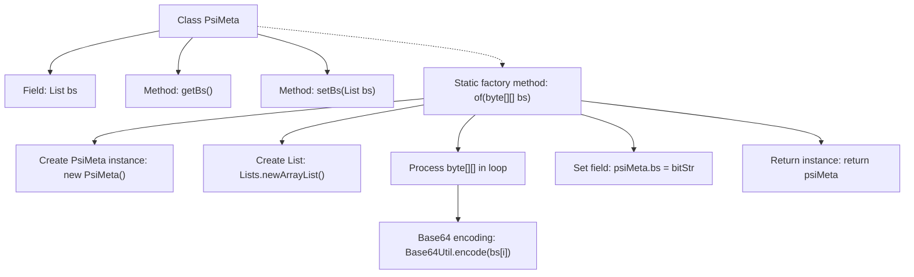

# Basic Information

|      |      |
|------|------|
| Name | PsiMeta |
| Language | .java |
| Code Path | WeFe/board/board-service/src/main/java/com/welab/wefe/board/service/dto/fusion/PsiMeta.java |
| Package Name | com.welab.wefe.board.service.dto.fusion |
| Dependencies | ['com.welab.wefe.common.util.Base64Util', 'org.apache.commons.compress.utils.Lists', 'java.util.List'] |
| Brief Description | The PsiMeta class contains a string list bs, providing getter and setter methods. The static method of converts a byte array into a Base64-encoded string list and creates a PsiMeta instance. |

# Description

The PsiMeta class is a simple data structure containing a list of strings, bs. It provides methods getBs and setBs to retrieve and modify the bs list. The class also defines a static factory method, of, which takes a two-dimensional byte array bs as a parameter, converts each byte array element into a string using Base64 encoding, stores it in the bs list of a newly created PsiMeta object, and finally returns that object. The entire process involves no complex logic and is primarily used to encapsulate and handle a list of Base64-encoded strings.

# Class Summary

| Name   | Type  | Description |
|-------|------|-------------|
| PsiMeta | class | The PsiMeta class contains a string list bs, provides get/set methods, and a static method of that converts a byte array into a Base64-encoded string list and returns a PsiMeta instance. |


## Class PsiMeta

|      |      |
|------|------|
| Access Modifier | public |
| Type | class |
| Name | PsiMeta |
| Description | The PsiMeta class contains a string list bs, provides get/set methods, and a static method of that converts a byte array into a Base64-encoded string list and returns a PsiMeta instance. |


### UML Class Diagram

```mermaid
classDiagram
    class PsiMeta {
        -List~String~ bs
        +List~String~ getBs()
        +void setBs(List~String~ bs)
        +static PsiMeta of(byte[][] bs)
    }
    // The PsiMeta class contains a private member 'bs' of type List<String>, with getter and setter methods
    // The static 'of' method takes a 2D byte array, Base64-encodes its elements into a List, and returns a PsiMeta instance
```

This code defines a simple Java class named PsiMeta, primarily used for encapsulating and processing Base64-encoded byte array lists. The class contains a private member 'bs' (a string list) accessed and modified via getter and setter methods. Its core functionality is through the static factory method of(), which Base64-encodes each element of the input 2D byte array into the list and returns a PsiMeta object containing the encoded results. This design pattern is commonly used in scenarios where object creation and initialization need to be separated, particularly suitable for cases requiring input data preprocessing.


### Internal Method Call Graph



This code demonstrates a PsiMeta class primarily designed for Base64 encoding conversion of byte arrays. The flowchart clearly illustrates the class structure, including the bs field, getter/setter methods, and the key static factory method of(). The of() method implements the conversion from byte arrays to Base64 string lists by creating an empty list, processing input byte arrays in a loop, performing Base64 encoding, and finally populating the list to return the instance. Arrows connect all steps, fully presenting the logical chain of object creation and data processing.

### Field List

| Name  | Type  | Description |
|-------|-------|------|
| bs | List<String> | Declare a string list variable named bs. |

### Method List

| Name  | Type  | Description |
|-------|-------|------|
| getBs | List<String> | The method getBs returns a list of strings bs. |
| setBs | void | This is a Java method used to set the value of the class member variable "bs", with the parameter being a string list. |
| of | PsiMeta | The static method `of` takes a two-dimensional byte array, Base64-encodes each item, stores them in a list, and encapsulates the result as a PsiMeta object. |


