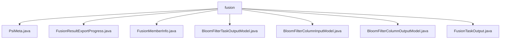

# Basic Information

|      |      |
|------|------|
| Name | fusion |
| Language | .java |
| Code Path | WeFe/board/board-service/src/main/java/com/welab/wefe/board/service/dto/fusion |
| Package Name | docs.board.board-service.src.main.java.com.welab.wefe.board.service.dto.fusion |
| Brief Description | The PsiMeta class encapsulates a list of Base64 strings. FusionResultExportProgress tracks export progress. FusionMemberInfo stores member information. BloomFilterTaskOutputModel records the status of Bloom filter tasks. BloomFilterColumnInputModel validates field inputs. BloomFilterColumnOutputModel describes field outputs. FusionTaskOutput encapsulates fusion task information. |

# Description

## Overview  
The core responsibility of this module is to manage metadata, progress tracking, and task outputs during the data fusion process, functioning similarly to a data pipeline controller. The interface specifications include basic CRUD operations and status update methods, such as Base64 encoding conversion for PsiMeta and progress calculation for FusionResultExportProgress. Key data structures include PsiMeta (string lists), FusionMemberInfo (member metadata), BloomFilter series models (field-level control), and FusionTaskOutput (end-to-end task encapsulation). External dependencies involve Base64 encoding, regex validation (e.g., length constraints), and the AbstractOutputModel base class.

## Primary Business Scenarios  
The module supports full lifecycle management of data fusion, with typical workflows including: initializing Bloom filter fields (BloomFilterColumnInputModel) → executing fusion tasks (FusionTaskOutput) → tracking export progress (FusionResultExportProgress). The interaction mode is state-driven, such as automatically updating progress percentages via the increment method. Full functionality covers metadata encapsulation (e.g., role management in FusionMemberInfo), data validation (@Check annotation), and result export (e.g., primary key deduplication statistics in BloomFilterTaskOutputModel). Typical applications include multi-source data fusion and collaborative task distribution among members.

### Package Internal Structure View

This flowchart illustrates the structural relationships within the fusion data directory of the board-service module in the WeFe project. The parent node 'fusion' directly encompasses seven DTO class files, including PsiMeta, FusionResultExportProgress, etc. These files reside at the same hierarchical level with no subdirectories. All files are utilized for handling business logic related to data fusion, reflecting the completeness and modular design of this module in implementing data fusion functionalities.

# File List

| Name   | Type  | Description |
|-------|------|-------------|
| [PsiMeta.java](PsiMeta.md) | file | The PsiMeta class contains a string list bs and provides getter and setter methods. The static method of converts a byte array into a Base64-encoded string list and creates a PsiMeta instance. |
| [FusionResultExportProgress.java](FusionResultExportProgress.md) | file | The `FusionResultExportProgress` class is used to track export progress, containing fields such as business ID, table name, progress percentage, total count, processed count, status, and completion time. It provides methods for progress calculation and incremental updates. |
| [FusionMemberInfo.java](FusionMemberInfo.md) | file | The FusionMemberInfo class includes attributes such as member ID, name, role, data resource information, row count, hash function, field list, and column name list, providing getter and setter methods. |
| [BloomFilterTaskOutputModel.java](BloomFilterTaskOutputModel.md) | file | BloomFilter task output model class, containing fields such as filter name, ID, data row count, progress, remaining time, duplicate primary key count, and error messages, along with their getter/setter methods. |
| [BloomFilterColumnInputModel.java](BloomFilterColumnInputModel.md) | file | The BloomFilterColumnInputModel class inherits from AbstractCheckModel and includes field name, data type, and comment attributes, with a comment length limit of 250 characters and mandatory data type validation. |
| [BloomFilterColumnOutputModel.java](BloomFilterColumnOutputModel.md) | file | The BloomFilterColumnOutputModel class inherits from AbstractOutputModel and includes attributes such as filter ID, field sequence number, name, data type, comments, null value count, and value distribution, along with their corresponding getter/setter methods. |
| [FusionTaskOutput.java](FusionTaskOutput.md) | file | The FusionTaskOutput class includes attributes such as task ID, name, status, error message, member role, data resource information, algorithm type, tracking fields, and time consumption, which are used to describe the output results of a fusion task. |

