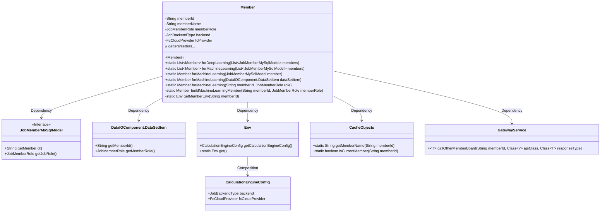

# Basic Information

|      |      |
|------|------|
| Name | Member |
| Language | .java |
| Code Path | WeFe/board/board-service/src/main/java/com/welab/wefe/board/service/dto/kernel/Member.java |
| Package Name | com.welab.wefe.board.service.dto.kernel |
| Dependencies | ['com.welab.wefe.board.service.api.member.GetMemberMachineLearningEnvApi', 'com.welab.wefe.board.service.component.DataIOComponent', 'com.welab.wefe.board.service.database.entity.job.JobMemberMySqlModel', 'com.welab.wefe.board.service.dto.kernel.machine_learning.Env', 'com.welab.wefe.board.service.service.CacheObjects', 'com.welab.wefe.board.service.service.GatewayService', 'com.welab.wefe.common.exception.StatusCodeWithException', 'com.welab.wefe.common.web.Launcher', 'com.welab.wefe.common.wefe.enums.FcCloudProvider', 'com.welab.wefe.common.wefe.enums.JobBackendType', 'com.welab.wefe.common.wefe.enums.JobMemberRole', 'java.util.ArrayList', 'java.util.List'] |
| Brief Description | The Member class represents member information, including ID, name, role, backend type, and cloud provider. It provides methods for constructing member lists for deep learning and machine learning, supports creating member objects from different data sources, and sets relevant environment configurations. |

# Description

The code defines a `Member` class to represent member information, including attributes such as member ID, name, role, backend type, and cloud service provider. It provides two static factory methods: `forDeepLearning` and `forMachineLearning`, which are used to create lists of member objects for deep learning and machine learning, respectively. Among them, `forMachineLearning` has multiple overloaded versions that support constructing member objects from different data sources and will retrieve member environment configurations via the `getMemberEnv` method to set the backend type and cloud service provider. The class also includes getter and setter methods for all attributes.

# Class Summary

| Name   | Type  | Description |
|-------|------|-------------|
| Member | class | The `Member` class is used to create member objects for deep learning or machine learning, containing member ID, name, role, backend type, and cloud provider information. It provides static methods to construct member lists or individual members for different scenarios. |

## Class Member

|      |      |
|------|------|
| Access Modifier | public |
| Type | class |
| Name | Member |
| Description | The `Member` class is used to create member objects for deep learning or machine learning, containing member ID, name, role, backend type, and cloud provider information. It provides static methods to construct member lists or individual members for different scenarios. |

### UML Class Diagram

Class Diagram Description: This diagram illustrates the Member class and its related dependencies. The Member class contains attributes such as member information and roles, providing static factory methods to create instances for deep learning/machine learning scenarios. It retrieves data through JobMemberMySqlModel and DataSetItem interfaces, depends on CacheObjects for cached data, and uses GatewayService for remote calls to other member environments. The Env class contains calculation engine configuration, while CalculationEngineConfig stores backend type and cloud provider settings.

### Internal Method Call Graph

This flowchart illustrates the complete structure of the Member class, including 5 private attributes, 1 constructor, and 7 core business methods. The main logic focuses on the forMachineLearning method series, which ultimately call buildMachineLearningMember to construct objects. This method retrieves environment configurations through getMemberEnv and sets fcProvider based on the backend type. The flowchart highlights method invocation chains and conditional branches, particularly the dual-path logic (local/remote) for environment retrieval.

### Field List

| Name  | Type  | Description |
|-------|-------|------|
| fcProvider | FcCloudProvider | The private cloud service provider variable `fcProvider`. |
| memberName | String | Private string type variable, storing member name. |
| memberId | String | Declare a private string type variable memberId. |
| backend | JobBackendType | Defined a private variable `backend` of type `JobBackendType`. |
| memberRole | JobMemberRole | Private member variable of type JobMemberRole, representing the job member role. |

### Method List

| Name  | Type  | Description |
|-------|-------|------|
| forMachineLearning | List<Member> | Convert the JobMemberMySqlModel list to a Member list, returning an empty list if the input is empty. Iterate through each element and call the forMachineLearning method to convert them individually. |
| forDeepLearning | List<Member> | Convert a list of JobMemberMySqlModel to a list of Member, including the memberId, memberName, and memberRole fields. Return an empty list if the input is empty. |
| setMemberName | void | Defined a public method setMemberName for setting the value of the member variable memberName. |
| forMachineLearning | Member | The static method `forMachineLearning` constructs a machine learning member object based on the member ID and role. |
| getMemberEnv | Env | The method `getMemberEnv` retrieves environment information based on `memberId`: if it is the current user, it fetches locally; otherwise, it remotely calls the `GetMemberMachineLearningEnvApi` interface via `GatewayService`, returning `null` in case of exceptions. |
| forMachineLearning | Member | This method creates a member object for machine learning scenarios, accepts member ID and role parameters, and returns a member instance by invoking an internal construction method. |
| buildMachineLearningMember | Member | Building machine learning member objects: Set ID, name, role, configure backend type based on environment, and add cloud provider information if FC is selected. |
| getMemberName | String | Methods for obtaining member names, returning the member name as a string. |
| forMachineLearning | Member | The static method `forMachineLearning` creates a machine learning member based on `DataSetItem`, invoking `buildMachineLearningMember` and passing in the member ID and role parameters. |
| getMemberRole | JobMemberRole | The method returns a member role object. |
| getBackend | JobBackendType | Methods to obtain the backend attribute value of type JobBackendType. |
| setMemberId | void | The method to set the member ID assigns the passed string parameter to the class's member variable `memberId`. |
| setMemberRole | void | The method `setMemberRole` is used to set the member role, with the parameter of type `JobMemberRole`, which is assigned to the member variable `memberRole`. |
| getMemberId | String | Methods to obtain member ID, returns a string-type memberId. |
| setBackend | void | The method for setting the task backend type assigns the passed `backend` parameter to the `backend` property of the current object. |
| getFcProvider | FcCloudProvider | The method to obtain an FcCloudProvider instance returns an fcProvider object. |
| setFcProvider | void | The method to set the FcCloudProvider instance assigns the parameter fcProvider to the fcProvider property of the current object. |

