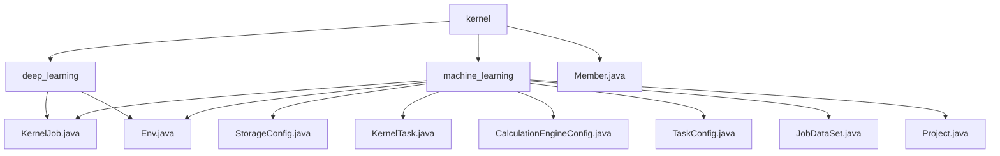

# Basic Information

|      |      |
|------|------|
| Name | kernel |
| Language | .java |
| Code Path | WeFe/board/board-service/src/main/java/com/welab/wefe/board/service/dto/kernel |
| Package Name | docs.board.board-service.src.main.java.com.welab.wefe.board.service.dto.kernel |
| Brief Description | The module manages federated learning task configuration and execution, including the KernelJob task structure and Env environment configuration. It supports multi-party collaboration and master-slave interaction, with processes encompassing initialization, resource allocation, and cluster submission. The Member class defines member information and provides factory methods to create member objects for different learning types. |

# Description

## Overview  
The core responsibility of this module is to centrally manage task configurations, execution environments, and member topologies for federated learning and deep learning, functioning as a hybrid of a task scheduling hub and configuration center. The interface specification adheres to the JavaBean standard, with serialization behavior controlled via static methods (e.g., `StorageConfig.get()`) and annotations (`@Check`/`@JSONField`). Key data structures include a three-tier encapsulation: task metadata (`KernelJob`), member topology (`KernelTask`/`Member`), and computation configurations (`CalculationEngineConfig`). External dependencies involve distributed training frameworks (e.g., PaddleFL), MySQL persistence, and the `GlobalConfigService` configuration service. For instance, the `Env` class switches storage strategies via a working mode toggle, while the `Member` class dynamically constructs member lists based on task types (deep learning/machine learning).  

## Core Business Scenarios  
The module supports full lifecycle management of cross-institution joint modeling, adopting a hybrid mode of "configuration-driven execution" and master-slave interaction. A typical workflow includes: initializing the `Env` environment → configuring member topologies (e.g., `Member.forMachineLearning` constructs a hybrid federation) → binding datasets → dispatching tasks via `KernelJob`. Functional completeness is reflected in member management (roles/cloud providers), multi-backend switching (e.g., `CalculationEngineConfig` supports FC cloud vendors), and visual monitoring (`useVdl` toggle). API integration examples include environment pre-checks, dynamic configuration loading (`get()`), and task serialization (`toJson()`). For instance, the `Project` class associates task instances via `projectId`, while the `Env` class can enforce a single-Worker mode to adapt to small-scale testing.

### Package Internal Structure View

This flowchart illustrates the hierarchical structure under the `kernel` directory, which includes two subdirectories `deep_learning` and `machine_learning`, as well as an independent file `Member.java`. The `deep_learning` directory contains two files: `KernelJob.java` and `Env.java`. The `machine_learning` directory includes multiple configuration files such as `StorageConfig.java`, `KernelTask.java`, etc., along with two files that share the same names as those in the `deep_learning` directory: `KernelJob.java` and `Env.java`.

# File List

| Name   | Type  | Description |
|-------|------|-------------|
| [deep_learning](deep_learning/_module.md) | package | The KernelJob class defines the structure of distributed tasks, including attributes such as project ID, task type, and members. The Env class manages training environment configurations, such as the number of workers and device information, enforcing a single-worker setup with an upper limit. |
| [Member.java](Member.md) | file | The `Member` class represents member information, including ID, name, role, backend type, and cloud provider. It provides methods for constructing member lists for deep learning and machine learning, supports creating member objects from different data sources, and enables the configuration of relevant environment settings. |
| [machine_learning](machine_learning/_module.md) | package | The `StorageConfig` class retrieves storage configurations and checks that the type is not empty. The `KernelTask` class manages member lists and provider information. The `CalculationEngineConfig` class handles computation engine configurations and validates the backend type. The `KernelJob` class encapsulates federated learning task configurations. The `TaskConfig` class defines the task structure, including input and output parameters. The `JobDataSet` class describes task dataset information. The `Project` class encapsulates the project ID. The `Env` class manages environment configurations and work modes. |

