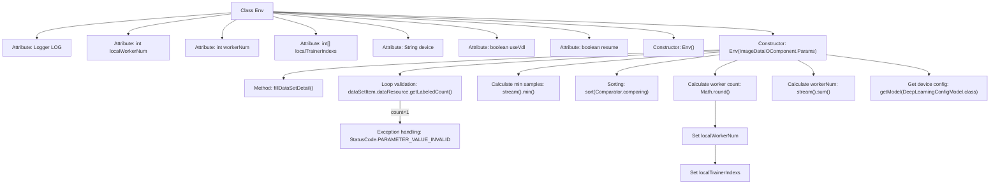

# Basic Information

|      |      |
|------|------|
| Name | Env |
| Language | .java |
| Code Path | WeFe/board/board-service/src/main/java/com/welab/wefe/board/service/dto/kernel/deep_learning/Env.java |
| Package Name | com.welab.wefe.board.service.dto.kernel.deep_learning |
| Dependencies | ['com.welab.wefe.board.service.component.deep_learning.ImageDataIOComponent', 'com.welab.wefe.board.service.service.CacheObjects', 'com.welab.wefe.board.service.service.globalconfig.GlobalConfigService', 'com.welab.wefe.common.Convert', 'com.welab.wefe.common.StatusCode', 'com.welab.wefe.common.exception.StatusCodeWithException', 'com.welab.wefe.common.web.Launcher', 'com.welab.wefe.common.wefe.dto.global_config.DeepLearningConfigModel', 'org.slf4j.Logger', 'org.slf4j.LoggerFactory', 'java.util.Comparator', 'java.util.LinkedHashMap'] |
| Brief Description | The Env class manages distributed training environment configurations, including calculating the number of workers (based on the minimum sample count, capped at 10), local worker indices, device type (CPU/GPU), visualization toggle, and task recovery flag. During initialization, it validates dataset annotation quantities and sorts members to ensure consistent worker allocation. |

# Description

The `Env` class is an environment configuration class primarily used for managing worker configurations and device information in distributed training. Key attributes include: `localWorkerNum` indicates the number of local workers, calculated based on the minimum sample count and capped at a maximum value of 10; `workerNum` represents the total number of workers across all participating parties; `localTrainerIndexs` stores the index range of local workers; `device` records the computational device in use; `useVdl` controls whether visualization is enabled; `resume` determines whether to continue from the last interruption point. The constructor validates dataset annotation quantities, calculates the number of workers per member, and initializes related configurations. The current implementation enforces the use of 1 worker per member and imposes an upper limit on the number of workers.

# Class Summary

| Name   | Type  | Description |
|-------|------|-------------|
| Env | class | The Env class manages distributed training environment configurations, including worker count calculation (based on minimum sample size, capped at 10), device type (CPU/GPU), visualization toggle, and task recovery options. During initialization, it validates dataset annotation quantities and assigns worker indices. |


## Class Env

|      |      |
|------|------|
| Access Modifier | public |
| Type | class |
| Name | Env |
| Description | The Env class manages distributed training environment configurations, including worker count calculation (based on minimum sample size, capped at 10), device type (CPU/GPU), visualization toggle, and task recovery options. During initialization, it validates dataset annotation quantities and assigns worker indices. |


### UML Class Diagram

```mermaid
classDiagram
    class Env {
        -Logger LOG
        +int localWorkerNum
        +int workerNum
        +int[] localTrainerIndexs
        +String device
        +boolean useVdl
        +boolean resume
        +Env()
        +Env(ImageDataIOComponent~Params~ imageDataIoParam) throws StatusCodeWithException
    }

    class ImageDataIOComponent {
        <<Interface>>
    }
    // ImageDataIOComponent interface contains inner classes Params and DataSetItem
    class "ImageDataIOComponent.Params" {
        +List~DataSetItem~ dataSetList
        +void fillDataSetDetail()
    }
    class "ImageDataIOComponent.DataSetItem" {
        +String memberId
        +DataResource dataResource
        +String getMemberId()
    }

    class DataResource {
        +String name
        +long getLabeledCount()
    }

    class DeepLearningConfigModel {
        +String device
    }

    class GlobalConfigService {
        +DeepLearningConfigModel getModel(Class~DeepLearningConfigModel~)
    }

    Env --> "ImageDataIOComponent.Params" : depends on\n(constructor param)
    Env --> GlobalConfigService : depends on\n(get device config)
    "ImageDataIOComponent.Params" --> "ImageDataIOComponent.DataSetItem" : contains\n(dataset list)
    "ImageDataIOComponent.DataSetItem" --> DataResource : associates with\n(data resource)
    GlobalConfigService --> DeepLearningConfigModel : depends on\n(config model)
```

Class diagram description: The Env class is an environment configuration class that primarily manages parameters such as worker count and device type in distributed training. It obtains dataset information through ImageDataIOComponent.Params, calculates worker counts for each member, and retrieves deep learning device configurations via GlobalConfigService. It includes validation logic for data annotation volume to ensure training data validity. The core functionality is initializing the training environment and allocating worker resources.


### Internal Method Call Graph



This flowchart illustrates the complete structure of the Env class, focusing on the execution flow of the parameterized constructor. Starting with parameter validation, it first checks the labeled dataset quantity, then calculates the minimum sample count as the base value. After sorting members, it computes the number of workers while handling special constraints (enforcing 1 worker and an upper limit of 10). Finally, it aggregates the total worker count and retrieves device configurations. The entire process incorporates exception handling and data transformation logic, reflecting the core workflow of distributed training environment initialization.

### Field List

| Name  | Type  | Description |
|-------|-------|------|
| localWorkerNum | int | Declare a public integer variable localWorkerNum. |
| localTrainerIndexs | int[] | Declare a public integer array variable localTrainerIndexs. |
| LOG = LoggerFactory.getLogger(this.getClass()) | Logger | Define the logger instance for the current class. |
| device | String | Declare a public string variable named device. |
| workerNum | int | An integer public variable defined in the class, representing the number of workers. |
| useVdl = true | boolean | The code defines a boolean variable useVdl with an initial value of true. |
| resume = false | boolean | The variable resume is of boolean type, with an initial value of false. |

### Method List

| Name  | Type  | Description |
|-------|-------|------|


