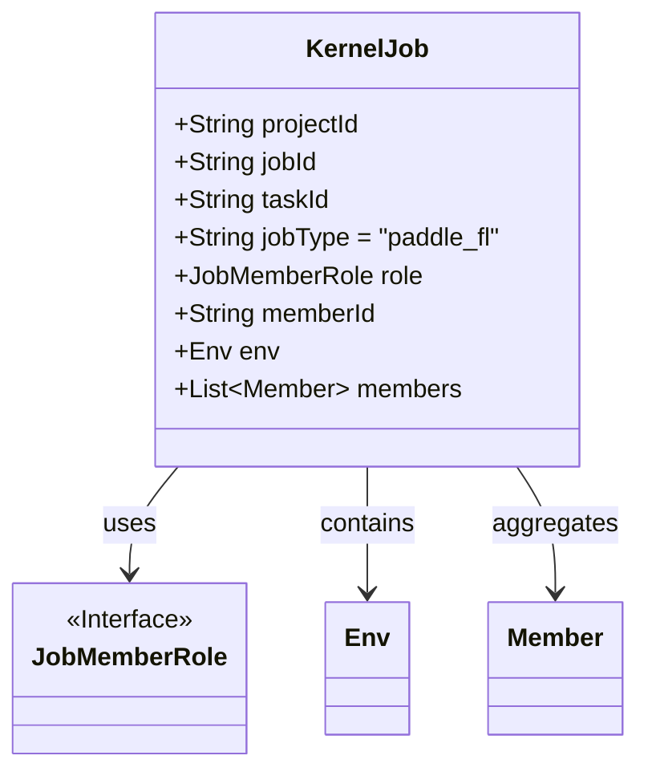
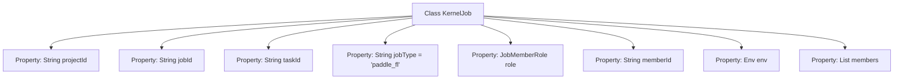

# Basic Information

|      |      |
|------|------|
| Name | KernelJob |
| Language | .java |
| Code Path | WeFe/board/board-service/src/main/java/com/welab/wefe/board/service/dto/kernel/deep_learning/KernelJob.java |
| Package Name | com.welab.wefe.board.service.dto.kernel.deep_learning |
| Dependencies | ['com.welab.wefe.board.service.dto.kernel.Member', 'com.welab.wefe.common.wefe.enums.JobMemberRole', 'java.util.List'] |
| Brief Description | The KernelJob class includes fields such as project ID, task ID, job type, role, member ID, environment, and member list. |

# Description

The `KernelJob` class defines a core task structure, containing key attributes such as project ID, task ID, job type (defaulting to `paddle_fl`), role, member ID, environment configuration, and member list. This class is used to describe the basic information of distributed tasks and participating members.

# Class Summary

| Name   | Type  | Description |
|-------|------|-------------|
| KernelJob | class | The KernelJob class includes fields such as project ID, task ID, job type, role, member ID, environment, and member list. |

## Class KernelJob

|      |      |
|------|------|
| Access Modifier | public |
| Type | class |
| Name | KernelJob |
| Description | The KernelJob class includes fields such as project ID, task ID, job type, role, member ID, environment, and member list. |

### UML Class Diagram

This class diagram illustrates the structure of the KernelJob class and its associations. KernelJob is a core task class containing basic attributes such as project ID and task ID, with jobType defaulting to "paddle_fl". The class aggregates multiple Member objects, includes an Env environment object, and relies on the JobMemberRole interface to define member roles. The overall structure clearly reflects the fundamental components and interrelationships of a federated learning task.

### Internal Method Call Graph

This code defines a class named KernelJob with 8 member properties, storing project ID, job ID, job type (default value: "paddle_fl"), role enumeration, member ID, environment configuration object, and member list. The class features a clear structure primarily designed to describe core metadata of distributed computing tasks. Each property stores different dimensional information of tasks through varied data types, providing foundational data structure support for subsequent task scheduling and member collaboration.

### Field List

| Name  | Type  | Description |
|-------|-------|------|
| jobType = "paddle_fl" | String | The task type is paddle_fl |
| taskId | String | Task ID string variable |
| role | JobMemberRole | The class member variable `role`, of type `JobMemberRole`, represents the job member role. |
| projectId | String | Project ID string variable |
| jobId | String | Defined a public string-type variable jobId. |
| memberId | String | Member ID string variable |
| env | Env | Declare a public environment variable named env. |
| members | List<Member> | Member list, storing Member objects. |

### Method List

| Name  | Type  | Description |
|-------|-------|------|

