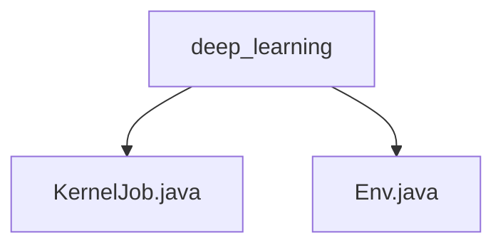

# Basic Information

|      |      |
|------|------|
| Name | deep_learning |
| Language | .java |
| Code Path | WeFe/board/board-service/src/main/java/com/welab/wefe/board/service/dto/kernel/deep_learning |
| Package Name | docs.board.board-service.src.main.java.com.welab.wefe.board.service.dto.kernel.deep_learning |
| Brief Description | The KernelJob class defines the structure of distributed tasks, including attributes such as project ID, task type, and members. The Env class manages training environment configurations, such as the number of workers and device information, enforcing a single-worker setup with an upper limit. |

# Description

## Overview  
The core responsibility of this module is to manage the configuration and execution of distributed deep learning tasks, following a task scheduling center model. The KernelJob class defines the basic structure of tasks, including metadata such as project ID and job type; the Env class handles environment configuration, managing the number of Workers and device allocation. Key data structures include task attribute sets (e.g., roles, member lists) and training configuration items (e.g., number of Workers, device type). External dependencies are limited to distributed training frameworks (e.g., PaddleFL). For instance, the Env class validates datasets and enforces single-Worker mode.  

## Main Business Scenarios  
The module supports federated learning tasks involving multi-party collaboration, adopting a master-slave interaction model. A typical workflow involves initializing KernelJob to define task attributes, configuring Worker resources via Env (e.g., limiting the maximum number of Workers to 10), and finally submitting the task to the training cluster. All APIs are designed around the task lifecycle, such as environment pre-checks and resource allocation. Application scenarios include cross-institution joint modeling, where the useVdl switch in Env enables visual monitoring of the training process.

### Package Internal Structure View

This flowchart illustrates the file structure relationships within the deep learning module, containing two Java file nodes: KernelJob.java and Env.java, both directly subordinate to the deep_learning directory. This hierarchical structure reflects the typical organization of Data Transfer Objects (DTOs) in a deep learning functional module, with the total node count strictly matching the given 3 path information items.

# File List

| Name   | Type  | Description |
|-------|------|-------------|
| [KernelJob.java](KernelJob.md) | file | The KernelJob class includes fields such as project ID, task ID, job type, role, member ID, environment, and member list. |
| [Env.java](Env.md) | file | The Env class manages distributed training environment configurations, including worker count calculation (based on minimum sample size, capped at 10), local worker index, device type (CPU/GPU), visualization toggle, and task recovery flag. During initialization, it validates dataset annotation quantities and sorts members to ensure consistent worker allocation. |

