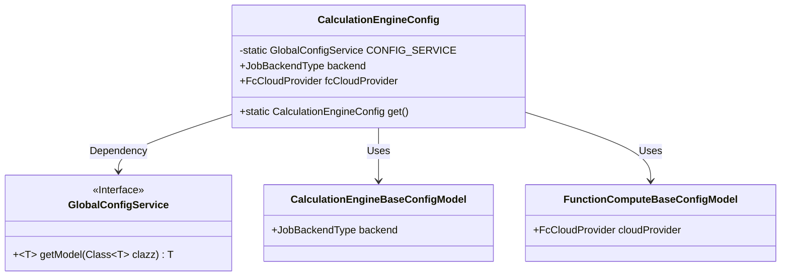
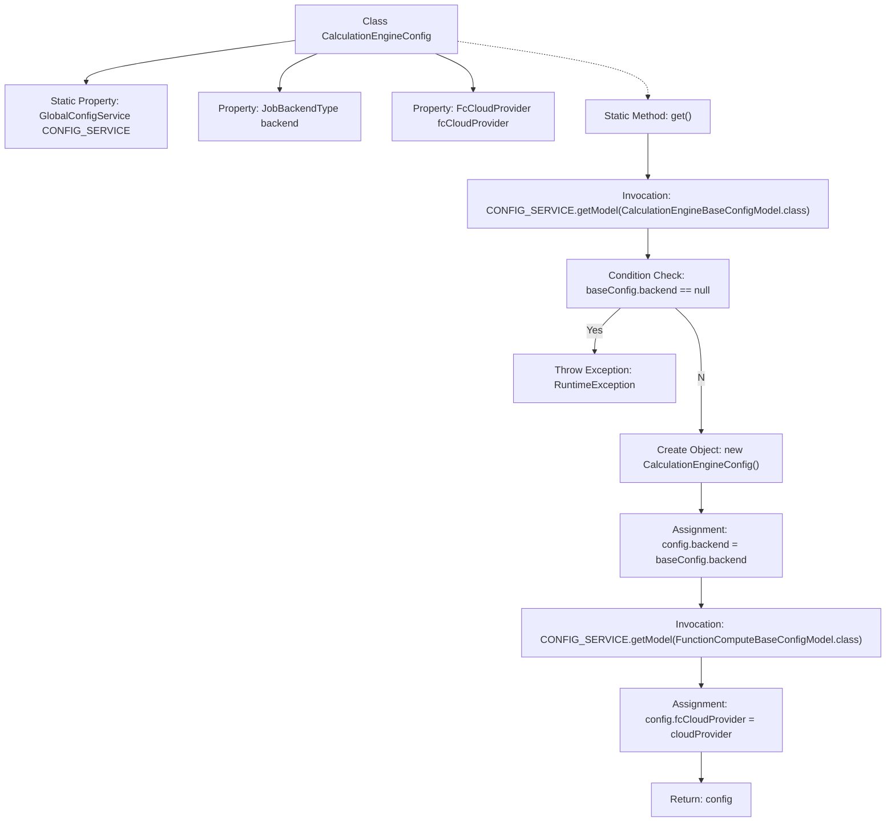

# Basic Information

|      |      |
|------|------|
| Name | CalculationEngineConfig |
| Language | .java |
| Code Path | WeFe/board/board-service/src/main/java/com/welab/wefe/board/service/dto/kernel/machine_learning/CalculationEngineConfig.java |
| Package Name | com.welab.wefe.board.service.dto.kernel.machine_learning |
| Dependencies | ['com.alibaba.fastjson.annotation.JSONField', 'com.welab.wefe.board.service.service.globalconfig.GlobalConfigService', 'com.welab.wefe.common.web.Launcher', 'com.welab.wefe.common.wefe.dto.global_config.calculation_engine.CalculationEngineBaseConfigModel', 'com.welab.wefe.common.wefe.dto.global_config.calculation_engine.fc.FunctionComputeBaseConfigModel', 'com.welab.wefe.common.wefe.enums.FcCloudProvider', 'com.welab.wefe.common.wefe.enums.JobBackendType'] |
| Brief Description | The `CalculationEngineConfig` class defines the calculation engine configuration, including the backend type and function computing provider. It retrieves and validates the configuration from global settings via the `get` method, throwing an exception if unspecified. |

# Description

The code defines a class named `CalculationEngineConfig` for managing computation engine configurations. It contains two public fields: `backend` represents the job backend type, and `fcCloudProvider` denotes the function computation service provider. The class provides a static method `get()` to retrieve the base configuration from the global configuration service and construct a configuration object. This method first checks if the `backend` field is empty; if so, it throws an exception prompting the user to specify the computation environment. It then fetches the relevant configuration model from the global configuration service, populates the fields of the `config` object, and returns it. The entire class primarily serves to encapsulate and retrieve global configuration information for the computation engine.

# Class Summary

| Name   | Type  | Description |
|-------|------|-------------|
| CalculationEngineConfig | class | The `CalculationEngineConfig` class defines the calculation engine configuration, including the backend type and function computation provider. It retrieves and validates mandatory fields from the global configuration via get methods. |

## Class CalculationEngineConfig

|      |      |
|------|------|
| Access Modifier | public |
| Type | class |
| Name | CalculationEngineConfig |
| Description | The `CalculationEngineConfig` class defines the calculation engine configuration, including the backend type and function computation provider. It retrieves and validates mandatory fields from the global configuration via get methods. |

### UML Class Diagram

This code demonstrates a calculation engine configuration class `CalculationEngineConfig`, which retrieves base configuration models from the global configuration service `GlobalConfigService` through the static method `get()`. The class contains two public fields: backend type and cloud service provider. It constructs the configuration object after validating the configuration. The class diagram clearly illustrates the dependency relationships with the configuration service interface and two configuration model classes, presenting a concise yet complete structure that covers the core business logic.

### Internal Method Call Graph

This code defines a calculation engine configuration class containing a static method to retrieve global configurations. The flowchart illustrates the complete process starting from invoking the get() method, through obtaining the base configuration model, checking if the backend type is null, creating a configuration object and assigning properties, until finally returning the configuration object. It includes an exception handling branch where a runtime exception is thrown when the computing environment is unspecified.

### Field List

| Name  | Type  | Description |
|-------|-------|------|
| CONFIG_SERVICE = Launcher.getBean(GlobalConfigService.class) | GlobalConfigService | Obtain the global configuration service instance by acquiring the Bean of the GlobalConfigService class through Launcher. |
| backend | JobBackendType | The backend variable of type JobBackendType. |
| fcCloudProvider | FcCloudProvider | Declare a public variable fcCloudProvider of type FcCloudProvider. |

### Method List

| Name  | Type  | Description |
|-------|-------|------|
| get | CalculationEngineConfig | Retrieve the compute engine configuration, check the backend settings, and report an error if not configured. Returns a configuration object containing both the backend and cloud provider details. |

