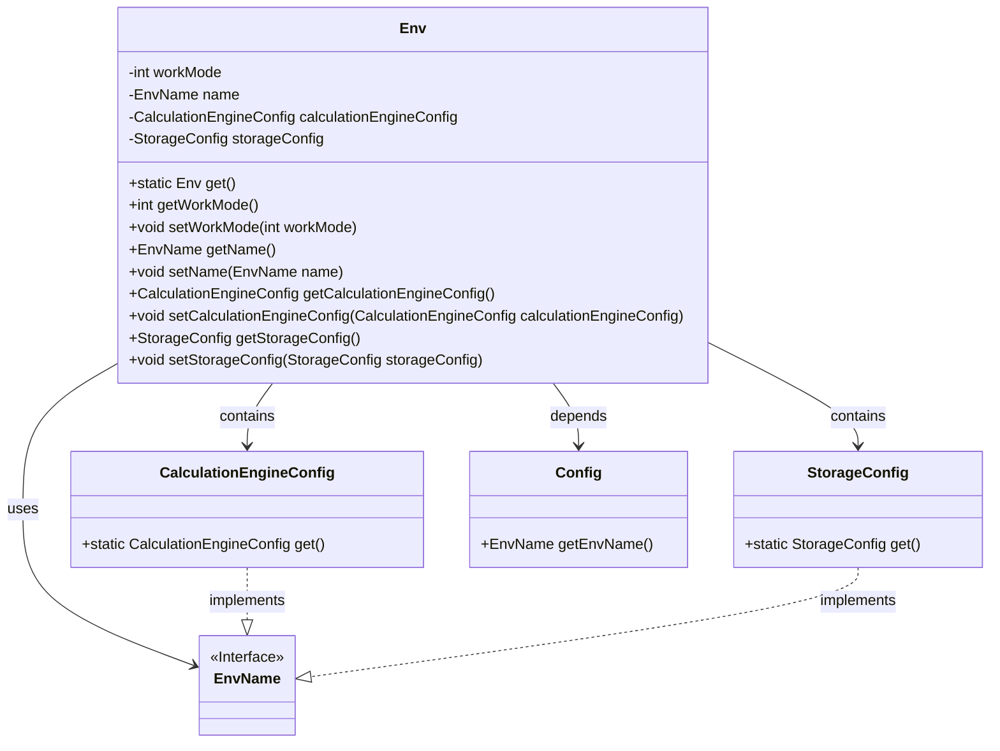
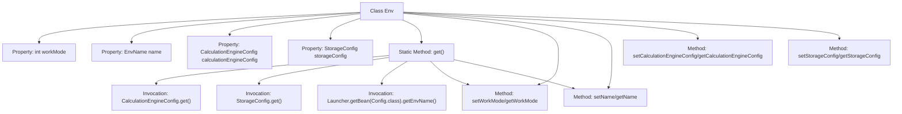

# Basic Information

|      |      |
|------|------|
| Name | Env |
| Language | .java |
| Code Path | WeFe/board/board-service/src/main/java/com/welab/wefe/board/service/dto/kernel/machine_learning/Env.java |
| Package Name | com.welab.wefe.board.service.dto.kernel.machine_learning |
| Dependencies | ['com.alibaba.fastjson.annotation.JSONField', 'com.welab.wefe.board.service.constant.Config', 'com.welab.wefe.common.web.Launcher', 'com.welab.wefe.common.wefe.enums.env.EnvName'] |
| Brief Description | The Env class encapsulates environment configurations, including operation mode, name, computing engine, and storage settings. It defaults to cluster mode (1), interacts via a gateway, and supports getter/setter methods. |

# Description

The Env class encapsulates environment configuration information, including operation mode, environment name, computing engine configuration, and storage configuration. The operation mode is divided into cluster mode (1) and standalone mode (0). Cluster mode requires interaction through a gateway, while standalone mode writes directly to MySQL. The configuration is initialized via the get method, with the default setting being cluster mode, and the environment name is retrieved. The class provides getter and setter methods for each attribute.

# Class Summary

| Name   | Type  | Description |
|-------|------|-------------|
| Env | class | The Env class contains the work mode, name, computing engine, and storage configuration. The default work mode is cluster mode (1), accessed via the gateway, and supports getter/setter methods. |

## Class Env

|      |      |
|------|------|
| Access Modifier | public |
| Type | class |
| Name | Env |
| Description | The Env class contains the work mode, name, computing engine, and storage configuration. The default work mode is cluster mode (1), accessed via the gateway, and supports getter/setter methods. |

### UML Class Diagram

This code demonstrates an environment configuration class Env, which encapsulates core attributes such as work mode, environment name, calculation engine configuration, and storage configuration. The class diagram clearly illustrates the containment relationships between Env and CalculationEngineConfig/StorageConfig, as well as the dependency with the Config class. EnvName serves as an interface implemented by multiple configuration classes, reflecting sound abstract design. The static factory method get() centrally manages environment configuration initialization, ensuring consistency and ease of use.

### Internal Method Call Graph

This code defines an Env class for managing environment configurations. Its core functionality includes initializing environment instances via the static get() method, loading calculation engine and storage configurations, and setting work modes and names. The work mode is categorized into cluster mode (1) and standalone mode (0), while the name is retrieved from configuration via Launcher. The class contains standard getter/setter methods and controls serialization behavior through @JSONField annotations. The flowchart illustrates the class structure, method invocation relationships, and property access paths.

### Field List

| Name  | Type  | Description |
|-------|-------|------|
| storageConfig | StorageConfig | Private Storage Configuration Object |
| workMode | int | The private integer variable workMode is used to represent the working mode. |
| name | EnvName | Private environment variable names. |
| calculationEngineConfig | CalculationEngineConfig | Private computing engine configuration object. |

### Method List

| Name  | Type  | Description |
|-------|-------|------|
| get | Env | The method get() creates an Env object, configuring the compute engine and storage settings. The task mode is set to cluster mode (1), requiring gateway interaction, with the name retrieved from the configuration. In standalone mode (0), it directly writes to MySQL. |
| setWorkMode | void | The method to set the working mode, with the parameter being workMode, assigns the value to the workMode property of the current object. |
| getCalculationEngineConfig | CalculationEngineConfig | Methods to obtain the calculation engine configuration, returns a calculationEngineConfig object. |
| setCalculationEngineConfig | void | The method for setting the computation engine configuration assigns the passed configuration object to the member variables of the current object. |
| getStorageConfig | StorageConfig | Methods to obtain storage configuration objects. |
| setStorageConfig | void | Set the storage configuration method by assigning the input parameters to the class's storage configuration variables. |
| setName | void | The method for setting the object name assigns the parameter `name` to the `name` property of the object. |
| getName | EnvName | Methods to obtain the current environment name, returning an EnvName-type variable named `name`. |
| getWorkMode | int | The method returns the current working mode value. |

