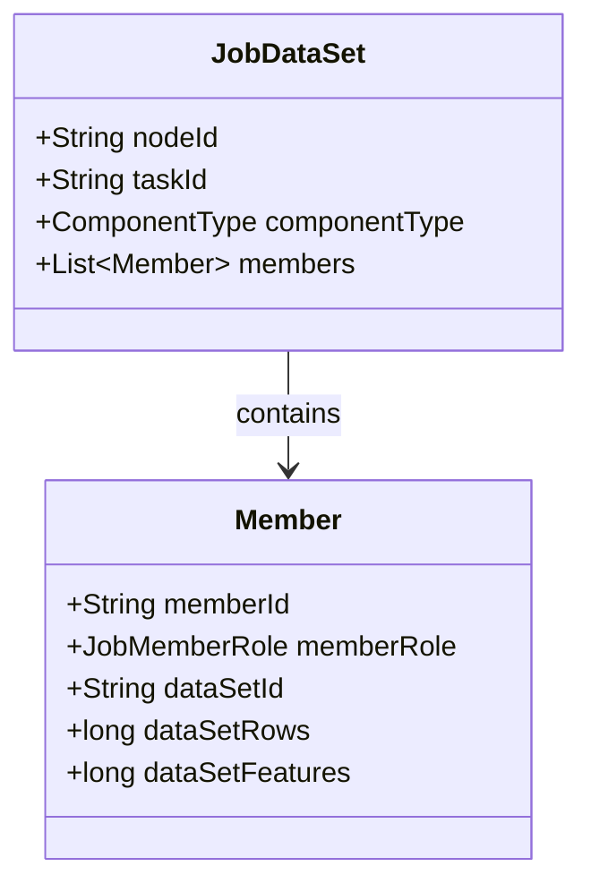
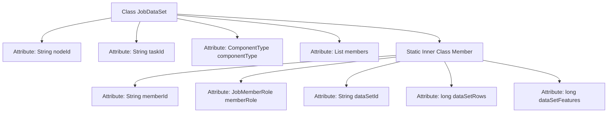

# Basic Information

|      |      |
|------|------|
| Name | JobDataSet |
| Language | .java |
| Code Path | WeFe/board/board-service/src/main/java/com/welab/wefe/board/service/dto/kernel/machine_learning/JobDataSet.java |
| Package Name | com.welab.wefe.board.service.dto.kernel.machine_learning |
| Dependencies | ['com.welab.wefe.common.wefe.enums.ComponentType', 'com.welab.wefe.common.wefe.enums.JobMemberRole', 'java.util.List'] |
| Brief Description | The JobDataSet class includes node ID, job ID, component type, and member list. Each member has an ID, role, dataset ID, row count, and feature count. |

# Description

The JobDataSet class contains four main attributes: node ID, job ID, component type, and member list. The member list is composed of Member classes, with each Member including five fields: member ID, role, dataset ID, number of dataset rows, and number of features. This structure is used to describe task-related dataset information, including participating members and their corresponding dataset details.

# Class Summary

| Name   | Type  | Description |
|-------|------|-------------|
| JobDataSet | class | The JobDataSet class includes node ID, job ID, component type, and member list. The Member class defines member ID, role, dataset ID, row count, and feature count. |

## Class JobDataSet

|      |      |
|------|------|
| Access Modifier | public |
| Type | class |
| Name | JobDataSet |
| Description | The JobDataSet class includes node ID, job ID, component type, and member list. The Member class defines member ID, role, dataset ID, row count, and feature count. |

### UML Class Diagram

This class diagram illustrates the structure of the JobDataSet class and its nested Member class. JobDataSet contains node ID, task ID, component type, and a list of Member objects; the Member class stores member ID, role, dataset ID, and data scale information. The two classes form a simple aggregation relationship, reflecting the hierarchical structure between datasets and members.

### Internal Method Call Graph

This code defines a class named JobDataSet, which contains four attributes: nodeId, taskId, componentType, and members. The members attribute is a list of type Member. Member is a static inner class with five attributes: memberId, memberRole, dataSetId, dataSetRows, and dataSetFeatures. The flowchart clearly illustrates the hierarchical relationship between the class and its inner class, as well as the composition of their respective attributes.

### Field List

| Name  | Type  | Description |
|-------|-------|------|
| members | List<Member> | Declare a public list named members to store objects of type Member. |
| nodeId | String | Declare a public string-type variable nodeId. |
| taskId | String | Declare a public string variable taskId. |
| componentType | ComponentType | Define public variables for component types. |

### Method List

| Name  | Type  | Description |
|-------|-------|------|

