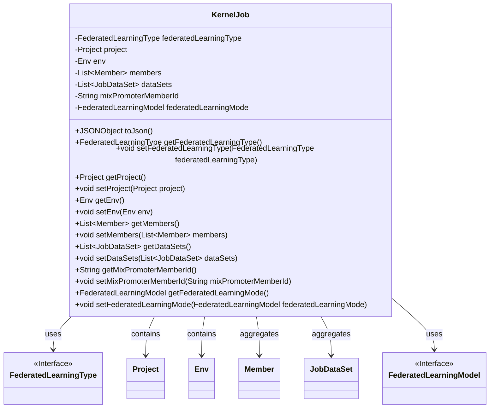
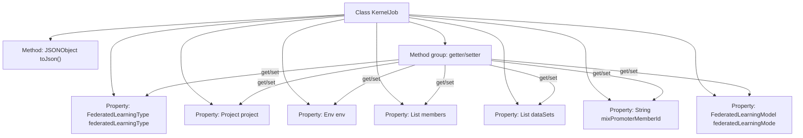

# Basic Information

|      |      |
|------|------|
| Name | KernelJob |
| Language | .java |
| Code Path | WeFe/board/board-service/src/main/java/com/welab/wefe/board/service/dto/kernel/machine_learning/KernelJob.java |
| Package Name | com.welab.wefe.board.service.dto.kernel.machine_learning |
| Dependencies | ['com.alibaba.fastjson.JSONObject', 'com.welab.wefe.board.service.dto.kernel.Member', 'com.welab.wefe.common.fieldvalidate.annotation.Check', 'com.welab.wefe.common.wefe.enums.FederatedLearningModel', 'com.welab.wefe.common.wefe.enums.FederatedLearningType', 'java.util.List'] |
| Brief Description | The KernelJob class contains attributes such as federated learning type, project, environment, members, and datasets, providing getter/setter methods and JSON conversion functionality. |

# Description

The KernelJob class defines the core attributes of a federated learning task, including the federated learning type, project information, environment configuration, member list, dataset list, hybrid federated initiator ID, and federated learning model. The class provides getter and setter methods for all attributes, as well as a toJson method to convert the object into JSON format. This class is used to encapsulate the complete configuration information of a federated learning task.

# Class Summary

| Name   | Type  | Description |
|-------|------|-------------|
| KernelJob | class | The KernelJob class contains attributes such as federated learning type, project, environment, members, and datasets, providing getter/setter methods and JSON conversion functionality. |

## Class KernelJob

|      |      |
|------|------|
| Access Modifier | public |
| Type | class |
| Name | KernelJob |
| Description | The KernelJob class contains attributes such as federated learning type, project, environment, members, and datasets, providing getter/setter methods and JSON conversion functionality. |

### UML Class Diagram

This class diagram illustrates the structure of the KernelJob class and its relationships with other classes. KernelJob is a core job class containing private attributes such as federated learning type, project information, environment configuration, member lists, and dataset lists, with access provided through getter/setter methods. The class implements the toJson() method for object serialization and maintains associations with FederatedLearningType, Project, Env, etc., where Member and JobDataSet exist in an aggregation relationship. All associated classes maintain unidirectional dependencies, reflecting clear responsibility division.

### Internal Method Call Graph

This flowchart illustrates the complete structure of the KernelJob class, containing 7 private properties with corresponding getter/setter method groups, along with the core toJson() serialization method. All properties are encapsulated following the standard JavaBean specification, where the mixPromoterMemberId property carries a custom annotation validation marker. The toJson() method implements object-to-JSON string conversion through a JSON library, reflecting the class's primary data exchange functionality.

### Field List

| Name  | Type  | Description |
|-------|-------|------|
| dataSets | List<JobDataSet> | List of private JobDataSet type variables dataSets. |
| project | Project | Private project object `project`. |
| members | List<Member> | Member list, storing Member objects. |
| mixPromoterMemberId | String | Define the private string mixPromoterMemberId to check the promoter_id of the hybrid federation. |
| federatedLearningType | FederatedLearningType | The private federated learning type variable `federatedLearningType`. |
| federatedLearningMode | FederatedLearningModel | The private federated learning model variable federatedLearningMode. |
| env | Env | Private environment variable instance env. |

### Method List

| Name  | Type  | Description |
|-------|-------|------|
| getDataSets | List<JobDataSet> | Methods for obtaining the dataset list, returns the stored collection of datasets. |
| setProject | void | Set the project attributes of the current object to the specified project. |
| toJson | JSONObject | The method converts the current object into a JSON string, then parses it into a JSONObject and returns it. |
| setFederatedLearningType | void | The method to set the federated learning type, with the parameter being of type FederatedLearningType. |
| getFederatedLearningMode | FederatedLearningModel | Get the current mode of the federated learning model. The return value is of type FederatedLearningModel. |
| setFederatedLearningMode | void | The method to set the federated learning mode, with the parameter of type FederatedLearningModel. |
| getEnv | Env | Methods to obtain the environment object, returns an env instance. |
| getProject | Project | Methods to obtain the current project object. |
| getMixPromoterMemberId | String | Get the string value of mixPromoterMemberId. |
| setEnv | void | Methods for setting environment variables, assigning the passed env parameter to the env property of the current object. |
| setDataSets | void | Method for setting the dataset list, which assigns the input parameters to the class member variable `dataSets`. |
| setMembers | void | Set the member list method, assigning the input parameter `members` to the `members` property of the current object. |
| getFederatedLearningType | FederatedLearningType | Method to obtain the federated learning type, returns the currently set federatedLearningType value. |
| setMixPromoterMemberId | void | The method to set the mixed promotion member ID assigns the parameter value to the class member variable `mixPromoterMemberId`. |
| getMembers | List<Member> | The method to retrieve the member list directly returns the collection of members. |

