# Basic Information

|      |      |
|------|------|
| Name | KernelTask |
| Language | .java |
| Code Path | WeFe/board/board-service/src/main/java/com/welab/wefe/board/service/dto/kernel/machine_learning/KernelTask.java |
| Package Name | com.welab.wefe.board.service.dto.kernel.machine_learning |
| Dependencies | ['com.welab.wefe.board.service.dto.kernel.Member', 'com.welab.wefe.common.fieldvalidate.annotation.Check', 'java.util.List'] |
| Brief Description | The KernelTask class contains member lists and provider-related attributes, such as the master node identifier, ID, etc., and provides getter and setter methods. |

# Description

The `KernelTask` class is a class that contains a member list and related provider information. It has two constructors: one without parameters and another that accepts a member list. The class includes a private member list `members`, as well as multiple fields annotated with `@Check`, such as `mixPromoterMemberId` (hybrid alliance initiator ID), `providerMaster` (whether it is the master node), `providerInnerId` (current provider ID), `providerMasterInnerId` (master node ID), and `providerOtherInnerId` (list of other provider IDs). The class provides corresponding getter and setter methods for each field to access and modify these properties.

# Class Summary

| Name   | Type  | Description |
|-------|------|-------------|
| KernelTask | class | The KernelTask class contains member lists and provider-related attributes, such as master node identifiers, IDs, etc., and provides getter and setter methods. |


## Class KernelTask

|      |      |
|------|------|
| Access Modifier | public |
| Type | class |
| Name | KernelTask |
| Description | The KernelTask class contains member lists and provider-related attributes, such as master node identifiers, IDs, etc., and provides getter and setter methods. |


### UML Class Diagram

```mermaid
classDiagram
    class KernelTask {
        -List~Member~ members
        -String mixPromoterMemberId <<Check("Mixed Federation promoter_id")>>
        -boolean providerMaster <<Check("Whether it is the main node of the current provider")>>
        -String providerInnerId <<Check("The id of the current provider")>>
        -String providerMasterInnerId <<Check("The primary node id of the current provider")>>
        -List~String~ providerOtherInnerId <<Check("Other id of the current provider, not including itself")>>
        +KernelTask()
        +KernelTask(List~Member~ members)
        +List~Member~ getMembers()
        +void setMembers(List~Member~ members)
        +String getMixPromoterMemberId()
        +void setMixPromoterMemberId(String mixPromoterMemberId)
        +boolean isProviderMaster()
        +void setProviderMaster(boolean providerMaster)
        +String getProviderInnerId()
        +void setProviderInnerId(String providerInnerId)
        +String getProviderMasterInnerId()
        +void setProviderMasterInnerId(String providerMasterInnerId)
        +List~String~ getProviderOtherInnerId()
        +void setProviderOtherInnerId(List~String~ providerOtherInnerId)
    }
```

This class diagram illustrates the structure of the KernelTask class, which is a task class containing a member list and various provider-related attributes. The class features two constructors (default and one with a member list parameter), along with multiple properties annotated with @Check for validating the mixed federation promoter ID, current provider's master node status, provider internal ID, etc. All attributes have corresponding getter and setter methods, enabling encapsulated management of member data and provider-related configurations.


### Internal Method Call Graph

```mermaid
graph TD
    A["Class KernelTask"]
    B["Attribute: List<Member> members"]
    C["Attribute: @Check String mixPromoterMemberId"]
    D["Attribute: @Check boolean providerMaster"]
    E["Attribute: @Check String providerInnerId"]
    F["Attribute: @Check String providerMasterInnerId"]
    G["Attribute: @Check List<String> providerOtherInnerId"]
    H["Constructor: KernelTask()"]
    I["Constructor: KernelTask(List<Member>)"]
    J["Method: getMembers()"]
    K["Method: setMembers(List<Member>)"]
    L["Method: getMixPromoterMemberId()"]
    M["Method: setMixPromoterMemberId(String)"]
    N["Method: isProviderMaster()"]
    O["Method: setProviderMaster(boolean)"]
    P["Method: getProviderInnerId()"]
    Q["Method: setProviderInnerId(String)"]
    R["Method: getProviderMasterInnerId()"]
    S["Method: setProviderMasterInnerId(String)"]
    T["Method: getProviderOtherInnerId()"]
    U["Method: setProviderOtherInnerId(List<String>)"]

    A --> B
    A --> C
    A --> D
    A --> E
    A --> F
    A --> G
    A --> H
    A --> I
    A --> J
    A --> K
    A --> L
    A --> M
    A --> N
    A --> O
    A --> P
    A --> Q
    A --> R
    A --> S
    A --> T
    A --> U
```



This code describes a class named KernelTask, primarily used for managing member lists and provider-related information. The class contains multiple attributes annotated with @Check for data validation. It provides two constructors: a no-argument constructor and one that accepts a member list. Additionally, it includes multiple getter and setter methods for accessing and modifying private attributes. The overall design reflects encapsulation by exposing attribute operations through methods while using annotations to mark properties requiring validation.

### Field List

| Name  | Type  | Description |
|-------|-------|------|
| providerMaster | boolean | Check whether the current node is the provider's master node, a boolean field named providerMaster. |
| providerInnerId | String | ID verification field of the current provider. |
| providerOtherInnerId | List<String> | List of other internal IDs for the current provider (excluding itself). |
| providerMasterInnerId | String | Current provider's master node ID check field. |
| mixPromoterMemberId | String | The private string variable `mixPromoterMemberId` is used to check the `promoter_id` in hybrid federations. |
| members | List<Member> | Member list, storing Member objects. |

### Method List

| Name  | Type  | Description |
|-------|-------|------|
| setMembers | void | The method to set the member list assigns the input parameters to the class member variable `members`. |
| setMixPromoterMemberId | void | The method to set the mixed promotion member ID assigns the parameter value to the class member variable `mixPromoterMemberId`. |
| getMembers | List<Member> | The method to retrieve the member list returns a collection of members. |
| getMixPromoterMemberId | String | Method to obtain the mixed promotion member ID, returns a string-type mixPromoterMemberId. |
| setProviderMaster | void | Set the boolean value method for the providerMaster property. |
| isProviderMaster | boolean | Check if it is the provider's master node. |
| setProviderInnerId | void | The method to set the internal provider ID assigns the parameter value to the class member variable `providerInnerId`. |
| getProviderInnerId | String | A public method to obtain the providerInnerId, which returns the providerInnerId value as a string. |
| getProviderMasterInnerId | String | Method to obtain the string value of providerMasterInnerId. |
| setProviderMasterInnerId | void | Method for setting internal ID of provider identifier. |
| getProviderOtherInnerId | List<String> | The method to obtain the providerOtherInnerId list, with a return type of List<String>. |
| setProviderOtherInnerId | void | Method for setting the providerOtherInnerId list, used to update the providerOtherInnerId field in the class. |


