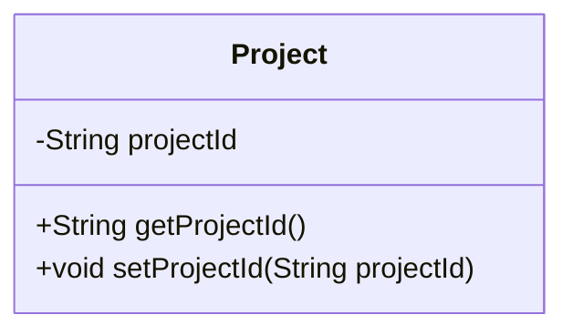
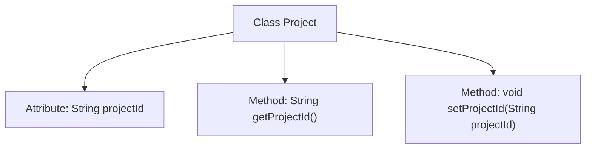

# Basic Information

|      |      |
|------|------|
| Name | Project |
| Language | .java |
| Code Path | WeFe/board/board-service/src/main/java/com/welab/wefe/board/service/dto/kernel/machine_learning/Project.java |
| Package Name | com.welab.wefe.board.service.dto.kernel.machine_learning |
| Dependencies | [] |
| Brief Description | The Project class contains a private field projectId along with its getter and setter methods. |

# Description

This content defines a Java class named Project, which includes a private string-type member variable projectId. The class provides public access methods for this variable: getProjectId() to retrieve the variable value and setProjectId(String projectId) to set the variable value. The encapsulation and access control of the private variable are implemented through getter and setter methods. The entire class structure is concise, containing only one attribute and its corresponding access methods.

# Class Summary

| Name   | Type  | Description |
|-------|------|-------------|
| Project | class | The Project class contains a private field projectId along with its getter and setter methods. |

## Class Project

|      |      |
|------|------|
| Access Modifier | public |
| Type | class |
| Name | Project |
| Description | The Project class contains a private field projectId along with its getter and setter methods. |

### UML Class Diagram

This code defines a simple Project class containing a private string attribute projectId and corresponding getter/setter methods. The class diagram clearly illustrates the class structure: the private attribute projectId is encapsulated and accessed/modified through public methods getProjectId() and setProjectId(). This design adheres to the encapsulation principle of object-oriented programming, making attribute access controllable and easy to maintain. The class diagram concisely presents the class members and methods, facilitating understanding of the class's functionality and usage.

### Internal Method Call Graph

This flowchart depicts the structure of the Project class, which includes a private attribute projectId and its corresponding getter and setter methods. The getProjectId() method retrieves the project ID, while setProjectId(String) sets the project ID. The class encapsulates the private attribute through these two methods, adhering to the fundamental principles of object-oriented programming to ensure data security and controllability. The overall design is concise and clear, facilitating maintenance and extensibility.

### Field List

| Name  | Type  | Description |
|-------|-------|------|
| projectId | String | Define a private string variable projectId. |

### Method List

| Name  | Type  | Description |
|-------|-------|------|
| getProjectId | String | Methods to obtain the project ID, returning a string-type projectId. |
| setProjectId | void | The method to set the project ID assigns the input parameter projectId to the projectId property of the current object. |

