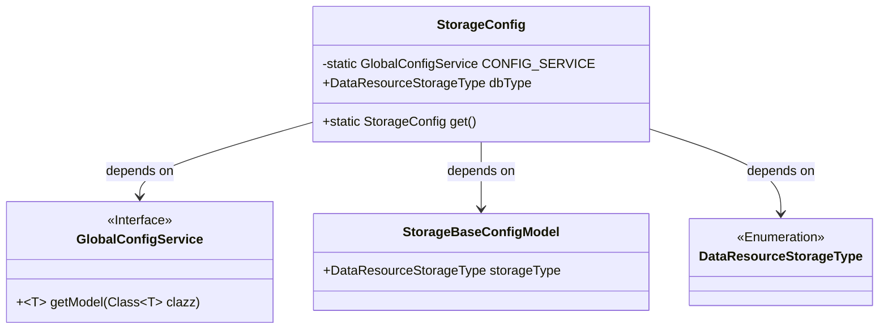
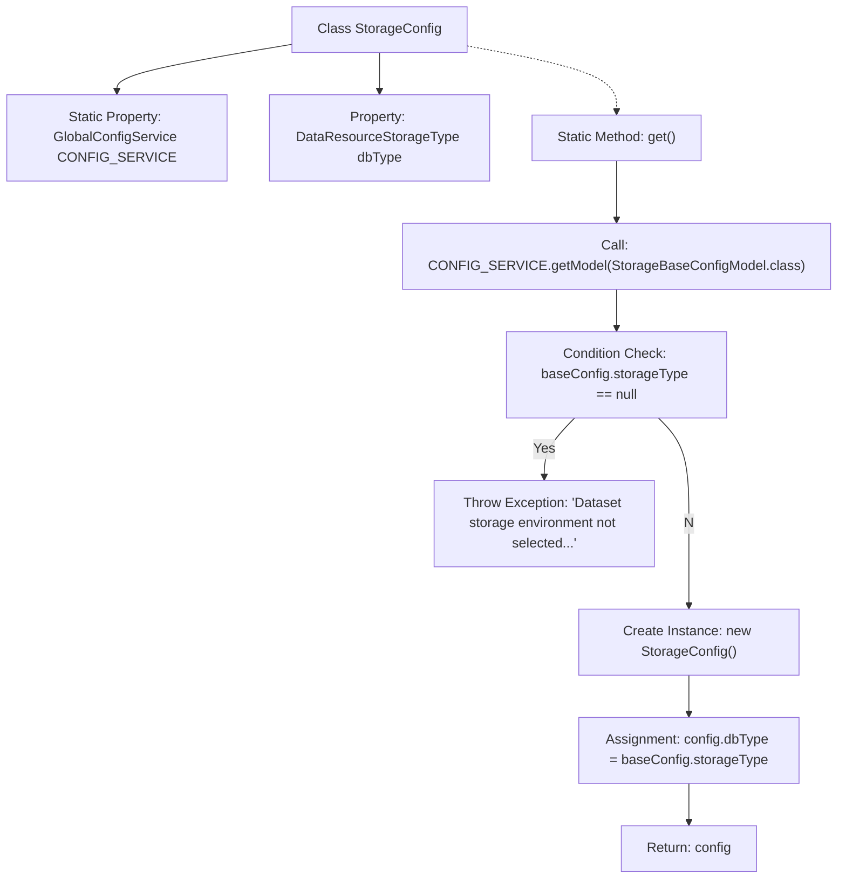

# Basic Information

|      |      |
|------|------|
| Name | StorageConfig |
| Language | .java |
| Code Path | WeFe/board/board-service/src/main/java/com/welab/wefe/board/service/dto/kernel/machine_learning/StorageConfig.java |
| Package Name | com.welab.wefe.board.service.dto.kernel.machine_learning |
| Dependencies | ['com.alibaba.fastjson.annotation.JSONField', 'com.welab.wefe.board.service.service.globalconfig.GlobalConfigService', 'com.welab.wefe.common.web.Launcher', 'com.welab.wefe.common.wefe.dto.global_config.storage.StorageBaseConfigModel', 'com.welab.wefe.common.wefe.enums.DataResourceStorageType'] |
| Brief Description | The StorageConfig class retrieves storage type configurations via the static method get, throwing an exception if unconfigured. It utilizes GlobalConfigService and the JSONField annotation. |

# Description

The `StorageConfig` class is used to retrieve the dataset storage configuration. It contains a static variable `CONFIG_SERVICE`, which obtains a `GlobalConfigService` instance through `Launcher`. The class defines a `dbType` field to represent the storage type. The `get` method is a static method annotated with `@JSONField` to disable serialization. This method retrieves a `StorageBaseConfigModel` instance from `CONFIG_SERVICE`, checks if `storageType` is null, and throws an exception prompting the user to specify the storage type if it is null. Finally, it creates a `StorageConfig` instance, sets the `dbType`, and returns it.

# Class Summary

| Name   | Type  | Description |
|-------|------|-------------|
| StorageConfig | class | The StorageConfig class retrieves storage type configurations via the static method get, throwing an exception if unconfigured. It loads configurations using GlobalConfigService and returns a StorageConfig instance. |

## Class StorageConfig

|      |      |
|------|------|
| Access Modifier | public |
| Type | class |
| Name | StorageConfig |
| Description | The StorageConfig class retrieves storage type configurations via the static method get, throwing an exception if unconfigured. It loads configurations using GlobalConfigService and returns a StorageConfig instance. |

### UML Class Diagram

This code describes a storage configuration class `StorageConfig`, which retrieves the base configuration model `StorageBaseConfigModel` from the global configuration service `GlobalConfigService` via the static method `get()`, and verifies whether the storage type is set. If not set, it throws an exception; otherwise, it returns a configuration instance containing the storage type enumeration `DataResourceStorageType`. The class diagram illustrates the relationships between `StorageConfig` and its three dependent components, including an interface, a data model, and an enumeration type.

### Internal Method Call Graph

This flowchart illustrates the execution logic of the static method get() in the StorageConfig class. It first retrieves the base configuration model via CONFIG_SERVICE, checks if the storage type is null, throws an exception if true, otherwise creates a new instance, sets the dbType property, and returns it. The entire process implements configuration validation and encapsulated return for dataset storage type settings.

### Field List

| Name  | Type  | Description |
|-------|-------|------|
| dbType | DataResourceStorageType | Database resource storage type variable dbType. |
| CONFIG_SERVICE = Launcher.getBean(GlobalConfigService.class) | GlobalConfigService | Obtain the global configuration service instance by injecting the GlobalConfigService class through the getBean method of Launcher. |

### Method List

| Name  | Type  | Description |
|-------|-------|------|
| get | StorageConfig | The static method get() retrieves the storage configuration. If the storage type is not set, it throws an exception; otherwise, it returns a configuration object containing the storage type. |

