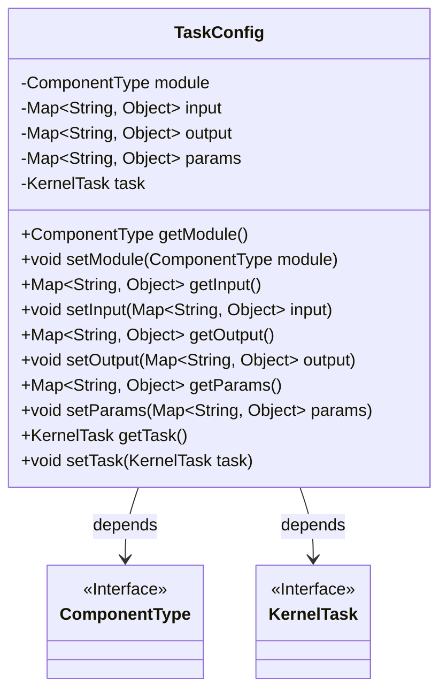

# Basic Information

|      |      |
|------|------|
| Name | TaskConfig |
| Language | .java |
| Code Path | WeFe/board/board-service/src/main/java/com/welab/wefe/board/service/dto/kernel/machine_learning/TaskConfig.java |
| Package Name | com.welab.wefe.board.service.dto.kernel.machine_learning |
| Dependencies | ['com.welab.wefe.common.fieldvalidate.annotation.Check', 'com.welab.wefe.common.wefe.enums.ComponentType', 'java.util.Map'] |
| Brief Description | The TaskConfig class includes module type, input/output information, and parameter configuration, as well as associations with KernelTask, providing complete getter/setter methods. |

# Description

The `TaskConfig` class defines the core structure of task configuration, containing five main fields: `module` represents the component type, `input` and `output` store the component's input and output information respectively (annotated with `@Check`), `params` holds component parameters (requiring uppercase initials for kernel compatibility), and `task` associates with a `KernelTask` instance. All fields are accessed via getter/setter methods, implementing data encapsulation following the standard JavaBean specification.

# Class Summary

| Name   | Type  | Description |
|-------|------|-------------|
| TaskConfig | class | The TaskConfig class includes module types, input-output mappings, parameter mappings, and task objects, providing getter/setter methods. |

## Class TaskConfig

|      |      |
|------|------|
| Access Modifier | public |
| Type | class |
| Name | TaskConfig |
| Description | The TaskConfig class includes module types, input-output mappings, parameter mappings, and task objects, providing getter/setter methods. |

### UML Class Diagram

Class diagram description: The TaskConfig class is used to configure task information, containing private fields such as module type (ComponentType), input/output parameters (Map<String, Object>), and task parameters (params), which are accessed and modified through public getter/setter methods. This class depends on two interfaces: ComponentType and KernelTask, representing the module type and core functionality of kernel tasks respectively. The @Check annotation is used to mark validation information for input/output parameters.

### Internal Method Call Graph

```mermaid
graph TD
    A["Class TaskConfig"]
    B["Property: ComponentType module"]
    C["Property: Map<String,Object> input"]
    D["Property: Map<String,Object> output"]
    E["Property: Map<String,Object> params"]
    F["Property: KernelTask task"]
    G["Method: getModule()"]
    H["Method: setModule(ComponentType)"]
    I["Method: getInput()"]
    J["Method: setInput(Map)"]
    K["Method: getOutput()"]
    L["Method: setOutput(Map)"]
    M["Method: getParams()"]
    N["Method: setParams(Map)"]
    O["Method: getTask()"]
    P["Method: setTask(KernelTask)"]

    A --> B
    A --> C
    A --> D
    A --> E
    A --> F
    A --> G
    A --> H
    A --> I
    A --> J
    A --> K
    A --> L
    A --> M
    A --> N
    A --> O
    A --> P
```

This code defines a class named TaskConfig for managing task configuration information. The class contains five main properties: module represents the component type, input and output store the component's input/output information respectively (with @Check annotation), params holds component parameters, and task associates with the kernel task. Standard getter/setter methods are provided for each property, implementing encapsulated access to configuration data. The annotation indicates that input/output fields require validation, while the comment on the params field specifies that its naming must comply with kernel specifications.

### Field List

| Name  | Type  | Description |
|-------|-------|------|
| module | ComponentType | Declare a private variable module of module component type. |
| task | KernelTask | Private kernel task object. |
| input | Map<String, Object> | Component input information verification, storing key-value pair mappings. |
| params | Map<String, Object> | Private mapping variable `params`, with keys as strings and values as objects. |
| output | Map<String, Object> | Define inspection annotations for component output information, with the type being a key-value pair mapping. |

### Method List

| Name  | Type  | Description |
|-------|-------|------|
| getParams | Map<String, Object> | Returns the set of key-value pairs in the params map. |
| setParams | void | This method is used to set parameters, accepting a Map with string keys and object values, and assigns it to the class's params member variable. |
| getModule | ComponentType | Get the component type of the module. |
| getInput | Map<String, Object> | The method `getInput` returns a `Map` with keys of type `String` and values of type `Object`, directly returning the member variable `input`. |
| setModule | void | Methods for setting up component type modules. |
| setInput | void | Set the input parameters, with the type being Map<String, Object>. |
| setOutput | void | Methods for setting output objects, which accept key-value pair mapping parameters and assign them to the class member variable `output`. |
| getOutput | Map<String, Object> | Methods to obtain the output mapping table. |
| setTask | void | Set the current task object. |
| getTask | KernelTask | Get the current KernelTask instance. |

