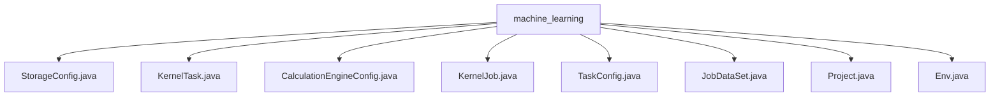

# Basic Information

|      |      |
|------|------|
| Name | machine_learning |
| Language | .java |
| Code Path | WeFe/board/board-service/src/main/java/com/welab/wefe/board/service/dto/kernel/machine_learning |
| Package Name | docs.board.board-service.src.main.java.com.welab.wefe.board.service.dto.kernel.machine_learning |
| Brief Description | The `StorageConfig` class retrieves storage configurations and checks that the type is not empty. The `KernelTask` class manages member lists and provider information. The `CalculationEngineConfig` class handles computation engine configurations and validates the backend type. The `KernelJob` class encapsulates federated learning task configurations. The `TaskConfig` class defines the task structure, including input and output parameters. The `JobDataSet` class describes task dataset information. The `Project` class encapsulates the project ID. The `Env` class manages environment configurations and work modes. |

# Description

## Overview  
The core responsibility of this module is to manage the global configuration and execution environment of federated learning tasks, functioning as the configuration hub similar to a task scheduling center. The interface specification adheres to the JavaBean standard, with global configurations retrieved via static methods (e.g., `StorageConfig.get()`). Key fields use `@Check`/`@JSONField` annotations to control serialization behavior.  

Key data structures include a three-layer encapsulation: `StorageBaseConfigModel` (storage type), `KernelTask` (member topology), `CalculationEngineConfig` (computing backend), and `KernelJob` (task metadata). External dependencies include `GlobalConfigService` for configuration retrieval and MySQL for data persistence in standalone mode. For instance, the `Env` class switches storage strategies via a working mode toggle (0/1).  

## Key Business Scenarios  
The module supports full lifecycle management of federated learning tasks, adopting a "configuration-driven execution" model. A typical workflow involves: initializing the `Env` environment → loading `StorageConfig` → constructing `KernelJob` → dispatching computing tasks via `TaskConfig`. The interaction resembles an event bus pattern, where components exchange data through standard getter/setter methods.  

Comprehensive functionality includes: member topology management (e.g., `KernelTask` records hybrid alliance initiators), multi-backend support (e.g., `CalculationEngineConfig` switches between FC cloud providers), and task orchestration (e.g., `JobDataSet` binds datasets to members). API integration examples include: `toJson()` for task configuration serialization and `get()` for dynamic environment variable loading. For instance, the `Project` class associates task instances via `projectId`.

### Package Internal Structure View

This flowchart illustrates the file structure relationships within the machine_learning directory. The root node is the machine_learning folder, which directly contains 8 Java class files including StorageConfig, KernelTask, etc. These files belong to machine learning core-related configuration and task classes, with no deeper subdirectory hierarchy. All files reside at the same level and are directly subordinate to the machine_learning directory.

# File List

| Name   | Type  | Description |
|-------|------|-------------|
| [StorageConfig.java](StorageConfig.md) | file | The StorageConfig class retrieves storage type configurations via the static method get, throwing an exception if unconfigured. It utilizes GlobalConfigService and the JSONField annotation. |
| [KernelTask.java](KernelTask.md) | file | The KernelTask class contains member lists and provider-related attributes, such as the master node identifier, ID, etc., and provides getter and setter methods. |
| [CalculationEngineConfig.java](CalculationEngineConfig.md) | file | The `CalculationEngineConfig` class defines the calculation engine configuration, including the backend type and function computing provider. It retrieves and validates the configuration from global settings via the `get` method, throwing an exception if not specified. |
| [KernelJob.java](KernelJob.md) | file | The KernelJob class contains attributes such as federated learning type, project, environment, members, and datasets, providing getter/setter methods and JSON conversion functionality. |
| [TaskConfig.java](TaskConfig.md) | file | The TaskConfig class includes module types, input/output information, and parameter configurations, as well as associations with KernelTask, providing complete getter/setter methods. |
| [JobDataSet.java](JobDataSet.md) | file | The JobDataSet class includes node ID, job ID, component type, and member list. Each member has an ID, role, dataset ID, row count, and feature count. |
| [Project.java](Project.md) | file | The Project class contains a private field projectId along with its getter and setter methods. |
| [Env.java](Env.md) | file | The Env class encapsulates environment configurations, including operation mode, name, computing engine, and storage settings. It defaults to cluster mode (1), interacts via a gateway, and supports getter/setter methods. |

