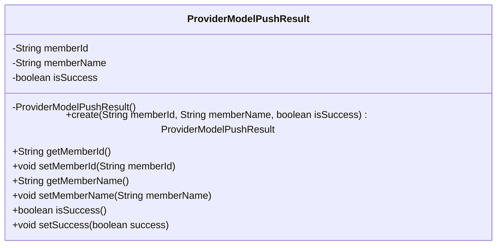
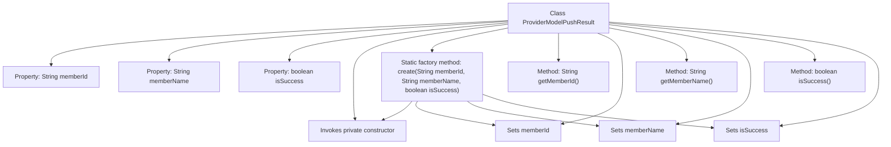

# Basic Information

|      |      |
|------|------|
| Name | ProviderModelPushResult |
| Language | .java |
| Code Path | WeFe/board/board-service/src/main/java/com/welab/wefe/board/service/dto/serving/ProviderModelPushResult.java |
| Package Name | com.welab.wefe.board.service.dto.serving |
| Dependencies | [] |
| Brief Description | The ProviderModelPushResult class contains member variables ID, name, and operation status, providing creation and access methods. |

# Description

The `ProviderModelPushResult` class is used to record model push results and contains three core attributes: `memberId` represents the member identifier, `memberName` represents the member name, and `isSuccess` indicates whether the push was successful. This class enforces the use of the static factory method `create` for instantiation through a private constructor and provides standard getter and setter methods for attribute access and modification.

# Class Summary

| Name   | Type  | Description |
|-------|------|-------------|
| ProviderModelPushResult | class | The `ProviderModelPushResult` class encapsulates member IDs, names, and push statuses, providing construction and access methods. |

## Class ProviderModelPushResult

|      |      |
|------|------|
| Access Modifier | public |
| Type | class |
| Name | ProviderModelPushResult |
| Description | The `ProviderModelPushResult` class encapsulates member IDs, names, and push statuses, providing construction and access methods. |

### UML Class Diagram

This class diagram illustrates the structure of the ProviderModelPushResult class, which is an entity class designed to encapsulate provider model push results. It contains three private fields: memberId (member ID), memberName (member name), and isSuccess (operation success flag). Instances are constructed via the factory method create(), with standard getter/setter methods provided for field access. Notably, the constructor is set to private, enforcing the use of the static factory method for object creation—a common design pattern that allows better control over the object instantiation process.

### Internal Method Call Graph

This flowchart illustrates the structure and internal invocation relationships of the ProviderModelPushResult class. The class contains three private properties and seven methods, with create() being the core static factory method that creates objects by invoking the private constructor and setting property values. Other methods include standard getter/setter methods for accessing and modifying member variables. The flowchart clearly presents the invocation chain of the factory method's internal calls to the private constructor and property assignment methods.

### Field List

| Name  | Type  | Description |
|-------|-------|------|
| isSuccess | boolean | The boolean variable isSuccess is used to indicate the success status. |
| memberName | String | Member variable, string type, name memberName. |
| memberId | String | Member ID string variable |

### Method List

| Name  | Type  | Description |
|-------|-------|------|
| create | ProviderModelPushResult | Create a ProviderModelPushResult object, set the member ID, name, and success status, then return it. |
| isSuccess | boolean | The method isSuccess returns the state of the boolean value isSuccess. |
| setMemberName | void | Method to set the member variable memberName. |
| getMemberName | String | Methods to get the member name, which returns the value of the member variable memberName. |
| setMemberId | void | The method to set the member ID assigns the input parameter to the class's member variable `memberId`. |
| setSuccess | void | Methods for setting boolean values of operation success status. |
| getMemberId | String | Methods to obtain member ID, returns the member ID string. |

