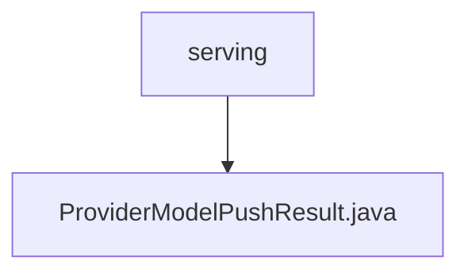

# Basic Information

|      |      |
|------|------|
| Name | serving |
| Language | .java |
| Code Path | WeFe/board/board-service/src/main/java/com/welab/wefe/board/service/dto/serving |
| Package Name | docs.board.board-service.src.main.java.com.welab.wefe.board.service.dto.serving |
| Brief Description | The ProviderModelPushResult class contains member ID, name, and operation status, providing creation and access methods. |

# Description

The ProviderModelPushResult class is used to record model push results, containing three core attributes: memberId represents the member identifier, memberName represents the member name, and isSuccess indicates whether the push was successful. This class enforces instantiation via the static factory method create through a private constructor and provides standard getter and setter methods for attribute access and modification.

### Package Internal Structure View

This flowchart illustrates the hierarchical relationship between the `serving` directory and the `ProviderModelPushResult.java` file. The `serving` directory acts as the parent, containing a child file `ProviderModelPushResult.java`. The structure is simple and clear, reflecting a typical file organization in the DTO layer of a Java project.

# File List

| Name   | Type  | Description |
|-------|------|-------------|
| [ProviderModelPushResult.java](ProviderModelPushResult.md) | file | The ProviderModelPushResult class contains member variables ID, name, and operation status, providing creation and access methods. |

