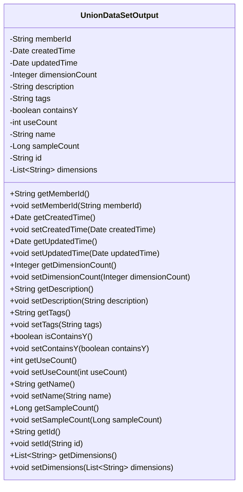

# Basic Information

|      |      |
|------|------|
| Name | UnionDataSetOutput |
| Language | .java |
| Code Path | WeFe/board/board-service/src/main/java/com/welab/wefe/board/service/dto/union/UnionDataSetOutput.java |
| Package Name | com.welab.wefe.board.service.dto.union |
| Dependencies | ['java.util.Date', 'java.util.List'] |
| Brief Description | The UnionDataSetOutput class includes attributes such as member ID, creation/update time, number of dimensions, description, labels, whether it contains Y, usage count, name, sample count, ID, and dimension list, along with their corresponding getter/setter methods. |

# Description

The `UnionDataSetOutput` class is a Java class that contains dataset-related attributes, primarily used for storing and managing basic information of datasets. This class includes fields such as member ID, creation time, update time, number of dimensions, description, tags, whether it contains a Y flag, usage count, name, sample count, unique ID, and a list of dimensions. Each field has corresponding getter and setter methods for accessing and modifying the attribute values.

# Class Summary

| Name   | Type  | Description |
|-------|------|-------------|
| UnionDataSetOutput | class | The UnionDataSetOutput class includes attributes such as member ID, creation/update time, number of dimensions, description, labels, whether it contains Y, usage count, name, sample count, ID, and dimension list, along with their corresponding getter/setter methods. |

## Class UnionDataSetOutput

|      |      |
|------|------|
| Access Modifier | public |
| Type | class |
| Name | UnionDataSetOutput |
| Description | The UnionDataSetOutput class includes attributes such as member ID, creation/update time, number of dimensions, description, labels, whether it contains Y, usage count, name, sample count, ID, and dimension list, along with their corresponding getter/setter methods. |

### UML Class Diagram

This code defines a Java class named UnionDataSetOutput, which is a typical Data Transfer Object (DTO) used to encapsulate dataset-related information. The class contains 12 private fields that record member ID, creation time, update time, dimension count, description, tags, contains-Y flag, usage count, name, sample count, ID, and dimension list. Each field has corresponding getter and setter methods, providing standard access and modification interfaces for these private fields. The primary purpose of this class is to serve as a data container, facilitating the transfer of structured dataset information between different layers.

### Internal Method Call Graph

```mermaid
graph TD
    A["Class UnionDataSetOutput"]
    B["Attribute: String memberId"]
    C["Attribute: Date createdTime"]
    D["Attribute: Date updatedTime"]
    E["Attribute: Integer dimensionCount"]
    F["Attribute: String description"]
    G["Attribute: String tags"]
    H["Attribute: boolean containsY"]
    I["Attribute: int useCount"]
    J["Attribute: String name"]
    K["Attribute: Long sampleCount"]
    L["Attribute: String id"]
    M["Attribute: List<String> dimensions"]
    N["Method: getMemberId()/setMemberId()"]
    O["Method: getCreatedTime()/setCreatedTime()"]
    P["Method: getUpdatedTime()/setUpdatedTime()"]
    Q["Method: getDimensionCount()/setDimensionCount()"]
    R["Method: getDescription()/setDescription()"]
    S["Method: getTags()/setTags()"]
    T["Method: isContainsY()/setContainsY()"]
    U["Method: getUseCount()/setUseCount()"]
    V["Method: getName()/setName()"]
    W["Method: getSampleCount()/setSampleCount()"]
    X["Method: getId()/setId()"]
    Y["Method: getDimensions()/setDimensions()"]

    A --> B
    A --> C
    A --> D
    A --> E
    A --> F
    A --> G
    A --> H
    A --> I
    A --> J
    A --> K
    A --> L
    A --> M
    A --> N
    A --> O
    A --> P
    A --> Q
    A --> R
    A --> S
    A --> T
    A --> U
    A --> V
    A --> W
    A --> X
    A --> Y
```

This code defines a Java class named UnionDataSetOutput, containing 12 private attributes and corresponding getter/setter methods. The class is primarily used to encapsulate metadata related to dataset output, including member ID, creation/update timestamps, dimension count, description, tags, Y-flag indicator, usage count, name, sample count, unique identifier, and dimension list. Each attribute provides standardized getter/setter methods for access and modification, complying with JavaBean specifications, making it suitable for data encapsulation and serialization scenarios.

### Field List

| Name  | Type  | Description |
|-------|-------|------|
| createdTime | Date | Create a time field with the type Date. |
| name | String | Private string variable name. |
| containsY | boolean | Boolean variable indicating whether Y is included. |
| tags | String | Private string variable tags, used to store tag information. |
| dimensions | List<String> | Private string list variable dimensions. |
| useCount | int | Private integer variable, recording the number of uses. |
| id | String | Private string type variable id. |
| description | String | Private string type variable description |
| sampleCount | Long | The private long integer variable sampleCount is used to record the number of samples. |
| dimensionCount | Integer | Private integer variable used to record the number of dimensions. |
| updatedTime | Date | The field updatedTime is used to record the update time, and its type is Date. |
| memberId | String | Member ID string type private variable |

### Method List

| Name  | Type  | Description |
|-------|-------|------|
| setUseCount | void | Java Method: Set the value of the useCount variable. |
| setDescription | void | Method for setting object description, which assigns the input string to the object's description property. |
| setContainsY | void | This is a Java method used to set the value of the boolean member variable `containsY`. The method accepts a boolean parameter and assigns it to the `containsY` property of the current object. |
| setId | void | Methods for setting the object ID, assigning the parameter id to the id property of the current object. |
| getName | String | This is a Java method that returns the value of the private member variable `name`. |
| setTags | void | Set the label property of the object to the specified string. |
| getId | String | This is a Java method that returns the string-type id attribute value. |
| setName | void | This is a Java method used to set the name property of an object. The method takes a string parameter name and assigns it to the name field of the current object. |
| getSampleCount | Long | This is a Java method that returns the value of a Long type variable named sampleCount. |
| isContainsY | boolean | This is a Java method that returns the boolean state of containsY. |
| setUpdatedTime | void | A public method to set the update time, with a parameter of type Date. |
| getDimensions | List<String> | The method returns a string list dimensions. |
| getUpdatedTime | Date | Method returns the updated time object. |
| getDescription | String | Methods for obtaining descriptive information, returning the string-type description value. |
| getDimensionCount | Integer | Methods to obtain the number of dimensions, returns an integer value dimensionCount. |
| setCreatedTime | void | Method to set creation time, with parameter of Date type. |
| setMemberId | void | Methods for setting member ID, assigning the input parameter to the class's member variable memberId. |
| setDimensionCount | void | Methods for setting the number of dimensions, with the parameter being of integer type. |
| getMemberId | String | The method returns the member ID string. |
| getTags | String | The method getTags returns the value of the string-type variable tags. |
| setSampleCount | void | Java method: Set the sampleCount property value to the passed-in Long type parameter. |
| getCreatedTime | Date | Methods to obtain the creation time, returning the createdTime field of type Date. |
| getUseCount | int | Get the integer value of the usage count. |
| setDimensions | void | This is a Java method used to set the value of the class member variable "dimensions," with the parameter being of type string list. |

