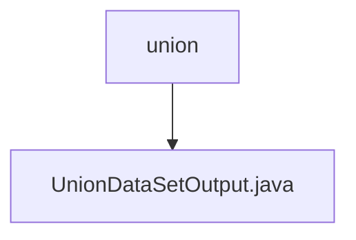

# Basic Information

|      |      |
|------|------|
| Name | union |
| Language | .java |
| Code Path | WeFe/board/board-service/src/main/java/com/welab/wefe/board/service/dto/union |
| Package Name | docs.board.board-service.src.main.java.com.welab.wefe.board.service.dto.union |
| Brief Description | The UnionDataSetOutput class includes attributes such as member ID, creation/update time, number of dimensions, description, labels, whether it contains Y, usage count, name, sample count, ID, and dimension list, along with their corresponding getter/setter methods. |

# Description

The `UnionDataSetOutput` class is a Java class that contains dataset-related attributes, primarily used for storing and managing basic information of datasets. This class includes fields such as member ID, creation time, update time, number of dimensions, description, tags, whether it contains a Y flag, usage count, name, sample count, unique ID, and a list of dimensions. Each field has corresponding getter and setter methods for accessing and modifying the attribute values.

### Package Internal Structure View

This flowchart illustrates the DTO directory structure under the board-service module in the WeFe project. The root node "union" represents the data transfer object package for joint datasets, and its child node "UnionDataSetOutput.java" is the specific output data transfer class defined within this package. This structure clearly reflects the organization of joint dataset-related classes in the DTO layer, adhering to typical Java project layering conventions.

# File List

| Name   | Type  | Description |
|-------|------|-------------|
| [UnionDataSetOutput.java](UnionDataSetOutput.md) | file | The UnionDataSetOutput class includes attributes such as member ID, creation/update time, number of dimensions, description, labels, whether it contains Y, usage count, name, sample count, ID, and dimension list, along with their corresponding getter/setter methods. |

