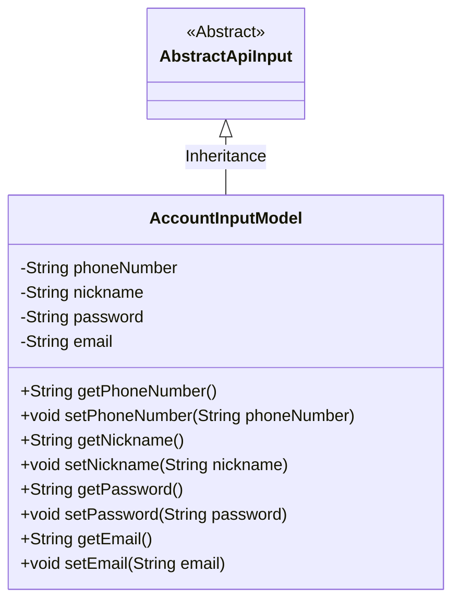

# Basic Information

|      |      |
|------|------|
| Name | AccountInputModel |
| Language | .java |
| Code Path | WeFe/board/board-service/src/main/java/com/welab/wefe/board/service/dto/vo/AccountInputModel.java |
| Package Name | com.welab.wefe.board.service.dto.vo |
| Dependencies | ['com.welab.wefe.common.fieldvalidate.StandardFieldType', 'com.welab.wefe.common.fieldvalidate.annotation.Check', 'com.welab.wefe.common.web.dto.AbstractApiInput'] |
| Brief Description | The AccountInputModel class includes four mandatory fields: phone number, nickname, password, and email, each with corresponding format validation rules. |

# Description

The `AccountInputModel` class inherits from `AbstractApiInput` and is used to encapsulate account input data. It includes four required fields: `phoneNumber` must conform to the phone number format, `nickname` has a length limit of 2-15 characters, `password` has a length limit of 6-128 characters, and `email` must conform to the email format. Each field has corresponding getter and setter methods.

# Class Summary

| Name   | Type  | Description |
|-------|------|-------------|
| AccountInputModel | class | The AccountInputModel class includes fields for phone number, nickname, password, and email, all of which require validation with specific length or format requirements. |

## Class AccountInputModel

|      |      |
|------|------|
| Access Modifier | public |
| Type | class |
| Name | AccountInputModel |
| Description | The AccountInputModel class includes fields for phone number, nickname, password, and email, all of which require validation with specific length or format requirements. |

### UML Class Diagram

This code demonstrates an AccountInputModel class that inherits from AbstractApiInput, primarily used to encapsulate account-related input data. The class contains four private fields (phoneNumber, nickname, password, email) along with their corresponding getter and setter methods, each validated by @Check annotation for format constraints. The class diagram clearly reflects the inheritance relationship and field/method visibility, embodying the standard Java Bean design pattern.

### Internal Method Call Graph

```mermaid
graph TD
    A["Class AccountInputModel"]
    B["Inherits: AbstractApiInput"]
    C["Property: String phoneNumber"]
    D["Property: String nickname"]
    E["Property: String password"]
    F["Property: String email"]
    G["Method: getPhoneNumber()"]
    H["Method: setPhoneNumber(String)"]
    I["Method: getNickname()"]
    J["Method: setNickname(String)"]
    K["Method: getPassword()"]
    L["Method: setPassword(String)"]
    M["Method: getEmail()"]
    N["Method: setEmail(String)"]

    A --> B
    A --> C
    A --> D
    A --> E
    A --> F
    A --> G
    A --> H
    A --> I
    A --> J
    A --> K
    A --> L
    A --> M
    A --> N
```

This code defines a class named AccountInputModel, which inherits from AbstractApiInput. The class contains four private properties: phoneNumber, nickname, password, and email, each with corresponding getter and setter methods. The phoneNumber and email properties are validated through the @Check annotation, where phoneNumber must be in phone number format and email must be in email format. The nickname and password properties are validated through the @Check annotation with regular expressions, where nickname length must be between 2 and 15 characters, and password length must be between 6 and 128 characters. These validation rules ensure the validity and security of the input data.

### Field List

| Name  | Type  | Description |
|-------|-------|------|
| password | String | Password field validation: Required, length 6-128 characters, regex matches any character. |
| email | String | The code defines a private string variable email, marked as a required field with the @Check annotation, and specifies the validation type as standard email format. |
| nickname | String | The code defines a private string variable named nickname, with the @Check annotation enforcing that this field is mandatory and must be between 2 to 15 characters in length. |
| phoneNumber | String | The code defines a private string variable phoneNumber, annotated with @Check to mark it as required and of type phone number. |

### Method List

| Name  | Type  | Description |
|-------|-------|------|
| getNickname | String | Method to get nickname, returns a string type variable nickname. |
| setPhoneNumber | void | Methods for setting a phone number, assigning the input parameter to the class's phoneNumber member variable. |
| getPhoneNumber | String | This is a Java method that returns the value of the string-type variable phoneNumber. |
| setNickname | void | Methods for setting the user nickname, assigning the input parameter to the member variable nickname. |
| getPassword | String | Methods to obtain the password, returns a string-type password value. |
| setPassword | void | Method for setting password: assign the input string to the class member variable password. |
| getEmail | String | Methods to obtain the email string. |
| setEmail | void | This is a Java method used to set the email property of an object. The method takes a string parameter email and assigns it to the email field of the current object. |

