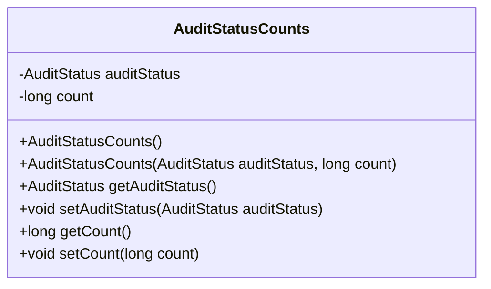
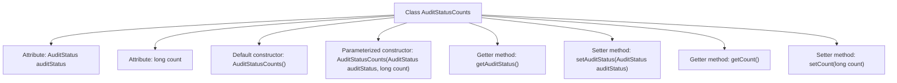

# Basic Information

|      |      |
|------|------|
| Name | AuditStatusCounts |
| Language | .java |
| Code Path | WeFe/board/board-service/src/main/java/com/welab/wefe/board/service/dto/vo/AuditStatusCounts.java |
| Package Name | com.welab.wefe.board.service.dto.vo |
| Dependencies | ['com.welab.wefe.common.wefe.enums.AuditStatus'] |
| Brief Description | The AuditStatusCounts class contains audit status and count fields, providing constructor methods and getter/setter. |

# Description

The `AuditStatusCounts` class is used to count the quantities of audit statuses, containing two private attributes: `auditStatus` represents the audit status, and `count` indicates the quantity of that status. The class provides a no-argument constructor and a parameterized constructor, supporting access and modification of attributes through getter and setter methods. This class features a concise structure and clear functionality, making it suitable for recording and managing the counting of different audit statuses.

# Class Summary

| Name   | Type  | Description |
|-------|------|-------------|
| AuditStatusCounts | class | The AuditStatusCounts class contains audit status and count fields, providing constructor methods and getters/setters. |

## Class AuditStatusCounts

|      |      |
|------|------|
| Access Modifier | public |
| Type | class |
| Name | AuditStatusCounts |
| Description | The AuditStatusCounts class contains audit status and count fields, providing constructor methods and getters/setters. |

### UML Class Diagram

This code defines a class named `AuditStatusCounts` used to record audit status and its corresponding count. The class contains two private fields: `auditStatus` (audit status) and `count` (count), along with constructors and corresponding getter/setter methods. This class is primarily used to encapsulate audit status statistics for easier data transfer and processing.

### Internal Method Call Graph

This code defines a class named AuditStatusCounts, primarily used to encapsulate audit status and its corresponding count information. The class contains two private attributes: auditStatus (audit status) and count (counter), providing both a default constructor and a parameterized constructor, along with corresponding getter and setter methods for accessing and modifying these two attributes. The design pattern of this class complies with the JavaBean specification, facilitating instantiation and manipulation of audit status count objects in other code.

### Field List

| Name  | Type  | Description |
|-------|-------|------|
| count | long | Private long integer variable count. |
| auditStatus | AuditStatus | The private audit state variable `auditStatus`. |

### Method List

| Name  | Type  | Description |
|-------|-------|------|
| setAuditStatus | void | Method to set audit status, assigns the passed auditStatus to the auditStatus field of the current object. |
| getAuditStatus | AuditStatus | The method returns the audit status auditStatus. |
| getCount | long | The method to obtain the count value directly returns the value of the variable count. |
| setCount | void | Methods to set the count attribute, with a parameter of long integer count. |

