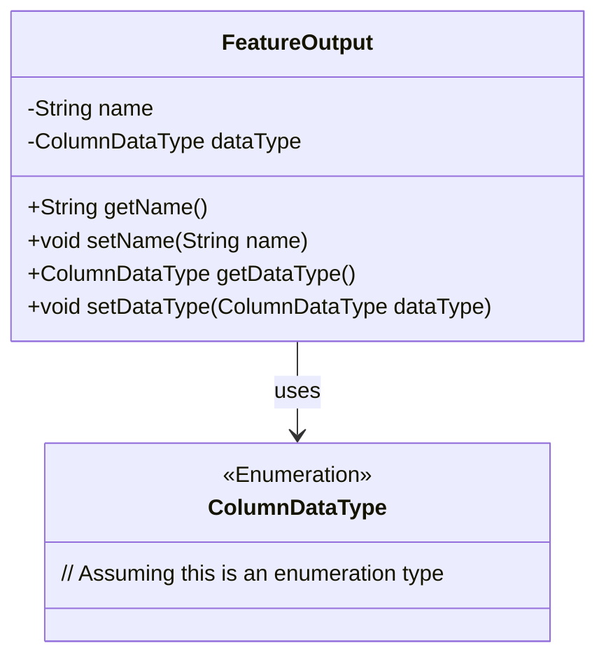
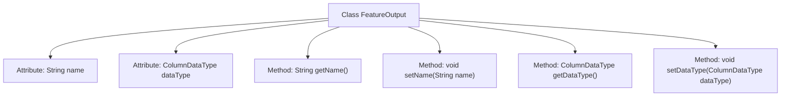

# Basic Information

|      |      |
|------|------|
| Name | FeatureOutput |
| Language | .java |
| Code Path | WeFe/board/board-service/src/main/java/com/welab/wefe/board/service/dto/vo/FeatureOutput.java |
| Package Name | com.welab.wefe.board.service.dto.vo |
| Dependencies | ['com.welab.wefe.common.wefe.enums.ColumnDataType'] |
| Brief Description | The FeatureOutput class contains name and dataType fields, providing corresponding getter and setter methods. |

# Description

The `FeatureOutput` class is a Java class that contains field names and data types. It has two private attributes: `name` represents the field name, and `dataType` denotes the data type, which is of type `ColumnDataType`. Getter and setter methods are provided for these two attributes to retrieve and modify their values. The class structure is simple and primarily used to encapsulate basic field information.

# Class Summary

| Name   | Type  | Description |
|-------|------|-------------|
| FeatureOutput | class | The FeatureOutput class includes the name and dataType fields along with their corresponding getter/setter methods. |

## Class FeatureOutput

|      |      |
|------|------|
| Access Modifier | public |
| Type | class |
| Name | FeatureOutput |
| Description | The FeatureOutput class includes the name and dataType fields along with their corresponding getter/setter methods. |

### UML Class Diagram

This code demonstrates a simple Java class `FeatureOutput`, which contains two private fields `name` and `dataType`, representing the field name and data type respectively. The class provides standard getter and setter methods to access and modify these fields. The `dataType` field is of type `ColumnDataType`, an enumeration type (assumed), used to constrain the range of valid data types. The class diagram clearly illustrates the dependency relationship between `FeatureOutput` and `ColumnDataType`, where `FeatureOutput` uses `ColumnDataType` as its field type.

### Internal Method Call Graph

This code defines a class named FeatureOutput, which contains two private attributes: name and dataType, representing the field name and data type respectively. The class provides four public methods: getName() and setName() for accessing and modifying the name attribute, getDataType() and setDataType() for accessing and modifying the dataType attribute. This is a typical data encapsulation class that controls access and modification of private attributes through getter and setter methods.

### Field List

| Name  | Type  | Description |
|-------|-------|------|
| name | String | private String variable name |
| dataType | ColumnDataType | The private field dataType, of type ColumnDataType. |

### Method List

| Name  | Type  | Description |
|-------|-------|------|
| getName | String | This is a Java method that returns the value of the private variable name. |
| getDataType | ColumnDataType | Methods for obtaining data types, returns a ColumnDataType object. |
| setName | void | The method to set the object name assigns the parameter `name` to the `name` property of the object. |
| setDataType | void | This is a Java method used to set the data type of a column. The method is named setDataType, which takes a parameter of type ColumnDataType called dataType and assigns it to the dataType property of the current object. |

