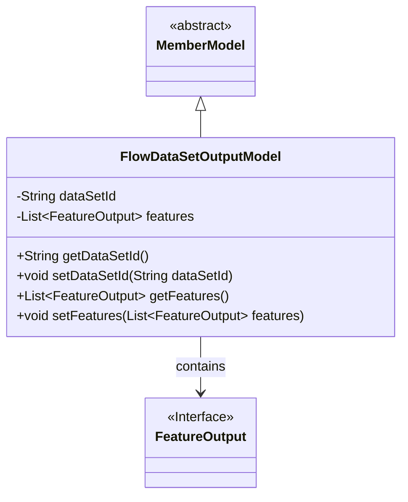
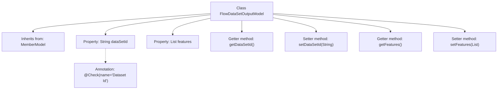

# Basic Information

|      |      |
|------|------|
| Name | FlowDataSetOutputModel |
| Language | .java |
| Code Path | WeFe/board/board-service/src/main/java/com/welab/wefe/board/service/dto/vo/FlowDataSetOutputModel.java |
| Package Name | com.welab.wefe.board.service.dto.vo |
| Dependencies | ['com.welab.wefe.board.service.dto.entity.MemberModel', 'com.welab.wefe.common.fieldvalidate.annotation.Check', 'java.util.List'] |
| Brief Description | FlowDataSetOutputModel inherits from MemberModel, containing a dataset ID and feature list, and provides getter/setter methods. |

# Description

The `FlowDataSetOutputModel` class inherits from `MemberModel` and contains two main attributes: `dataSetId` and `features`. `dataSetId` is a string type used to store the dataset ID and is validated via the `@Check` annotation. `features` is a list of type `FeatureOutput` used to store feature output data. The class provides getter and setter methods for these two attributes to retrieve and set their values. The overall structure is clear and complies with the JavaBean specification.

# Class Summary

| Name   | Type  | Description |
|-------|------|-------------|
| FlowDataSetOutputModel | class | The FlowDataSetOutputModel inherits from MemberModel, containing a dataset ID and a feature list, and provides getter/setter methods. |

## Class FlowDataSetOutputModel

|      |      |
|------|------|
| Access Modifier | public |
| Type | class |
| Name | FlowDataSetOutputModel |
| Description | The FlowDataSetOutputModel inherits from MemberModel, containing a dataset ID and a feature list, and provides getter/setter methods. |

### UML Class Diagram

This class diagram illustrates the structure where FlowDataSetOutputModel inherits from the abstract class MemberModel and contains a list of FeatureOutput interfaces. As a concrete implementation class, FlowDataSetOutputModel manages dataset IDs and feature output lists, providing access control to these private fields through getter/setter methods. FeatureOutput, as an interface, defines the specifications for feature outputs, forming an aggregation relationship with the main class. The overall design embodies object-oriented encapsulation and extensibility.

### Internal Method Call Graph

This code defines a class named FlowDataSetOutputModel, which inherits from MemberModel. The class contains two main properties: dataSetId (a String type with @Check annotation) and features (a List of FeatureOutput type). Standard getter and setter methods are provided to access and modify these properties. The flowchart clearly illustrates the class inheritance, property definitions, and method structure, with the dataSetId property specifically marked with its validation annotation.

### Field List

| Name  | Type  | Description |
|-------|-------|------|
| features | List<FeatureOutput> | Private feature output list. |
| dataSetId | String | Dataset ID verification field declaration. |

### Method List

| Name  | Type  | Description |
|-------|-------|------|
| getDataSetId | String | Methods to obtain the dataset ID, returning the dataset ID as a string type. |
| setDataSetId | void | The method to set the dataset ID assigns the input parameter to the class's dataSetId member variable. |
| getFeatures | List<FeatureOutput> | Methods to obtain the feature list, returning the `features` variable. |
| setFeatures | void | Methods for setting the feature list, assigning the input feature list to the feature attribute of the current object. |

