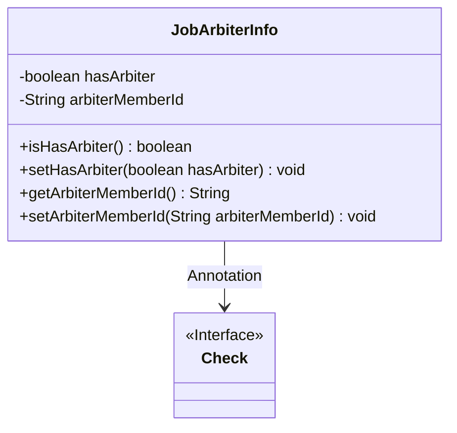
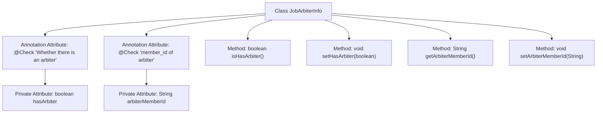

# Basic Information

|      |      |
|------|------|
| Name | JobArbiterInfo |
| Language | .java |
| Code Path | WeFe/board/board-service/src/main/java/com/welab/wefe/board/service/dto/vo/JobArbiterInfo.java |
| Package Name | com.welab.wefe.board.service.dto.vo |
| Dependencies | ['com.welab.wefe.common.fieldvalidate.annotation.Check'] |
| Brief Description | The JobArbiterInfo class contains two attributes: hasArbiter indicates whether there is an arbiter, and arbiterMemberId stores the arbiter member ID, providing getter and setter methods. |

# Description

The JobArbiterInfo class is used to represent arbiter information, containing two main attributes: the hasArbiter boolean indicates whether an arbiter exists, with a check annotation; the arbiterMemberId string stores the arbiter member ID, also with a check annotation. The class provides standard getter and setter methods for attribute access and modification.

# Class Summary

| Name   | Type  | Description |
|-------|------|-------------|
| JobArbiterInfo | class | The JobArbiterInfo class contains two attributes: hasArbiter indicates whether there is an arbiter, and arbiterMemberId stores the arbiter member ID, providing getter and setter methods. |

## Class JobArbiterInfo

|      |      |
|------|------|
| Access Modifier | public |
| Type | class |
| Name | JobArbiterInfo |
| Description | The JobArbiterInfo class contains two attributes: hasArbiter indicates whether there is an arbiter, and arbiterMemberId stores the arbiter member ID, providing getter and setter methods. |

### UML Class Diagram

This code defines a `JobArbiterInfo` class for storing arbiter-related information, containing two private fields `hasArbiter` and `arbiterMemberId`, which indicate the presence of an arbiter and its member ID respectively. The class provides standard getter and setter methods, and uses the `@Check` annotation to mark field validations. The class diagram clearly illustrates the class structure and its dependency relationship with the `Check` annotation interface.

### Internal Method Call Graph

This code defines a class named JobArbiterInfo, which includes two private attributes with @Check annotations: hasArbiter and arbiterMemberId, representing whether an arbiter exists and the arbiter's member ID, respectively. The class provides four methods: isHasArbiter() to retrieve the value of hasArbiter, setHasArbiter() to set the value of hasArbiter, getArbiterMemberId() to retrieve the value of arbiterMemberId, and setArbiterMemberId() to set the value of arbiterMemberId. The flowchart clearly illustrates the class structure and the relationships between attributes and methods.

### Field List

| Name  | Type  | Description |
|-------|-------|------|
| arbiterMemberId | String | Check the field for the arbitrator member ID. |
| hasArbiter | boolean | Check if an arbiter exists, private boolean variable hasArbiter. |

### Method List

| Name  | Type  | Description |
|-------|-------|------|
| setHasArbiter | void | The method to set the arbiter flag, with the parameter being a boolean value `hasArbiter`, is used to update the `hasArbiter` property of the current object. |
| isHasArbiter | boolean | Check the boolean method for the existence of an arbiter, returning the value of hasArbiter. |
| getArbiterMemberId | String | The method to obtain the arbiter member ID returns a string-type member ID variable `arbiterMemberId`. |
| setArbiterMemberId | void | The method for setting the arbitrator member ID assigns the parameter value to the class's member variable. |

