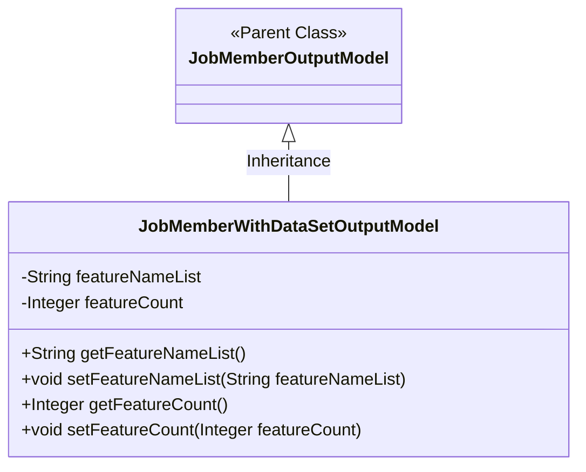
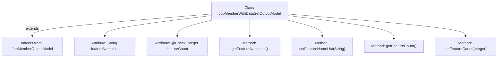

# Basic Information

|      |      |
|------|------|
| Name | JobMemberWithDataSetOutputModel |
| Language | .java |
| Code Path | WeFe/board/board-service/src/main/java/com/welab/wefe/board/service/dto/vo/JobMemberWithDataSetOutputModel.java |
| Package Name | com.welab.wefe.board.service.dto.vo |
| Dependencies | ['com.welab.wefe.board.service.dto.entity.job.JobMemberOutputModel', 'com.welab.wefe.common.fieldvalidate.annotation.Check'] |
| Brief Description | JobMemberWithDataSetOutputModel extends JobMemberOutputModel, containing fields such as the feature name list featureNameList and feature count featureCount, along with their corresponding getter/setter methods. |

# Description

The code defines a Java class named `JobMemberWithDataSetOutputModel`, which extends `JobMemberOutputModel`. The class contains two private attributes: `featureNameList` (a string type storing a list of feature names) and `featureCount` (an integer type annotated with `Check` for validating the feature count). Getter and setter methods are provided for these two attributes to retrieve and set their values.

# Class Summary

| Name   | Type  | Description |
|-------|------|-------------|
| JobMemberWithDataSetOutputModel | class | JobMemberWithDataSetOutputModel inherits from JobMemberOutputModel, containing a list of feature names and feature count attributes along with their getter/setter methods. |

## Class JobMemberWithDataSetOutputModel

|      |      |
|------|------|
| Access Modifier | public |
| Type | class |
| Name | JobMemberWithDataSetOutputModel |
| Description | JobMemberWithDataSetOutputModel inherits from JobMemberOutputModel, containing a list of feature names and feature count attributes along with their getter/setter methods. |

### UML Class Diagram

This class diagram illustrates the inheritance relationship where JobMemberWithDataSetOutputModel extends JobMemberOutputModel. The subclass contains two private attributes (featureNameList and featureCount) along with their corresponding getter and setter methods. The featureCount attribute carries a validation marker "Feature Count" annotated with @Check. This design pattern demonstrates a common POJO class structure in Java, achieving model extension through inheritance while maintaining encapsulation.

### Internal Method Call Graph

This flowchart illustrates the structure of the JobMemberWithDataSetOutputModel class, which inherits from the JobMemberOutputModel class. It contains two private attributes: featureNameList and featureCount with @Check annotation, along with their corresponding getter and setter methods. The diagram clearly shows the inheritance relationship of the class and the associations between attributes and methods. Attributes are annotated with their types and annotations, while methods display their parameter and return types.

### Field List

| Name  | Type  | Description |
|-------|-------|------|
| featureCount | Integer | The field featureCount is marked with the @Check annotation, indicating that the feature count needs to be validated. |
| featureNameList | String | The private string variable featureNameList is used to store the list of feature names. |

### Method List

| Name  | Type  | Description |
|-------|-------|------|
| getFeatureNameList | String | The method returns a list of feature names. |
| setFeatureNameList | void | Methods for setting the feature name list, assigning the input string to the class member variable featureNameList. |
| getFeatureCount | Integer | Method to obtain the number of features, returns the integer variable featureCount. |
| setFeatureCount | void | Set the feature count method, assign the input parameter to the class variable featureCount. |

